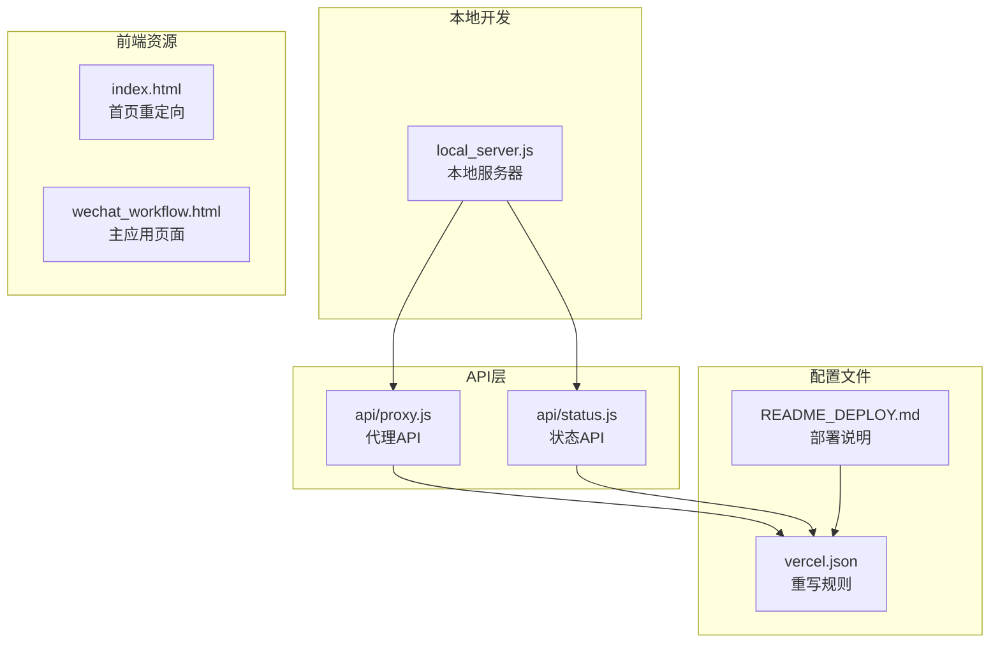
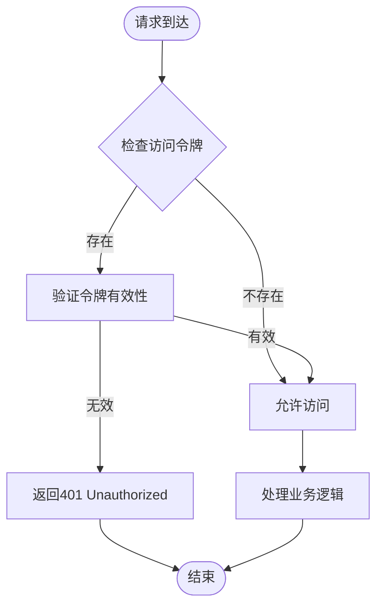
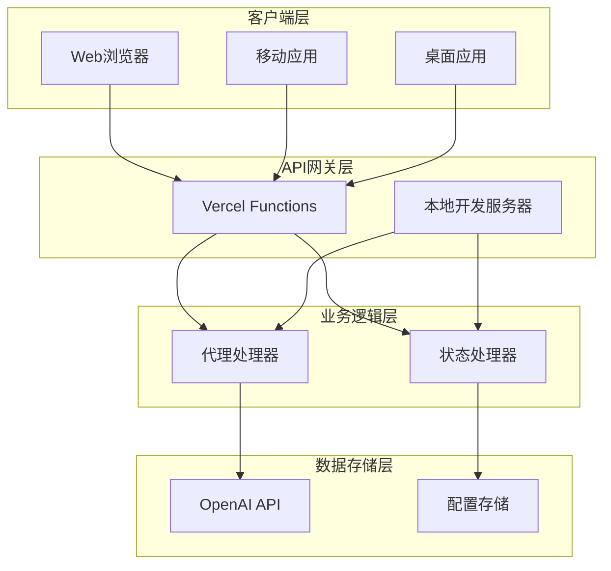
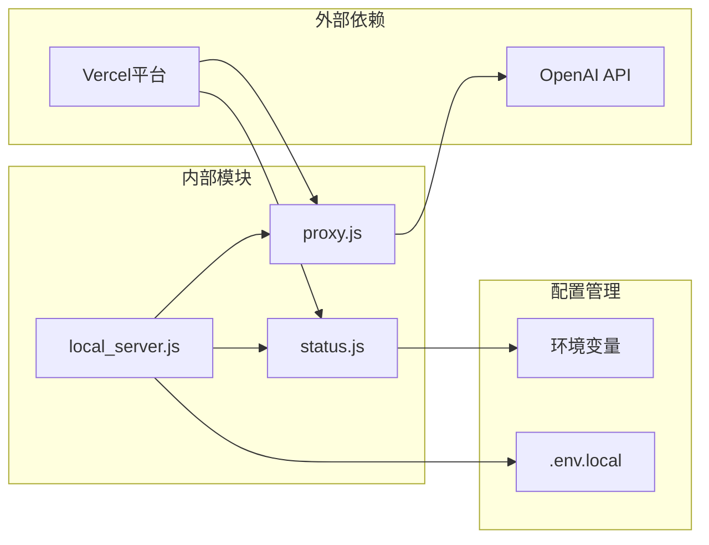

# API参考

<cite>
**本文档引用的文件**
- [api/proxy.js](file://api/proxy.js)
- [api/status.js](file://api/status.js)
- [local_server.js](file://local_server.js)
- [README_DEPLOY.md](file://README_DEPLOY.md)
- [vercel.json](file://vercel.json)
- [wechat_workflow.html](file://wechat_workflow.html)
- [index.html](file://index.html)
</cite>

## 目录
1. [简介](#简介)
2. [项目结构](#项目结构)
3. [核心组件](#核心组件)
4. [架构概览](#架构概览)
5. [详细组件分析](#详细组件分析)
6. [依赖关系分析](#依赖关系分析)
7. [性能考虑](#性能考虑)
8. [故障排除指南](#故障排除指南)
9. [结论](#结论)
10. [附录](#附录)

## 简介
本项目提供了一个基于OpenAI API的代理服务，包含两个主要的API接口：
- `/api/proxy` - API代理接口，支持流式响应和多种认证方式
- `/api/status` - 健康检查接口

该系统支持在Vercel平台和本地服务器两种环境下运行，提供了灵活的配置选项和安全机制。

## 项目结构
项目采用模块化的API设计，主要文件组织如下：



**图表来源**
- [api/proxy.js:1-119](file://api/proxy.js#L1-L119)
- [api/status.js:1-29](file://api/status.js#L1-L29)
- [local_server.js:1-204](file://local_server.js#L1-L204)
- [vercel.json:1-5](file://vercel.json#L1-L5)

**章节来源**
- [api/proxy.js:1-119](file://api/proxy.js#L1-L119)
- [api/status.js:1-29](file://api/status.js#L1-L29)
- [local_server.js:1-204](file://local_server.js#L1-L204)
- [vercel.json:1-5](file://vercel.json#L1-L5)

## 核心组件
本项目的核心组件包括API代理服务和健康检查服务，两者都实现了统一的认证机制和错误处理策略。

### 认证机制
系统支持多种认证方式，确保API的安全访问：



**图表来源**
- [api/proxy.js:12-21](file://api/proxy.js#L12-L21)
- [api/status.js:12-28](file://api/status.js#L12-L28)

### 错误处理策略
系统实现了统一的错误处理机制，包括输入验证、网络请求错误和内部异常处理。

**章节来源**
- [api/proxy.js:12-21](file://api/proxy.js#L12-L21)
- [api/status.js:12-28](file://api/status.js#L12-L28)

## 架构概览
系统采用分层架构设计，支持多环境部署：



**图表来源**
- [api/proxy.js:23-118](file://api/proxy.js#L23-L118)
- [api/status.js:12-28](file://api/status.js#L12-L28)
- [local_server.js:128-196](file://local_server.js#L128-L196)

## 详细组件分析

### /api/proxy 接口

#### 接口规范
- **HTTP方法**: POST
- **URL模式**: `/api/proxy`
- **功能**: 代理OpenAI API请求，支持流式响应

#### 认证方式
系统支持三种认证方式，按优先级顺序：

1. **请求头认证** (`X-Article-Jike-Access-Token`)
2. **Bearer Token认证** (`Authorization: Bearer <token>`)
3. **请求体认证** (`accessToken`字段)

#### 请求参数
| 参数名 | 类型 | 必需 | 描述 | 默认值 |
|--------|------|------|------|--------|
| baseUrl | string | 否 | OpenAI API基础URL | 环境变量或默认值 |
| apiKey | string | 否 | OpenAI API密钥 | 环境变量 |
| model | string | 否 | 模型名称 | 环境变量或'gpt-5.4' |
| messages | array | 是 | 对话消息数组 | - |
| stream | boolean | 否 | 是否启用流式响应 | false |
| reasoning_effort | string | 否 | 推理努力程度 | 环境变量 |
| max_tokens | number | 否 | 最大生成tokens数 | - |
| max_completion_tokens | number | 否 | 最大完成tokens数 | - |
| temperature | number | 否 | 采样温度 | - |
| top_p | number | 否 | Top-P采样 | - |

#### 响应格式
**非流式响应**:
```json
{
  "id": "string",
  "object": "chat.completion",
  "created": 1234567890,
  "model": "string",
  "choices": [
    {
      "message": {
        "role": "assistant",
        "content": "string"
      }
    }
  ]
}
```

**流式响应**:
使用SSE格式，逐条发送数据块，以`data: `前缀标识。

#### 错误代码
- **400 Bad Request**: 缺少必需参数或参数格式错误
- **401 Unauthorized**: 访问令牌验证失败
- **405 Method Not Allowed**: 使用了不支持的HTTP方法
- **500 Internal Server Error**: 服务器内部错误

#### 安全考虑
- 支持可选的访问令牌认证
- 自动清理敏感信息（API密钥长度日志）
- 支持自定义上游API端点
- 流式响应避免内存溢出

#### 性能优化
- 流式响应减少延迟
- 直接转发上游响应头
- 智能参数传递避免冗余

**章节来源**
- [api/proxy.js:23-118](file://api/proxy.js#L23-L118)

### /api/status 接口

#### 接口规范
- **HTTP方法**: GET
- **URL模式**: `/api/status`
- **功能**: 健康检查和状态报告

#### 响应参数
| 参数名 | 类型 | 描述 |
|--------|------|------|
| ok | boolean | 服务状态是否正常 |
| service | string | 服务名称 |
| model | string | 当前使用的模型 |
| reasoningEffort | string/null | 推理努力程度配置 |
| accessControl | boolean | 是否启用了访问控制 |
| authorized | boolean | 当前请求是否已授权 |
| serverKeyConfigured | boolean | 服务器API密钥是否已配置 |
| serverTime | string | 服务器时间戳 |

#### 响应示例
```json
{
  "ok": true,
  "service": "article-jike",
  "model": "gpt-5.4",
  "reasoningEffort": null,
  "accessControl": false,
  "authorized": true,
  "serverKeyConfigured": true,
  "serverTime": "2024-01-01T00:00:00.000Z"
  }
```

#### 安全考虑
- 返回最小必要信息
- 不暴露敏感配置
- 支持访问控制检查

**章节来源**
- [api/status.js:12-28](file://api/status.js#L12-L28)

### 本地开发服务器

#### 功能特性
本地服务器提供与Vercel函数相同的API接口，支持：
- `/api/proxy` - 代理API
- `/api/status` - 健康检查
- 静态文件服务
- 环境变量加载

#### 配置选项
- **PORT**: 服务器端口，默认3001
- **HOST**: 绑定地址，默认0.0.0.0
- **OPENAI_BASE_URL**: OpenAI API基础URL
- **OPENAI_MODEL**: 默认模型名称
- **OPENAI_REASONING_EFFORT**: 推理努力程度
- **OPENAI_API_KEY**: OpenAI API密钥
- **ARTICLE_JIKE_ACCESS_TOKEN**: 访问令牌

**章节来源**
- [local_server.js:128-196](file://local_server.js#L128-L196)
- [local_server.js:198-203](file://local_server.js#L198-L203)

## 依赖关系分析



**图表来源**
- [api/proxy.js:35-37](file://api/proxy.js#L35-L37)
- [api/status.js:21-26](file://api/status.js#L21-L26)
- [local_server.js:34-48](file://local_server.js#L34-L48)

### 外部依赖
- **OpenAI API**: 主要上游服务
- **Vercel Functions**: 云平台运行环境

### 内部依赖
- **环境变量管理**: 统一配置中心
- **认证模块**: 通用认证逻辑
- **错误处理**: 统一错误响应

**章节来源**
- [api/proxy.js:35-37](file://api/proxy.js#L35-L37)
- [api/status.js:21-26](file://api/status.js#L21-L26)
- [local_server.js:34-48](file://local_server.js#L34-L48)

## 性能考虑

### 流式响应优化
系统实现了高效的流式响应处理：
- 使用ReadableStream进行增量传输
- 避免完整响应缓存
- 实时数据传输减少延迟

### 内存管理
- 流式读取避免大对象内存占用
- 及时释放网络连接
- 控制日志输出避免内存泄漏

### 缓存策略
- 响应头透传保持上游缓存策略
- 无状态设计支持水平扩展
- 临时文件避免持久化

## 故障排除指南

### 常见问题诊断

#### 401 Unauthorized 错误
**症状**: 访问被拒绝
**原因**: 
- 未配置访问令牌
- 令牌不正确或过期
- 认证头格式错误

**解决方案**:
1. 检查环境变量配置
2. 验证令牌格式
3. 确认认证头设置

#### 400 Bad Request 错误
**症状**: 请求参数错误
**原因**:
- 缺少必需参数
- 参数类型不正确
- 消息格式错误

**解决方案**:
1. 验证请求体结构
2. 检查必需字段完整性
3. 确认参数类型匹配

#### 500 Internal Server Error 错误
**症状**: 服务器内部错误
**原因**:
- 上游API不可用
- 网络连接超时
- 服务器配置错误

**解决方案**:
1. 检查上游API状态
2. 验证网络连接
3. 查看服务器日志

### 调试技巧
1. **启用详细日志**: 查看Vercel函数日志中的调试信息
2. **参数验证**: 检查请求参数的完整性和格式
3. **网络监控**: 监控上游API响应时间和成功率
4. **性能分析**: 分析流式响应的传输效率

**章节来源**
- [api/proxy.js:40-49](file://api/proxy.js#L40-L49)
- [api/proxy.js:112-117](file://api/proxy.js#L112-L117)

## 结论
本API参考文档详细介绍了项目的两个核心接口及其配置选项。系统提供了：
- 灵活的认证机制支持多种访问控制方式
- 高效的流式响应处理优化用户体验
- 统一的错误处理和日志记录
- 支持多环境部署的架构设计

通过合理的配置和使用，用户可以获得稳定可靠的AI代理服务。

## 附录

### 部署配置示例

#### Vercel环境变量
```bash
OPENAI_API_KEY=your_openai_api_key
OPENAI_MODEL=gpt-5.4
OPENAI_REASONING_EFFORT=none
ARTICLE_JIKE_ACCESS_TOKEN=your_access_token
```

#### 本地开发配置
```bash
PORT=3001
HOST=0.0.0.0
OPENAI_BASE_URL=https://api.openai.com/v1
OPENAI_MODEL=gpt-5.4
OPENAI_REASONING_EFFORT=none
OPENAI_API_KEY=your_openai_api_key
ARTICLE_JIKE_ACCESS_TOKEN=your_access_token
```

### 客户端实现建议

#### JavaScript客户端
```javascript
// 基础请求示例
const response = await fetch('/api/proxy', {
  method: 'POST',
  headers: {
    'Content-Type': 'application/json',
    'X-Article-Jike-Access-Token': 'your-token'
  },
  body: JSON.stringify({
    baseUrl: 'https://api.openai.com/v1',
    apiKey: 'your-api-key',
    model: 'gpt-5.4',
    messages: [
      { role: 'user', content: 'Hello!' }
    ],
    stream: true
  })
});
```

#### 流式响应处理
```javascript
// 处理流式响应
const reader = response.body.getReader();
while (true) {
  const { done, value } = await reader.read();
  if (done) break;
  
  // 解析SSE数据块
  const text = new TextDecoder().decode(value);
  const data = text.trim();
  if (data.startsWith('data: ')) {
    const json = data.slice(6);
    // 处理JSON数据
  }
}
```

**章节来源**
- [README_DEPLOY.md:78-88](file://README_DEPLOY.md#L78-L88)
- [README_DEPLOY.md:92-112](file://README_DEPLOY.md#L92-L112)