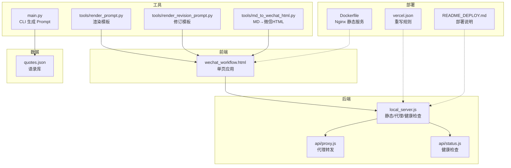
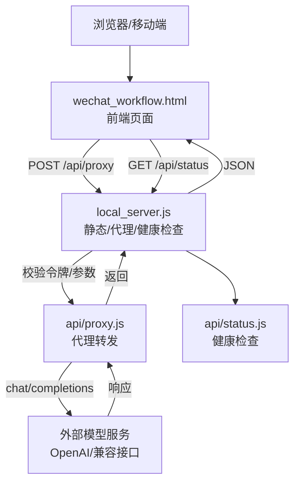
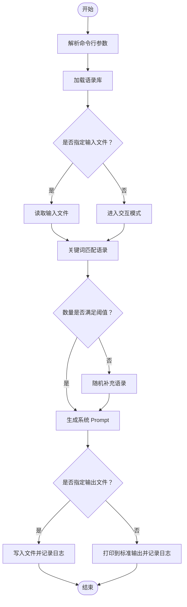
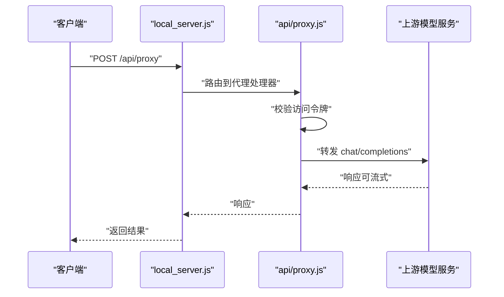
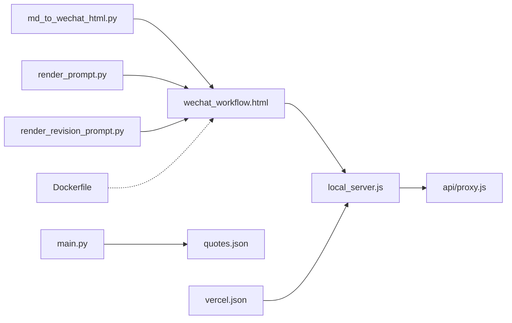

# 开发指南

<cite>
**本文引用的文件**
- [main.py](file://main.py)
- [local_server.js](file://local_server.js)
- [wechat_workflow.html](file://wechat_workflow.html)
- [README_DEPLOY.md](file://README_DEPLOY.md)
- [VERCEL_GUIDE.md](file://VERCEL_GUIDE.md)
- [Dockerfile](file://Dockerfile)
- [vercel.json](file://vercel.json)
- [quotes.json](file://quotes.json)
- [tools/md_to_wechat_html.py](file://tools/md_to_wechat_html.py)
- [tools/render_prompt.py](file://tools/render_prompt.py)
- [tools/render_revision_prompt.py](file://tools/render_revision_prompt.py)
- [api/proxy.js](file://api/proxy.js)
- [api/status.js](file://api/status.js)
</cite>

## 目录
1. [简介](#简介)
2. [项目结构](#项目结构)
3. [核心组件](#核心组件)
4. [架构总览](#架构总览)
5. [详细组件分析](#详细组件分析)
6. [依赖分析](#依赖分析)
7. [性能考虑](#性能考虑)
8. [故障排查指南](#故障排查指南)
9. [结论](#结论)
10. [附录](#附录)

## 简介
本指南面向希望参与本项目的开发者，提供从环境搭建、代码贡献、测试与调试、到部署与维护的全流程说明。项目围绕“公众号写作与润色工作流”展开，包含本地 CLI 工具、Web 前端页面、Node 本地服务器以及若干 Python 工具脚本，支持通过代理接口调用外部大模型服务，并提供多种部署方式（Vercel、自建服务器、Docker）。

## 项目结构
项目采用按功能与职责分层的组织方式：
- 核心逻辑
  - Python CLI：负责加载语录、根据用户输入生成 Prompt 并输出结果或写入文件。
  - Node 本地服务器：提供静态资源服务、健康检查、代理转发等。
- 前端页面
  - 单页应用（HTML/CSS/JS）：提供输入、生成、润色、预览与导出的可视化流程。
- 工具脚本
  - Python 工具：将 Markdown 转换为微信公众号 HTML、渲染 Prompt 模板、渲染修订 Prompt。
- API 层
  - Vercel 函数代理与状态接口：统一鉴权、参数校验、上游请求转发与响应。
- 配置与部署
  - Vercel 配置、Dockerfile、系统服务示例与环境变量说明。

图表来源
- [wechat_workflow.html](file://wechat_workflow.html)
- [local_server.js](file://local_server.js)
- [api/proxy.js](file://api/proxy.js)
- [api/status.js](file://api/status.js)
- [main.py](file://main.py)
- [tools/md_to_wechat_html.py](file://tools/md_to_wechat_html.py)
- [tools/render_prompt.py](file://tools/render_prompt.py)
- [tools/render_revision_prompt.py](file://tools/render_revision_prompt.py)
- [vercel.json](file://vercel.json)
- [Dockerfile](file://Dockerfile)
- [README_DEPLOY.md](file://README_DEPLOY.md)
- [quotes.json](file://quotes.json)

章节来源
- [wechat_workflow.html](file://wechat_workflow.html)
- [local_server.js](file://local_server.js)
- [api/proxy.js](file://api/proxy.js)
- [api/status.js](file://api/status.js)
- [main.py](file://main.py)
- [tools/md_to_wechat_html.py](file://tools/md_to_wechat_html.py)
- [tools/render_prompt.py](file://tools/render_prompt.py)
- [tools/render_revision_prompt.py](file://tools/render_revision_prompt.py)
- [vercel.json](file://vercel.json)
- [Dockerfile](file://Dockerfile)
- [README_DEPLOY.md](file://README_DEPLOY.md)
- [quotes.json](file://quotes.json)

## 核心组件
- Python CLI（main.py）
  - 功能：加载语录库、基于关键词匹配筛选语录、生成定制化系统 Prompt、支持文件模式与交互模式、记录操作日志。
  - 关键流程：解析参数 → 加载语录 → 匹配关键词 → 生成 Prompt → 输出到文件或标准输出。
- Node 本地服务器（local_server.js）
  - 功能：静态文件服务、/api/status 健康检查、/api/proxy 代理转发、访问令牌校验、环境变量注入（.env.local）。
- 前端页面（wechat_workflow.html）
  - 功能：输入草稿、展示 Prompt 预览、生成与润色、iPhone 设备模拟预览、导出与设置面板。
- 工具脚本
  - md_to_wechat_html.py：将 Markdown 转为微信公众号 HTML，支持多种排版风格预设。
  - render_prompt.py：将草稿文本注入 Prompt 模板，输出可提交给大模型的完整提示词。
  - render_revision_prompt.py：根据全文与修订请求生成修订提示词，支持全文或选区模式。
- API 层
  - api/proxy.js：校验访问令牌、组装上游请求、转发 chat/completions、支持流式与非流式响应。
  - api/status.js：返回服务状态、模型信息、鉴权状态与服务器时间等。
- 数据与配置
  - quotes.json：语录库，包含作者、中文翻译、标签等。
  - vercel.json：重写规则，确保 /api/* 路由正确转发至函数。
  - Dockerfile：基于 Nginx 提供静态服务。
  - README_DEPLOY.md：Vercel、系统服务与 Docker 部署说明。

章节来源
- [main.py](file://main.py)
- [local_server.js](file://local_server.js)
- [wechat_workflow.html](file://wechat_workflow.html)
- [tools/md_to_wechat_html.py](file://tools/md_to_wechat_html.py)
- [tools/render_prompt.py](file://tools/render_prompt.py)
- [tools/render_revision_prompt.py](file://tools/render_revision_prompt.py)
- [api/proxy.js](file://api/proxy.js)
- [api/status.js](file://api/status.js)
- [vercel.json](file://vercel.json)
- [Dockerfile](file://Dockerfile)
- [README_DEPLOY.md](file://README_DEPLOY.md)
- [quotes.json](file://quotes.json)

## 架构总览
系统采用“前端单页应用 + 后端代理/静态服务 + 大模型上游”的三层架构。前端通过 /api/proxy 发起请求，后端进行访问令牌校验与参数拼装，再向外部模型服务发起请求并返回结果。本地开发可通过 local_server.js 提供静态资源与代理能力；生产部署可使用 Vercel 函数或自建 Node 服务。

图表来源
- [wechat_workflow.html](file://wechat_workflow.html)
- [local_server.js](file://local_server.js)
- [api/proxy.js](file://api/proxy.js)
- [api/status.js](file://api/status.js)

## 详细组件分析

### Python CLI（main.py）
- 角色与职责
  - 加载语录库（quotes.json）。
  - 基于用户输入关键词映射匹配相关语录，不足时随机补充。
  - 生成系统 Prompt，包含角色设定、风格与语气、上下文引用、任务要求与用户输入。
  - 支持命令行参数（输入/输出路径）与交互模式。
  - 记录操作日志（含状态、输入/输出路径）。
- 关键算法与数据结构
  - 关键词映射：字典结构，键为中文关键词，值为英文/中文标签集合。
  - 匹配策略：将用户输入转小写，遍历语录标签，去重后不足数量时随机补齐。
  - 时间复杂度：匹配阶段 O(N×M)，N 为语录数，M 为关键词映射规模；随机补充 O(K)。
- 错误处理
  - 文件缺失、异常捕获、失败日志记录并退出。
- 使用建议
  - 保持关键词映射简洁明确，避免歧义。
  - 输出前可在本地校验 Prompt 结构与长度，减少上游调用失败概率。

图表来源
- [main.py](file://main.py)

章节来源
- [main.py](file://main.py)

### Node 本地服务器（local_server.js）
- 角色与职责
  - 提供静态文件服务，默认指向 wechat_workflow.html。
  - /api/status：返回服务状态、模型、鉴权状态与服务器时间。
  - /api/proxy：代理转发至上游模型服务，支持流式与非流式响应。
  - 访问令牌校验：支持请求头与 Bearer Token。
  - 环境变量注入：手动加载 .env.local。
- 关键流程
  - 解析请求路径与方法，路由到静态文件、健康检查或代理。
  - 代理流程：校验令牌 → 组装上游请求 → 发送请求 → 返回响应。
- 错误处理
  - 缺少必要字段返回 400；方法不被允许返回 405；上游错误返回 500；未授权返回 401。
- 配置要点
  - 端口与主机：PORT/HOST。
  - 上游：OPENAI_BASE_URL/NEWAPI_BASE_URL、OPENAI_API_KEY/NEWAPI_API_KEY、OPENAI_MODEL/NEWAPI_MODEL。
  - 鉴权：ARTICLE_JIKE_ACCESS_TOKEN/APP_ACCESS_TOKEN。

图表来源
- [local_server.js](file://local_server.js)
- [api/proxy.js](file://api/proxy.js)

章节来源
- [local_server.js](file://local_server.js)
- [api/proxy.js](file://api/proxy.js)
- [api/status.js](file://api/status.js)

### 前端页面（wechat_workflow.html）
- 角色与职责
  - 提供输入草稿、Prompt 预览、生成与润色、iPhone 设备模拟预览、导出与设置面板。
  - 页面切换、表单校验、提示与反馈（Toast）。
- 交互要点
  - 通过 /api/proxy 发起请求，支持流式响应。
  - 设置面板可配置访问令牌与模型参数。
- 最佳实践
  - 保持输入简洁明确，便于生成高质量 Prompt。
  - 使用“修订”功能进行局部优化，避免一次性大幅改动。

章节来源
- [wechat_workflow.html](file://wechat_workflow.html)

### 工具脚本
- md_to_wechat_html.py
  - 将 Markdown 转换为微信公众号 HTML，支持多种风格预设，自动插入风险提示。
- render_prompt.py
  - 将草稿文本注入 Prompt 模板，输出可提交给大模型的完整提示词。
- render_revision_prompt.py
  - 根据全文与修订请求生成修订提示词，支持全文或选区模式。

章节来源
- [tools/md_to_wechat_html.py](file://tools/md_to_wechat_html.py)
- [tools/render_prompt.py](file://tools/render_prompt.py)
- [tools/render_revision_prompt.py](file://tools/render_revision_prompt.py)

### API 层（api/proxy.js 与 api/status.js）
- 代理转发
  - 校验访问令牌，组装上游请求（模型、消息、推理强度、采样参数等）。
  - 支持流式与非流式响应，错误统一处理。
- 健康检查
  - 返回服务状态、模型、推理强度、鉴权状态与服务器时间等。

章节来源
- [api/proxy.js](file://api/proxy.js)
- [api/status.js](file://api/status.js)

## 依赖分析
- 组件耦合
  - 前端与后端通过 /api/proxy 通信，后端与上游模型服务直连。
  - Python CLI 与 Node 本地服务器相互独立，均可独立运行。
- 外部依赖
  - Node 环境：fetch、ReadableStream（现代 Node 版本）。
  - Python 环境：标准库（json、argparse、os、datetime 等）。
- 配置与环境变量
  - 通过环境变量控制上游地址、模型、API Key、推理强度与访问令牌。
  - Vercel 与 systemd 部署示例提供了最小可用配置。

图表来源
- [wechat_workflow.html](file://wechat_workflow.html)
- [local_server.js](file://local_server.js)
- [api/proxy.js](file://api/proxy.js)
- [main.py](file://main.py)
- [tools/md_to_wechat_html.py](file://tools/md_to_wechat_html.py)
- [tools/render_prompt.py](file://tools/render_prompt.py)
- [tools/render_revision_prompt.py](file://tools/render_revision_prompt.py)
- [vercel.json](file://vercel.json)
- [Dockerfile](file://Dockerfile)
- [quotes.json](file://quotes.json)

章节来源
- [wechat_workflow.html](file://wechat_workflow.html)
- [local_server.js](file://local_server.js)
- [api/proxy.js](file://api/proxy.js)
- [main.py](file://main.py)
- [tools/md_to_wechat_html.py](file://tools/md_to_wechat_html.py)
- [tools/render_prompt.py](file://tools/render_prompt.py)
- [tools/render_revision_prompt.py](file://tools/render_revision_prompt.py)
- [vercel.json](file://vercel.json)
- [Dockerfile](file://Dockerfile)
- [quotes.json](file://quotes.json)

## 性能考虑
- 代理转发
  - 流式响应可降低首字节延迟，适合长文本生成。
  - 合理设置 max_tokens、temperature、top_p 等参数，平衡质量与速度。
- 前端渲染
  - 预览与导出尽量在客户端完成，减少后端压力。
- 本地服务器
  - 生产环境建议使用 Nginx 或 Vercel Functions，避免 Node 长连接带来的内存压力。
- 日志与监控
  - 记录关键操作与错误，便于定位性能瓶颈与异常。

## 故障排查指南
- 401 未授权
  - 检查是否配置 ARTICLE_JIKE_ACCESS_TOKEN/APP_ACCESS_TOKEN。
  - 确认请求头携带 x-article-jike-access-token 或 Bearer Token。
- 400 缺少必要字段
  - 确认请求体包含 baseUrl、apiKey、model、messages。
- 500 内部错误
  - 查看后端日志，确认上游服务可达与参数正确。
- Vercel 部署后无法使用 AI
  - 按部署指南添加 OPENAI_API_KEY、OPENAI_BASE_URL、OPENAI_MODEL。
- 本地开发
  - 使用 local_server.js 提供静态与代理服务，确保 .env.local 中的环境变量已加载。

章节来源
- [api/proxy.js](file://api/proxy.js)
- [api/status.js](file://api/status.js)
- [README_DEPLOY.md](file://README_DEPLOY.md)
- [VERCEL_GUIDE.md](file://VERCEL_GUIDE.md)

## 结论
本项目提供了从本地 CLI 到前端页面、从代理转发到多平台部署的完整能力。开发者可依据本文档快速搭建环境、贡献代码、测试与调试，并按需选择部署方案。建议在开发过程中遵循统一的编码规范与审查标准，持续优化性能与用户体验。

## 附录

### 开发环境搭建
- Python
  - 安装 Python 3.x，运行 CLI：python main.py -i <输入> -o <输出>。
- Node
  - 安装 Node.js，启动本地服务器：node local_server.js。
  - 配置 .env.local 或环境变量（OPENAI_*、ARTICLE_JIKE_ACCESS_TOKEN 等）。
- 前端
  - 直接打开 wechat_workflow.html，或通过本地服务器访问。

章节来源
- [main.py](file://main.py)
- [local_server.js](file://local_server.js)
- [wechat_workflow.html](file://wechat_workflow.html)

### 测试策略
- 单元测试（建议）
  - 对 Python 工具脚本进行单元测试，覆盖 Markdown 转换、Prompt 渲染与修订模板。
- 集成测试
  - 使用 /api/status 检查服务可用性；通过 /api/proxy 发送典型消息，验证流式与非流式响应。
- 端到端测试
  - 在前端页面完成从输入草稿到生成、润色、预览的完整流程。

### 调试技巧
- 后端日志
  - 在代理函数中查看调试日志，确认上游地址、模型与参数。
- 前端调试
  - 打开浏览器开发者工具，检查网络请求与响应。
- 本地代理
  - 使用 local_server.js 快速验证代理转发与访问令牌校验。

### 代码贡献规范
- 提交信息
  - 使用清晰的类型前缀（feat/fix/docs/chore）与简明描述。
- 分支策略
  - 主分支受保护，功能开发在特性分支完成并通过合并请求。
- 代码审查
  - 至少一名维护者审查；关注安全性（令牌校验）、健壮性（错误处理）与可维护性（模块化与注释）。

### 编码规范
- Python
  - 使用标准库与类型注解；避免全局副作用；错误处理明确。
- JavaScript
  - 使用现代语法与异步处理；统一错误响应格式；注意跨平台兼容性。
- 前端
  - 保持样式与逻辑分离；组件化设计；可访问性与响应式优先。

### 模块依赖关系与扩展机制
- 模块化
  - 工具脚本独立可执行，便于集成到 CI/CD 或批处理流程。
- 扩展点
  - 新增语录：在 quotes.json 添加条目并更新关键词映射。
  - 新增排版风格：在 md_to_wechat_html.py 中新增预设。
  - 新增提示词模板：在 prompts 目录新增模板并在 render_prompt.py 中引用。

### 新功能开发流程
- 需求评审 → 设计方案 → 编码实现 → 单元测试 → 集成测试 → 代码审查 → 合并发布。

### Bug 修复流程
- 复现与定位 → 编写最小化测试 → 修复并验证 → 回归测试 → 合并与发布。

### 性能优化指南
- 参数调优：合理设置 temperature、top_p、max_tokens。
- 流式响应：优先使用流式以改善感知性能。
- 缓存与预热：对静态资源与模板进行缓存与预热。

### 开发工具与 IDE 配置建议
- Python
  - 推荐使用 VS Code + Python 扩展；启用 Pylance 与 Black/Isort。
- JavaScript
  - 推荐使用 VS Code + ESLint/Prettier；启用 Node 调试。
- 前端
  - 推荐使用 VS Code + Live Server 插件；启用 Prettier。

### 常用调试命令
- 本地服务器
  - node --check local_server.js
  - curl http://127.0.0.1:3001/api/status
- Vercel
  - vercel env add OPENAI_API_KEY
  - vercel --prod
- Docker
  - docker build -t article-jike .
  - docker run -p 80:80 article-jike

章节来源
- [README_DEPLOY.md](file://README_DEPLOY.md)
- [VERCEL_GUIDE.md](file://VERCEL_GUIDE.md)
- [Dockerfile](file://Dockerfile)
- [vercel.json](file://vercel.json)
- [local_server.js](file://local_server.js)