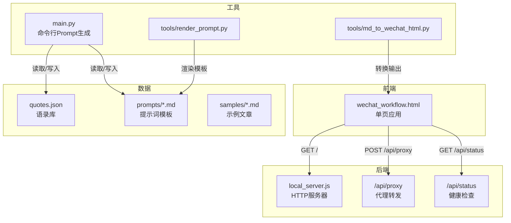
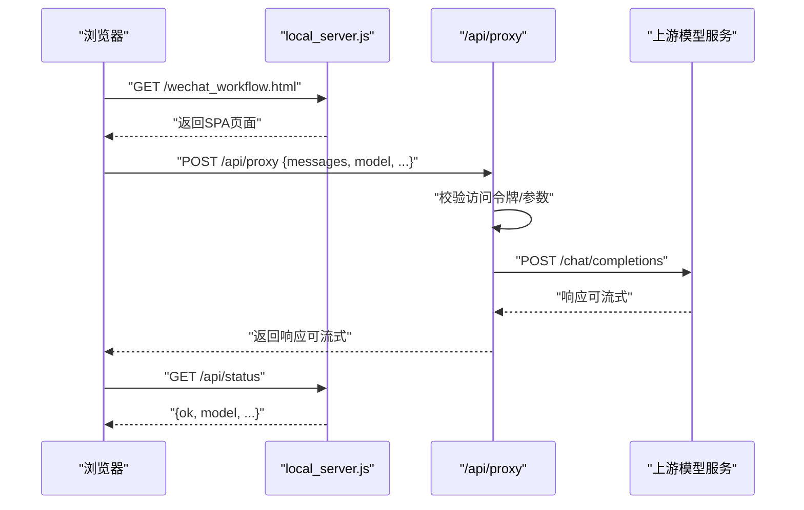
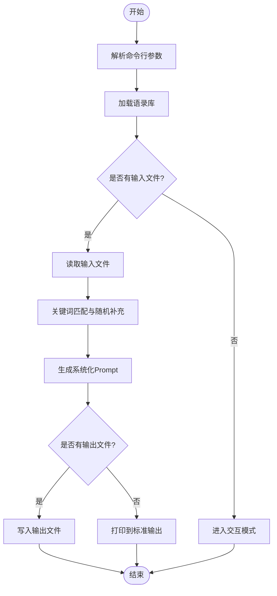
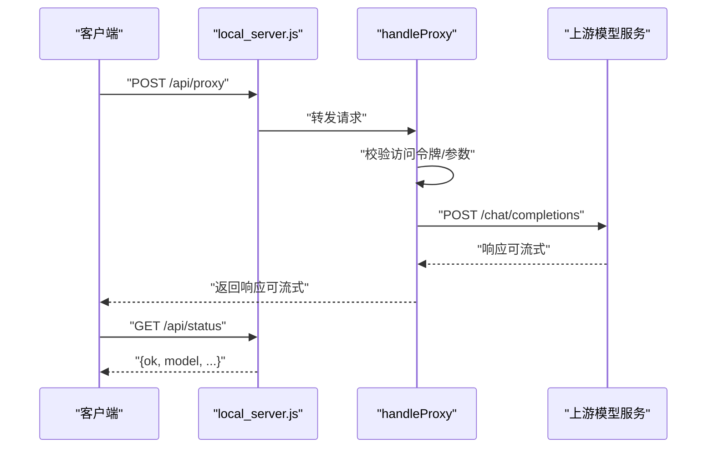
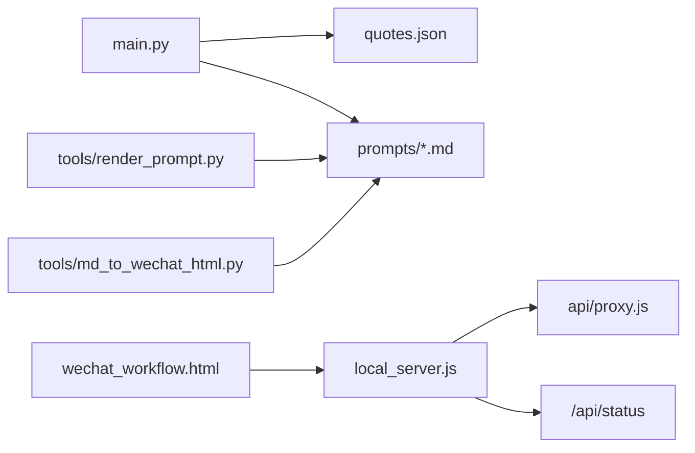

# 快速开始

<cite>
**本文引用的文件**
- [README_DEPLOY.md](file://README_DEPLOY.md)
- [VERCEL_GUIDE.md](file://VERCEL_GUIDE.md)
- [main.py](file://main.py)
- [local_server.js](file://local_server.js)
- [api/proxy.js](file://api/proxy.js)
- [tools/render_prompt.py](file://tools/render_prompt.py)
- [tools/md_to_wechat_html.py](file://tools/md_to_wechat_html.py)
- [wechat_workflow.html](file://wechat_workflow.html)
- [quotes.json](file://quotes.json)
- [Dockerfile](file://Dockerfile)
- [prompts/wechat_verify_v1.md](file://prompts/wechat_verify_v1.md)
- [samples/1月份的腾讯都没买的话这么多年的互联网白干了.md](file://samples/1月份的腾讯都没买的话这么多年的互联网白干了.md)
</cite>

## 目录
1. [简介](#简介)
2. [项目结构](#项目结构)
3. [核心组件](#核心组件)
4. [架构总览](#架构总览)
5. [详细组件解析](#详细组件解析)
6. [依赖关系分析](#依赖关系分析)
7. [性能与可用性建议](#性能与可用性建议)
8. [常见问题与故障排除](#常见问题与故障排除)
9. [结语](#结语)
10. [附录](#附录)

## 简介
本指南面向首次接触“投资智慧回响”项目的用户，目标是在约30分钟内完成环境准备、项目克隆与安装、基础使用（命令行与交互模式）、生成首个Prompt、使用API代理服务以及启动本地服务器。文档同时提供常见问题与故障排除建议，帮助你在最短时间内上手并稳定运行。

## 项目结构
该项目采用前后端分离思路：
- 前端：单页应用（SPA）页面用于输入、生成Prompt、预览与导出，位于网页文件中。
- 后端：Node.js本地服务器提供静态资源、健康检查与API代理；Python脚本用于命令行模式生成Prompt。
- 工具：若干Python脚本用于渲染模板、将Markdown转为微信公众号HTML。
- 配置：支持通过环境变量注入API Key、模型、推理强度等参数。

图表来源
- [wechat_workflow.html](file://wechat_workflow.html)
- [local_server.js](file://local_server.js)
- [api/proxy.js](file://api/proxy.js)
- [main.py](file://main.py)
- [tools/render_prompt.py](file://tools/render_prompt.py)
- [tools/md_to_wechat_html.py](file://tools/md_to_wechat_html.py)
- [quotes.json](file://quotes.json)
- [prompts/wechat_verify_v1.md](file://prompts/wechat_verify_v1.md)
- [samples/1月份的腾讯都没买的话这么多年的互联网白干了.md](file://samples/1月份的腾讯都没买的话这么多年的互联网白干了.md)

章节来源
- [wechat_workflow.html](file://wechat_workflow.html)
- [local_server.js](file://local_server.js)
- [main.py](file://main.py)
- [tools/render_prompt.py](file://tools/render_prompt.py)
- [tools/md_to_wechat_html.py](file://tools/md_to_wechat_html.py)
- [quotes.json](file://quotes.json)
- [prompts/wechat_verify_v1.md](file://prompts/wechat_verify_v1.md)
- [samples/1月份的腾讯都没买的话这么多年的互联网白干了.md](file://samples/1月份的腾讯都没买的话这么多年的互联网白干了.md)

## 核心组件
- 命令行Prompt生成器（Python）：支持文件模式与交互模式，自动匹配语录并生成系统化Prompt。
- 本地HTTP服务器（Node.js）：提供静态页面、/api/status健康检查、/api/proxy代理转发。
- API代理（Node.js）：接收前端请求，转发到上游模型服务，支持流式返回。
- 渲染与导出工具（Python）：渲染模板、将Markdown转换为微信公众号HTML。
- 前端页面（HTML/CSS/JS）：提供输入、预览、修订、导出等功能。

章节来源
- [main.py](file://main.py)
- [local_server.js](file://local_server.js)
- [api/proxy.js](file://api/proxy.js)
- [tools/render_prompt.py](file://tools/render_prompt.py)
- [tools/md_to_wechat_html.py](file://tools/md_to_wechat_html.py)
- [wechat_workflow.html](file://wechat_workflow.html)

## 架构总览
下图展示从浏览器到上游模型的典型调用链路，以及本地服务器如何作为代理与健康检查入口。

图表来源
- [local_server.js](file://local_server.js)
- [api/proxy.js](file://api/proxy.js)

## 详细组件解析

### 命令行模式（Python）
- 功能：从输入文件读取草稿，基于语录库匹配相关语录，生成系统化Prompt，可输出到文件或标准输出。
- 使用场景：批量生成、自动化集成、离线工作流。
- 关键流程：
  1) 解析参数（输入/输出路径）
  2) 加载语录库
  3) 关键词匹配与随机补充
  4) 生成最终Prompt
  5) 写入输出或打印

图表来源
- [main.py](file://main.py)
- [quotes.json](file://quotes.json)

章节来源
- [main.py](file://main.py)
- [quotes.json](file://quotes.json)

### 交互模式（Python）
- 功能：持续交互式输入，实时检索语录并生成Prompt，便于快速试错与迭代。
- 使用场景：快速原型、即时反馈、学习Prompt构造。
- 关键流程：
  1) 欢迎提示
  2) 循环读取用户输入
  3) 匹配语录并生成Prompt
  4) 输出Prompt并提示复制
  5) 记录操作日志

章节来源
- [main.py](file://main.py)

### 本地服务器（Node.js）
- 功能：提供静态页面、/api/status健康检查、/api/proxy代理转发。
- 环境变量：
  - PORT/HOST：监听端口与主机
  - OPENAI_BASE_URL/OPENAI_API_KEY/OPENAI_MODEL/OPENAI_REASONING_EFFORT：上游模型配置
  - ARTICLE_JIKE_ACCESS_TOKEN：访问令牌（可选）
- 关键路由：
  - GET /api/status：返回服务状态、模型、推理强度、授权状态等
  - POST /api/proxy：代理上游模型请求，支持流式返回
  - 默认首页：/wechat_workflow.html

图表来源
- [local_server.js](file://local_server.js)
- [api/proxy.js](file://api/proxy.js)

章节来源
- [local_server.js](file://local_server.js)
- [api/proxy.js](file://api/proxy.js)

### API代理（Node.js）
- 功能：接收前端请求，校验访问令牌，拼装上游请求参数，转发到上游模型服务，支持流式返回。
- 参数优先级：请求体 > 环境变量
- 支持字段：baseUrl、apiKey、model、messages、stream、reasoning_effort、max_tokens、max_completion_tokens、temperature、top_p
- 访问控制：若配置了访问令牌，则必须在请求头或请求体中携带一致令牌

章节来源
- [api/proxy.js](file://api/proxy.js)

### 渲染与导出工具（Python）
- render_prompt.py：将模板中的占位符替换为输入草稿与可选参数，输出到指定文件。
- md_to_wechat_html.py：将Markdown转换为适配微信公众号的HTML，内置多种排版风格预设。

章节来源
- [tools/render_prompt.py](file://tools/render_prompt.py)
- [tools/md_to_wechat_html.py](file://tools/md_to_wechat_html.py)

### 前端页面（HTML/CSS/JS）
- 功能：提供输入区域、Prompt预览、配置面板、修订与导出能力，适配移动端与桌面端。
- 与后端协作：通过POST /api/proxy与本地服务器通信；通过GET /api/status进行健康检查。

章节来源
- [wechat_workflow.html](file://wechat_workflow.html)

## 依赖关系分析
- Python侧依赖：标准库（os、sys、argparse、json、datetime、random）。
- Node.js侧依赖：内置模块（http、fs、path），通过fetch与上游模型通信。
- 配置与环境：通过环境变量注入API Key、模型、推理强度等。
- 数据依赖：quotes.json提供语录库；prompts目录提供模板；samples提供示例文章。

图表来源
- [main.py](file://main.py)
- [quotes.json](file://quotes.json)
- [prompts/wechat_verify_v1.md](file://prompts/wechat_verify_v1.md)
- [tools/render_prompt.py](file://tools/render_prompt.py)
- [tools/md_to_wechat_html.py](file://tools/md_to_wechat_html.py)
- [local_server.js](file://local_server.js)
- [api/proxy.js](file://api/proxy.js)
- [wechat_workflow.html](file://wechat_workflow.html)

章节来源
- [main.py](file://main.py)
- [local_server.js](file://local_server.js)
- [api/proxy.js](file://api/proxy.js)
- [tools/render_prompt.py](file://tools/render_prompt.py)
- [tools/md_to_wechat_html.py](file://tools/md_to_wechat_html.py)
- [wechat_workflow.html](file://wechat_workflow.html)
- [prompts/wechat_verify_v1.md](file://prompts/wechat_verify_v1.md)
- [samples/1月份的腾讯都没买的话这么多年的互联网白干了.md](file://samples/1月份的腾讯都没买的话这么多年的互联网白干了.md)

## 性能与可用性建议
- 流式响应：代理层支持流式返回，建议在前端启用流式渲染以获得更好的交互体验。
- 缓存策略：当前实现未内置缓存，可在代理层增加请求去重与结果缓存（需结合业务场景评估）。
- 并发与超时：根据上游模型的并发限制与延迟，合理设置超时与重试策略。
- 日志与监控：命令行模式与本地服务器均输出关键日志，建议接入统一日志收集与告警。

[本节为通用建议，无需特定文件引用]

## 常见问题与故障排除
- 401 未授权
  - 现象：访问 /api/proxy 返回401。
  - 排查：确认是否配置了访问令牌；请求头或请求体中的令牌是否与配置一致。
  - 参考：本地服务器与代理均支持访问令牌校验。
  - 章节来源
    - [local_server.js](file://local_server.js)
    - [api/proxy.js](file://api/proxy.js)

- 400 缺少必要字段
  - 现象：/api/proxy 返回400，提示缺少baseUrl、apiKey、model或messages。
  - 排查：检查请求体字段是否齐全；优先级为请求体 > 环境变量。
  - 章节来源
    - [api/proxy.js](file://api/proxy.js)

- 403 路径越界
  - 现象：访问静态资源返回403。
  - 排查：确认请求路径未越权访问根目录之外的文件。
  - 章节来源
    - [local_server.js](file://local_server.js)

- 404 资源不存在
  - 现象：访问页面或静态资源返回404。
  - 排查：确认文件存在且路径正确。
  - 章节来源
    - [local_server.js](file://local_server.js)

- 500 代理异常
  - 现象：代理转发失败返回500。
  - 排查：检查上游模型服务可达性、认证信息与网络连通性。
  - 章节来源
    - [api/proxy.js](file://api/proxy.js)

- 命令行模式报错
  - 现象：找不到quotes.json或处理文件时异常。
  - 排查：确认quotes.json存在且编码为UTF-8；检查输入文件路径与权限。
  - 章节来源
    - [main.py](file://main.py)

- 本地服务器启动失败
  - 现象：端口占用或环境变量缺失导致启动失败。
  - 排查：调整PORT/HOST；确保OPENAI_BASE_URL、OPENAI_API_KEY、OPENAI_MODEL等配置正确。
  - 章节来源
    - [local_server.js](file://local_server.js)

## 结语
通过本指南，你已了解项目的核心组件、基本使用方式与常见问题排查方法。建议先完成本地服务器启动与健康检查，再尝试命令行与交互模式生成Prompt，并结合代理服务完成首次AI生成体验。后续可根据团队需求扩展访问令牌策略、日志与监控体系。

[本节为总结性内容，无需特定文件引用]

## 附录

### 环境准备与安装
- Python 3.x
  - 安装Python 3.x（建议使用3.8+）。
  - 运行命令行工具前，确保系统已安装Python解释器。
  - 章节来源
    - [main.py](file://main.py)

- Node.js
  - 安装Node.js（建议使用较新的LTS版本）。
  - 用于启动本地服务器与运行代理服务。
  - 章节来源
    - [local_server.js](file://local_server.js)

- 项目克隆与安装
  - 克隆仓库后，确保Python与Node.js环境可用。
  - 若需要容器化部署，可参考Dockerfile构建镜像。
  - 章节来源
    - [Dockerfile](file://Dockerfile)

### 基本使用教程

- 命令行模式
  - 文件模式：传入输入文件与输出文件，生成并保存Prompt。
  - 交互模式：直接运行脚本，按提示输入草稿，实时生成Prompt。
  - 章节来源
    - [main.py](file://main.py)

- 交互模式
  - 运行脚本后，按提示输入想法或草稿，系统将输出可复制的Prompt。
  - 章节来源
    - [main.py](file://main.py)

- 使用API代理服务
  - 通过POST /api/proxy向本地服务器发起请求，携带messages、model等参数。
  - 可选开启流式返回，以获得更流畅的交互体验。
  - 章节来源
    - [local_server.js](file://local_server.js)
    - [api/proxy.js](file://api/proxy.js)

- 启动本地服务器
  - 设置环境变量（如PORT、OPENAI_BASE_URL、OPENAI_API_KEY、OPENAI_MODEL等）。
  - 启动Node.js服务器，默认监听端口并提供SPA页面与API。
  - 章节来源
    - [local_server.js](file://local_server.js)

### 使用示例

- 生成第一个Prompt
  - 使用命令行模式读取示例文章，生成系统化Prompt。
  - 示例文章路径：samples/1月份的腾讯都没买的话这么多年的互联网白干了.md
  - 章节来源
    - [main.py](file://main.py)
    - [samples/1月份的腾讯都没买的话这么多年的互联网白干了.md](file://samples/1月份的腾讯都没买的话这么多年的互联网白干了.md)

- 使用API代理服务
  - 在浏览器中打开本地服务器页面，输入草稿，点击“AI 自动生成”。
  - 前端将通过POST /api/proxy与本地服务器通信。
  - 章节来源
    - [wechat_workflow.html](file://wechat_workflow.html)
    - [local_server.js](file://local_server.js)
    - [api/proxy.js](file://api/proxy.js)

- 启动本地服务器
  - 设置必要环境变量后，启动Node.js服务器。
  - 访问 /api/status 确认服务健康。
  - 章节来源
    - [local_server.js](file://local_server.js)

### 部署参考
- Vercel部署与环境变量配置可参考官方指南。
- 服务器systemd部署与最小服务配置可参考部署指南。
- 章节来源
    - [README_DEPLOY.md](file://README_DEPLOY.md)
    - [VERCEL_GUIDE.md](file://VERCEL_GUIDE.md)