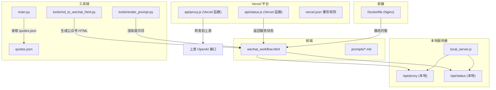
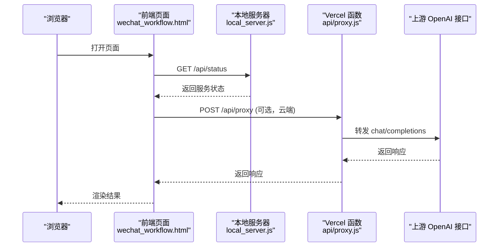
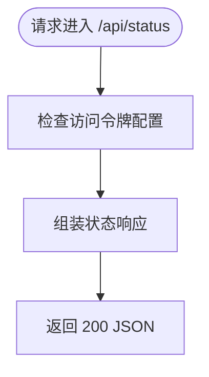
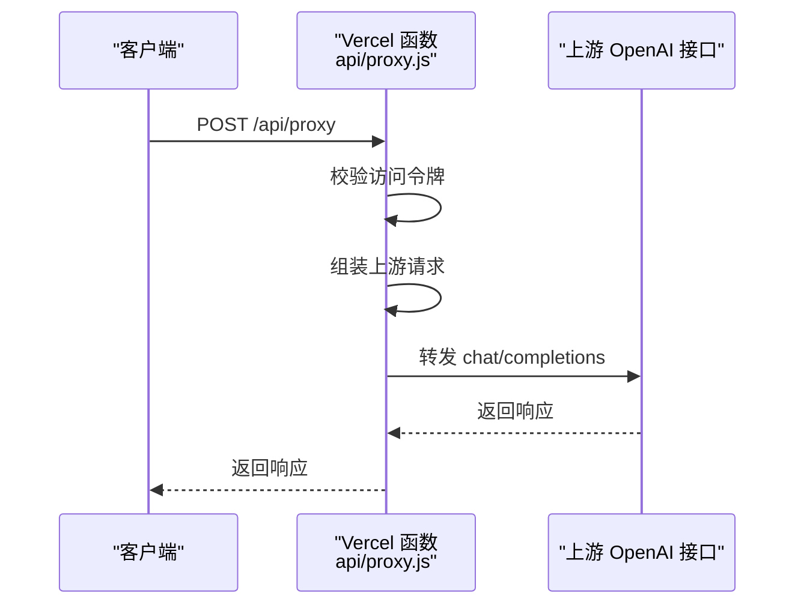
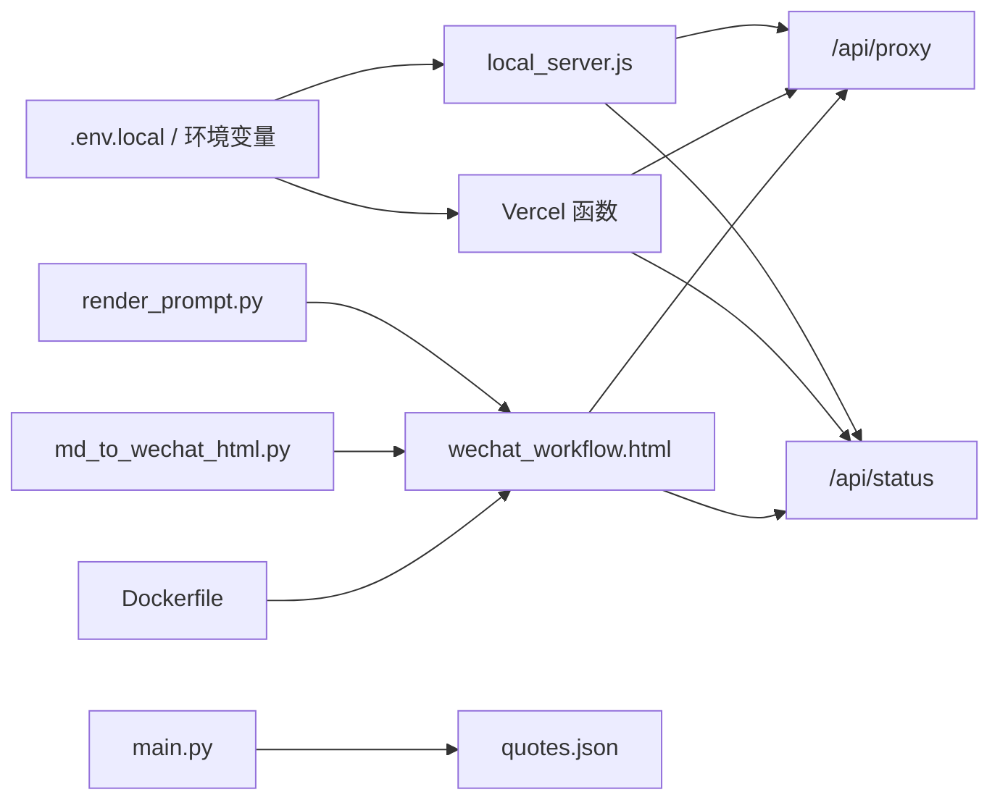

# 故障排除

<cite>
**本文引用的文件**
- [README_DEPLOY.md](file://README_DEPLOY.md)
- [VERCEL_GUIDE.md](file://VERCEL_GUIDE.md)
- [local_server.js](file://local_server.js)
- [api/proxy.js](file://api/proxy.js)
- [api/status.js](file://api/status.js)
- [wechat_workflow.html](file://wechat_workflow.html)
- [tools/md_to_wechat_html.py](file://tools/md_to_wechat_html.py)
- [tools/render_prompt.py](file://tools/render_prompt.py)
- [main.py](file://main.py)
- [Dockerfile](file://Dockerfile)
- [vercel.json](file://vercel.json)
- [quotes.json](file://quotes.json)
</cite>

## 目录
1. [简介](#简介)
2. [项目结构](#项目结构)
3. [核心组件](#核心组件)
4. [架构总览](#架构总览)
5. [详细组件分析](#详细组件分析)
6. [依赖关系分析](#依赖关系分析)
7. [性能考虑](#性能考虑)
8. [故障排除指南](#故障排除指南)
9. [结论](#结论)
10. [附录](#附录)

## 简介
本指南面向运维与使用者，系统化梳理部署、API 连接、文件处理、前端界面等常见问题的诊断与解决方法。内容覆盖环境变量配置、代理转发、健康检查、静态资源访问、Python 工具链、Docker/Nginx 部署以及日志与监控建议，帮助快速定位并解决问题。

## 项目结构
该项目包含前端页面、Node 本地服务器、Vercel 函数代理、Python 工具链与提示模板等模块。前端页面通过静态资源提供，后端通过本地服务器或 Vercel 函数实现 API 代理与状态检查。

图表来源
- [local_server.js:127-196](file://local_server.js#L127-L196)
- [api/proxy.js:23-118](file://api/proxy.js#L23-L118)
- [api/status.js:12-28](file://api/status.js#L12-L28)
- [wechat_workflow.html:1-800](file://wechat_workflow.html#L1-L800)
- [tools/md_to_wechat_html.py:1-256](file://tools/md_to_wechat_html.py#L1-L256)
- [tools/render_prompt.py:1-28](file://tools/render_prompt.py#L1-L28)
- [main.py:1-195](file://main.py#L1-L195)
- [Dockerfile:1-14](file://Dockerfile#L1-L14)
- [vercel.json:1-5](file://vercel.json#L1-L5)

章节来源
- [local_server.js:127-196](file://local_server.js#L127-L196)
- [api/proxy.js:23-118](file://api/proxy.js#L23-L118)
- [api/status.js:12-28](file://api/status.js#L12-L28)
- [wechat_workflow.html:1-800](file://wechat_workflow.html#L1-L800)
- [tools/md_to_wechat_html.py:1-256](file://tools/md_to_wechat_html.py#L1-L256)
- [tools/render_prompt.py:1-28](file://tools/render_prompt.py#L1-L28)
- [main.py:1-195](file://main.py#L1-L195)
- [Dockerfile:1-14](file://Dockerfile#L1-L14)
- [vercel.json:1-5](file://vercel.json#L1-L5)

## 核心组件
- 本地服务器：提供静态页面、/api/proxy 与 /api/status，支持访问令牌校验与 OpenAI 代理转发。
- Vercel 函数：与本地服务器一致的 /api/proxy 与 /api/status，便于云端部署与调试。
- 前端页面：微信公众号写作工作流页面，包含输入、排版、修订与输出预览。
- Python 工具链：提示词渲染、Markdown 到公众号 HTML 的排版转换、交互式提示词生成。
- Docker/Nginx：容器化静态托管方案，适合仅前端静态页面的部署。

章节来源
- [local_server.js:127-196](file://local_server.js#L127-L196)
- [api/proxy.js:23-118](file://api/proxy.js#L23-L118)
- [api/status.js:12-28](file://api/status.js#L12-L28)
- [wechat_workflow.html:1-800](file://wechat_workflow.html#L1-L800)
- [tools/md_to_wechat_html.py:1-256](file://tools/md_to_wechat_html.py#L1-L256)
- [tools/render_prompt.py:1-28](file://tools/render_prompt.py#L1-L28)
- [main.py:1-195](file://main.py#L1-L195)
- [Dockerfile:1-14](file://Dockerfile#L1-L14)

## 架构总览
系统采用“前端静态 + 后端代理”的模式。本地服务器与 Vercel 函数均提供 /api/proxy 与 /api/status，前者负责将请求转发至上游 OpenAI 接口，后者返回服务状态信息。前端页面通过 AJAX 调用 /api/proxy 获取 AI 内容，或调用 /api/status 进行健康检查。

图表来源
- [local_server.js:140-154](file://local_server.js#L140-L154)
- [api/proxy.js:23-118](file://api/proxy.js#L23-L118)
- [wechat_workflow.html:1-800](file://wechat_workflow.html#L1-L800)

章节来源
- [local_server.js:140-154](file://local_server.js#L140-L154)
- [api/proxy.js:23-118](file://api/proxy.js#L23-L118)
- [wechat_workflow.html:1-800](file://wechat_workflow.html#L1-L800)

## 详细组件分析

### 本地服务器与健康检查
- /api/status：返回服务状态、模型、推理策略、访问控制开关、授权状态与密钥配置状态等。
- /api/proxy：接收客户端请求，校验访问令牌，构造上游请求并转发，支持流式与非流式响应。

图表来源
- [local_server.js:140-154](file://local_server.js#L140-L154)

章节来源
- [local_server.js:140-154](file://local_server.js#L140-L154)

### Vercel 函数代理
- /api/proxy：与本地服务器一致的代理逻辑，支持访问令牌校验、参数透传、推理策略与流式响应。
- 日志：函数日志包含代理调试信息，便于定位上游配置与请求参数问题。

图表来源
- [api/proxy.js:23-118](file://api/proxy.js#L23-L118)

章节来源
- [api/proxy.js:23-118](file://api/proxy.js#L23-L118)

### 前端页面与交互
- 页面包含输入、排版、修订与输出预览区域，支持访问令牌设置与模型参数配置。
- 健康检查：页面可通过 /api/status 获取服务可用性与授权状态。

章节来源
- [wechat_workflow.html:1-800](file://wechat_workflow.html#L1-L800)
- [local_server.js:140-154](file://local_server.js#L140-L154)

### Python 工具链
- 提示词渲染：将草稿与模板拼接为最终提示词，支持保留关键信息与扩展要点。
- 公众号 HTML 排版：将 Markdown 转换为公众号可粘贴的 HTML，内置多种风格预设。
- 交互式提示词生成：基于 quotes.json 中的语录，按关键词匹配生成风格化 Prompt。

章节来源
- [tools/render_prompt.py:1-28](file://tools/render_prompt.py#L1-L28)
- [tools/md_to_wechat_html.py:1-256](file://tools/md_to_wechat_html.py#L1-L256)
- [main.py:1-195](file://main.py#L1-L195)
- [quotes.json:1-108](file://quotes.json#L1-L108)

### 容器化静态托管
- 使用 Nginx 静态托管 wechat_workflow.html 与 prompts 目录，适合仅前端静态页面的部署场景。

章节来源
- [Dockerfile:1-14](file://Dockerfile#L1-L14)

## 依赖关系分析
- 本地服务器依赖环境变量（如 OPENAI_API_KEY、OPENAI_MODEL、OPENAI_BASE_URL、ARTICLE_JIKE_ACCESS_TOKEN）与 .env.local。
- Vercel 函数依赖平台环境变量（OPENAI_API_KEY、OPENAI_MODEL、OPENAI_BASE_URL）与 vercel.json 的重写规则。
- 前端页面依赖本地服务器或 Vercel 函数提供的 /api/proxy 与 /api/status。
- Python 工具链依赖 quotes.json 与输入输出文件路径。

图表来源
- [local_server.js:34-48](file://local_server.js#L34-L48)
- [api/proxy.js:35-37](file://api/proxy.js#L35-L37)
- [vercel.json:1-5](file://vercel.json#L1-L5)
- [wechat_workflow.html:1-800](file://wechat_workflow.html#L1-L800)
- [main.py:32-43](file://main.py#L32-L43)
- [tools/render_prompt.py:1-28](file://tools/render_prompt.py#L1-L28)
- [tools/md_to_wechat_html.py:1-256](file://tools/md_to_wechat_html.py#L1-L256)
- [Dockerfile:1-14](file://Dockerfile#L1-L14)

章节来源
- [local_server.js:34-48](file://local_server.js#L34-L48)
- [api/proxy.js:35-37](file://api/proxy.js#L35-L37)
- [vercel.json:1-5](file://vercel.json#L1-L5)
- [wechat_workflow.html:1-800](file://wechat_workflow.html#L1-L800)
- [main.py:32-43](file://main.py#L32-L43)
- [tools/render_prompt.py:1-28](file://tools/render_prompt.py#L1-L28)
- [tools/md_to_wechat_html.py:1-256](file://tools/md_to_wechat_html.py#L1-L256)
- [Dockerfile:1-14](file://Dockerfile#L1-L14)

## 性能考虑
- 流式响应：代理转发支持流式输出，降低首字节延迟，改善用户体验。
- 缓存控制：/api/status 设置 Cache-Control: no-store，避免缓存状态信息。
- 资源类型：根据扩展名设置 Content-Type，减少浏览器解析错误与额外往返。
- 部署选择：本地服务器适合内网或自管环境；Vercel 函数适合云端弹性与可观测性；Docker/Nginx 适合静态托管。

章节来源
- [local_server.js:104-117](file://local_server.js#L104-L117)
- [local_server.js:10-13](file://local_server.js#L10-L13)
- [local_server.js:171-180](file://local_server.js#L171-L180)
- [Dockerfile:1-14](file://Dockerfile#L1-L14)

## 故障排除指南

### 一、环境配置问题
- 症状
  - 云端部署后 AI 功能返回 401。
  - 本地服务器启动后 /api/status 显示 serverKeyConfigured 为 false。
- 可能原因
  - 未正确配置 OPENAI_API_KEY、OPENAI_MODEL、OPENAI_BASE_URL。
  - 未设置 ARTICLE_JIKE_ACCESS_TOKEN 或 APP_ACCESS_TOKEN 导致访问控制开启。
  - .env.local 未被正确加载（仅本地服务器）。
- 解决步骤
  - Vercel：在项目设置的 Environment Variables 中添加 OPENAI_API_KEY、OPENAI_MODEL、OPENAI_BASE_URL，并重新部署。
  - 本地：确保 .env.local 存在且包含 KEY=VALUE 行，重启服务器。
  - 访问令牌：如需启用访问控制，在前端设置中填入 ARTICLE_JIKE_ACCESS_TOKEN，或在请求头携带相应令牌。
- 预防与监控
  - 在 /api/status 中核对 serverKeyConfigured、accessControl、authorized 字段。
  - 使用 vercel.json 的重写规则确保 /api/* 路由正确转发。

章节来源
- [README_DEPLOY.md:26-42](file://README_DEPLOY.md#L26-L42)
- [VERCEL_GUIDE.md:12-31](file://VERCEL_GUIDE.md#L12-L31)
- [local_server.js:34-48](file://local_server.js#L34-L48)
- [local_server.js:140-154](file://local_server.js#L140-L154)
- [vercel.json:1-5](file://vercel.json#L1-L5)

### 二、API 连接失败
- 症状
  - /api/proxy 返回 400（缺少必要字段）或 5xx（上游错误）。
  - 云端函数日志显示代理调试信息但请求失败。
- 可能原因
  - 缺少 baseUrl、apiKey、model 或 messages 参数。
  - 上游接口域名不可达或被防火墙阻断。
  - 推理策略（reasoning_effort）或参数（max_tokens 等）不被上游接受。
- 解决步骤
  - 校验请求体：确保包含 messages 数组与 model；如需流式输出，设置 stream=true。
  - 校验上游配置：确认 OPENAI_BASE_URL 与 OPENAI_API_KEY 正确，必要时在请求体中显式传入。
  - 查看函数日志：关注代理调试日志中的 finalBaseUrl、hasApiKey、model 等字段。
  - 临时方案：在本地服务器上使用 /api/proxy 进行对比测试，排除前端或网络问题。
- 预防与监控
  - 在 /api/status 中确认 model、reasoningEffort、serverKeyConfigured。
  - 使用 curl 或 Postman 直接调用 /api/proxy 验证参数与权限。

章节来源
- [api/proxy.js:51-63](file://api/proxy.js#L51-L63)
- [api/proxy.js:40-49](file://api/proxy.js#L40-L49)
- [local_server.js:73-77](file://local_server.js#L73-L77)
- [local_server.js:140-154](file://local_server.js#L140-L154)

### 三、文件处理错误
- 症状
  - Python 工具报错找不到输入文件或 quotes.json。
  - 交互式提示词生成中断。
- 可能原因
  - 输入路径不存在或编码不为 UTF-8。
  - quotes.json 缺失或格式不正确。
  - 权限不足导致读写失败。
- 解决步骤
  - 确认输入文件路径与编码，使用 UTF-8。
  - 检查 quotes.json 是否存在且为有效 JSON。
  - 在 logs/operations.log 查看最近操作日志，定位失败原因。
- 预防与监控
  - 在 CI/CD 中加入文件存在性与 JSON 校验步骤。
  - 为 Python 脚本增加更详细的异常捕获与日志记录。

章节来源
- [main.py:140-159](file://main.py#L140-L159)
- [main.py:32-43](file://main.py#L32-L43)
- [tools/md_to_wechat_html.py:236-256](file://tools/md_to_wechat_html.py#L236-L256)
- [tools/render_prompt.py:1-28](file://tools/render_prompt.py#L1-L28)

### 四、前端界面异常
- 症状
  - 页面空白或 404：静态资源路径错误或被重写规则覆盖。
  - 无法发起 /api/proxy 请求：跨域或路由未正确转发。
  - 访问令牌无效：前端设置未生效或请求头缺失。
- 可能原因
  - 路径解析错误导致文件越权访问被拒绝。
  - vercel.json 未正确重写 /api/*。
  - 前端未携带访问令牌或令牌不匹配。
- 解决步骤
  - 检查路径解析与文件存在性，确认返回的 Content-Type 与编码。
  - 核对 vercel.json 的重写规则，确保 /api/* 转发到 api/*。
  - 在浏览器开发者工具 Network 面板查看请求与响应头，确认 Access-Control 与 CORS。
  - 在 /api/status 中确认 authorized 字段与 accessControl 开关。
- 预防与监控
  - 在本地服务器上先验证静态资源与路由，再迁移至 Vercel。
  - 使用 /api/status 快速核对授权与密钥状态。

章节来源
- [local_server.js:131-138](file://local_server.js#L131-L138)
- [local_server.js:164-169](file://local_server.js#L164-L169)
- [vercel.json:1-5](file://vercel.json#L1-L5)
- [local_server.js:140-154](file://local_server.js#L140-L154)

### 五、容器化部署问题
- 症状
  - 容器启动后无法访问首页或提示 404。
  - 静态资源样式丢失。
- 可能原因
  - Nginx 默认首页未指向 wechat_workflow.html。
  - prompts 目录未正确拷贝。
- 解决步骤
  - 确认 Dockerfile 中 COPY 指令已包含 wechat_workflow.html 与 prompts。
  - 使用 docker build 与 docker run 验证静态页面可访问。
- 预防与监控
  - 在容器内执行 curl localhost/index.html 验证静态资源。
  - 使用 docker inspect 查看挂载与端口映射。

章节来源
- [Dockerfile:1-14](file://Dockerfile#L1-L14)

### 六、日志分析与性能排查
- 日志位置
  - 本地服务器：控制台输出（含代理调试与错误栈）。
  - Vercel 函数：平台日志（包含代理调试信息）。
  - Python：logs/operations.log。
- 分析技巧
  - 关注 /api/status 的 serverTime、uptimeSeconds、authorized、serverKeyConfigured。
  - 在 /api/proxy 中核对请求体字段与上游返回状态码。
  - 使用流式响应时，观察首字节到达时间与持续传输稳定性。
- 性能建议
  - 合理设置推理策略（reasoning_effort）与采样参数（temperature/top_p）。
  - 对长文本分批处理，避免超时。
  - 使用 CDN 缓存静态资源（如 Nginx 场景）。

章节来源
- [local_server.js:71](file://local_server.js#L71)
- [api/proxy.js:40-49](file://api/proxy.js#L40-L49)
- [main.py:20-31](file://main.py#L20-L31)
- [local_server.js:104-117](file://local_server.js#L104-L117)

## 结论
通过系统化的环境变量配置、代理转发与健康检查、文件处理与前端路由校验、容器化部署与日志监控，可快速定位并解决部署与运行中的大多数问题。建议在变更环境变量或上游配置后，优先使用 /api/status 与 /api/proxy 进行端到端验证，并结合日志与监控指标持续优化性能与稳定性。

## 附录

### A. 常见错误代码与含义
- 400 Bad Request：请求体缺少必要字段（如 baseUrl、apiKey、model、messages）。
- 401 Unauthorized：访问令牌缺失或不匹配。
- 403 Forbidden：路径越权访问（文件路径不在允许范围内）。
- 404 Not Found：静态资源不存在。
- 500 Internal Server Error：代理转发过程中发生异常。

章节来源
- [api/proxy.js:51-63](file://api/proxy.js#L51-L63)
- [local_server.js:164-169](file://local_server.js#L164-L169)
- [local_server.js:184-190](file://local_server.js#L184-L190)
- [api/proxy.js:112-117](file://api/proxy.js#L112-L117)

### B. 预防性维护与监控指标
- 预防性维护
  - 定期核对环境变量与 .env.local 内容一致性。
  - 在变更上游配置后，先在本地服务器验证 /api/proxy 与 /api/status。
  - 对 Python 工具链增加输入校验与异常捕获。
- 监控指标
  - /api/status：service、model、reasoningEffort、accessControl、authorized、serverKeyConfigured、uptimeSeconds、serverTime。
  - 日志：代理调试日志、Python 操作日志、Vercel 函数日志。

章节来源
- [local_server.js:140-154](file://local_server.js#L140-L154)
- [api/proxy.js:40-49](file://api/proxy.js#L40-L49)
- [main.py:20-31](file://main.py#L20-L31)