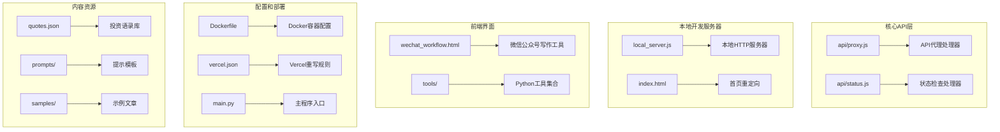
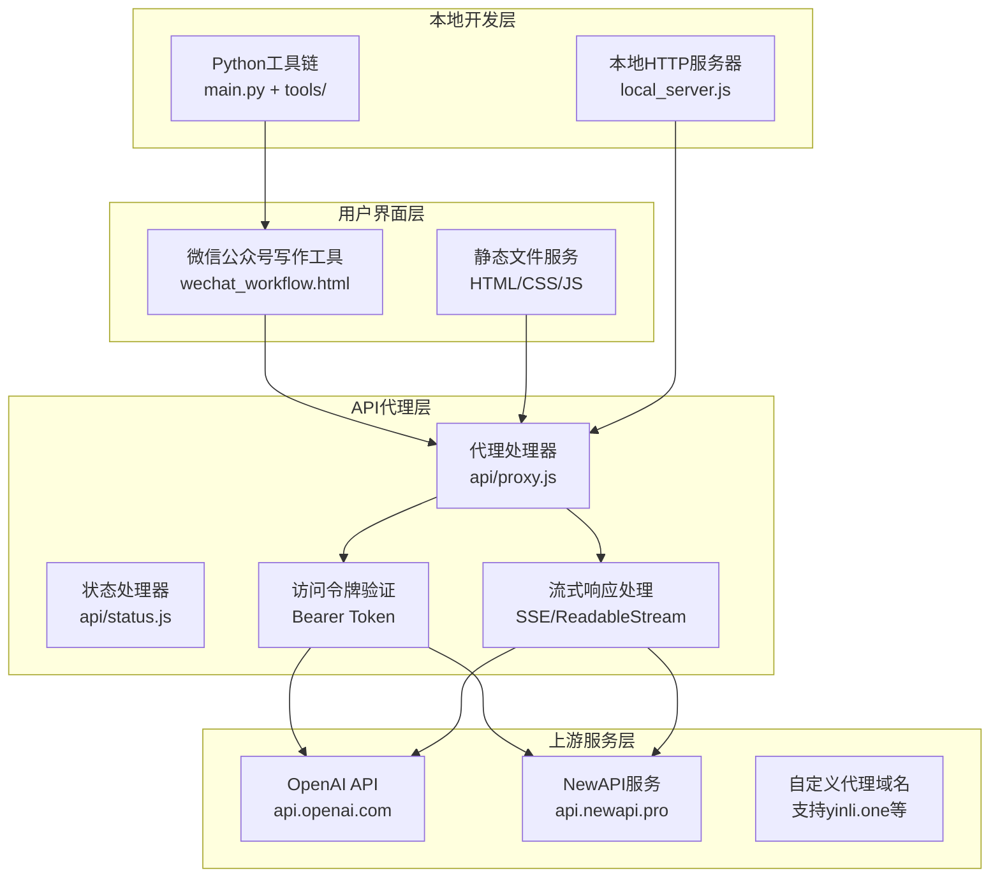
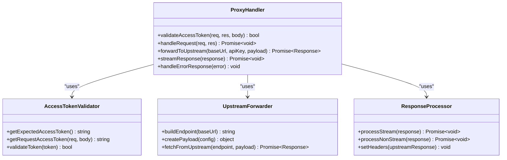
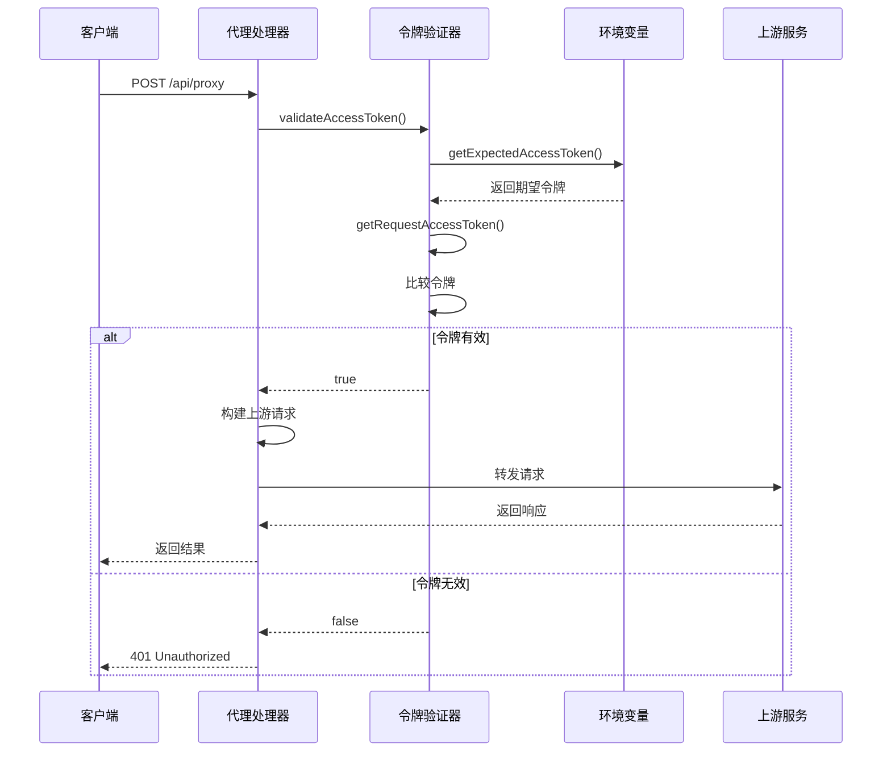
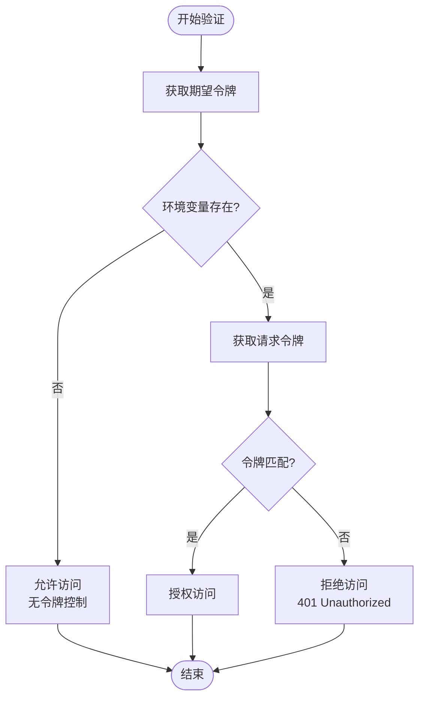
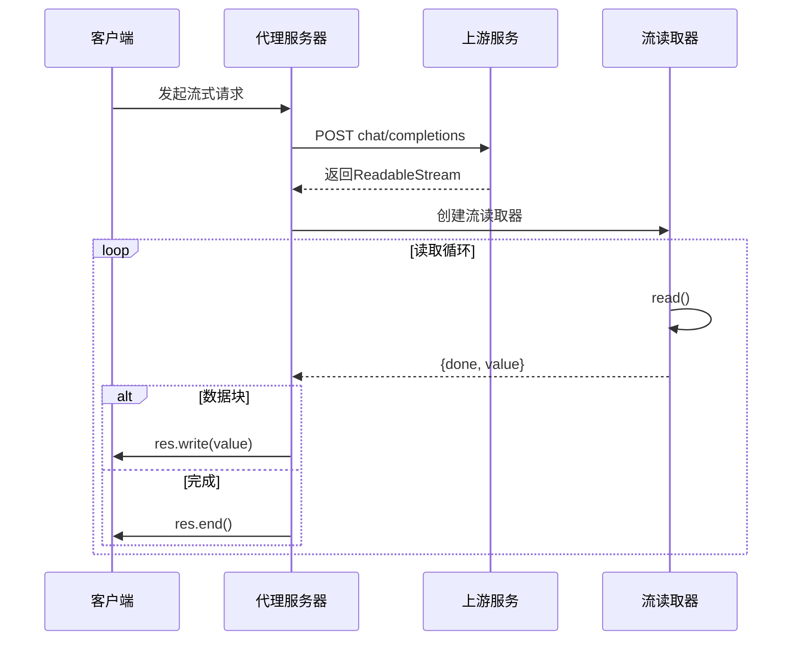
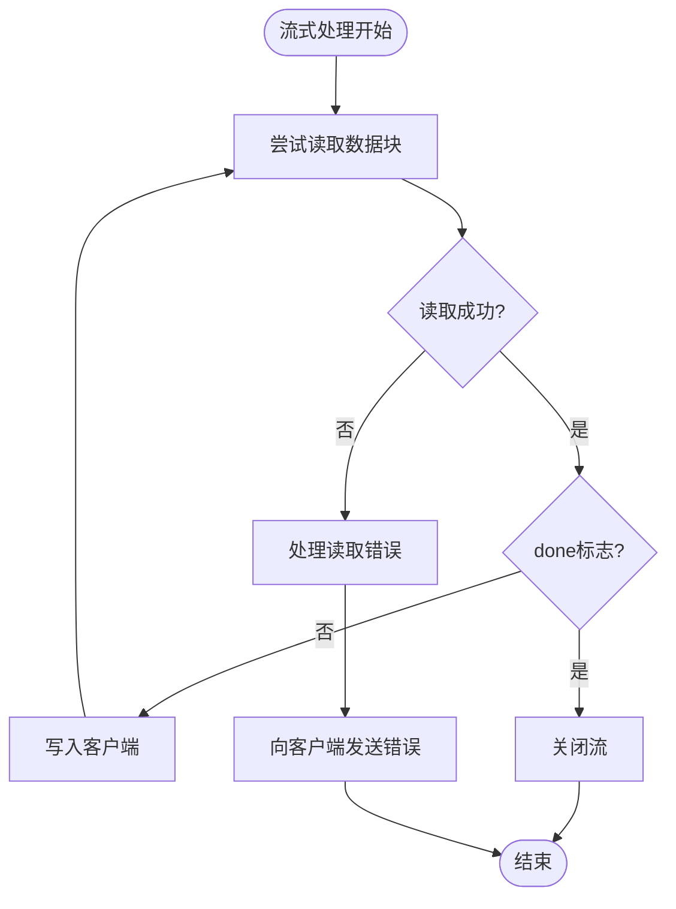

# API代理服务

<cite>
**本文档中引用的文件**
- [api/proxy.js](file://api/proxy.js)
- [api/status.js](file://api/status.js)
- [local_server.js](file://local_server.js)
- [main.py](file://main.py)
- [wechat_workflow.html](file://wechat_workflow.html)
- [index.html](file://index.html)
- [vercel.json](file://vercel.json)
- [Dockerfile](file://Dockerfile)
- [quotes.json](file://quotes.json)
- [tools/render_prompt.py](file://tools/render_prompt.py)
- [tools/md_to_wechat_html.py](file://tools/md_to_wechat_html.py)
- [prompts/wechat_verify_v1.md](file://prompts/wechat_verify_v1.md)
</cite>

## 目录
1. [简介](#简介)
2. [项目结构](#项目结构)
3. [核心组件](#核心组件)
4. [架构概览](#架构概览)
5. [详细组件分析](#详细组件分析)
6. [访问令牌验证机制](#访问令牌验证机制)
7. [流式响应处理技术](#流式响应处理技术)
8. [多API提供商支持架构](#多api提供商支持架构)
9. [API接口文档](#api接口文档)
10. [配置示例](#配置示例)
11. [调试技巧](#调试技巧)
12. [性能优化建议](#性能优化建议)
13. [故障排除指南](#故障排除指南)
14. [结论](#结论)

## 简介

API代理服务是一个基于JavaScript和Python构建的现代化AI内容创作平台，主要服务于微信公众号内容创作和投资分析。该系统提供了完整的API代理功能，支持多种AI提供商（包括OpenAI和NewAPI），具备强大的访问令牌验证机制、流式响应处理能力和灵活的配置选项。

系统采用前后端分离架构，前端使用HTML/CSS/JavaScript构建用户友好的界面，后端通过Node.js和Vercel Functions提供API服务，同时集成了Python工具链用于内容处理和模板渲染。

## 项目结构

该项目采用模块化组织方式，主要包含以下核心目录和文件：



**图表来源**
- [api/proxy.js:1-119](file://api/proxy.js#L1-L119)
- [local_server.js:1-204](file://local_server.js#L1-L204)
- [wechat_workflow.html:1-800](file://wechat_workflow.html#L1-L800)

**章节来源**
- [api/proxy.js:1-119](file://api/proxy.js#L1-L119)
- [local_server.js:1-204](file://local_server.js#L1-L204)
- [wechat_workflow.html:1-800](file://wechat_workflow.html#L1-L800)

## 核心组件

### API代理处理器 (api/proxy.js)

这是系统的核心组件，负责处理所有API代理请求。它实现了完整的访问令牌验证、请求转发和响应处理功能。

### 状态检查处理器 (api/status.js)

提供健康检查和状态查询功能，用于监控服务运行状态和配置信息。

### 本地开发服务器 (local_server.js)

为本地开发提供完整的HTTP服务器实现，包含静态文件服务、代理逻辑和访问控制。

### 前端工作流界面 (wechat_workflow.html)

基于Apple设计语言的现代化Web界面，提供直观的内容创作和编辑体验。

### Python内容处理工具 (main.py)

集成投资语录库的Python工具，支持CLI交互模式和文件处理模式。

**章节来源**
- [api/proxy.js:23-119](file://api/proxy.js#L23-L119)
- [api/status.js:12-29](file://api/status.js#L12-L29)
- [local_server.js:50-125](file://local_server.js#L50-L125)
- [main.py:129-195](file://main.py#L129-L195)

## 架构概览

系统采用三层架构设计，从上到下分别为用户界面层、API代理层和上游AI服务层：



**图表来源**
- [api/proxy.js:35-91](file://api/proxy.js#L35-L91)
- [local_server.js:128-196](file://local_server.js#L128-L196)

## 详细组件分析

### API代理处理器架构



**图表来源**
- [api/proxy.js:12-119](file://api/proxy.js#L12-L119)

### 访问令牌验证流程



**图表来源**
- [api/proxy.js:12-21](file://api/proxy.js#L12-L21)
- [api/proxy.js:5-10](file://api/proxy.js#L5-L10)

**章节来源**
- [api/proxy.js:12-119](file://api/proxy.js#L12-L119)

## 访问令牌验证机制

### 令牌格式检查

系统支持多种令牌传递方式，确保最大的兼容性和安全性：

1. **Header令牌**：通过 `x-article-jike-access-token` 头部传递
2. **Bearer令牌**：通过标准 `Authorization: Bearer <token>` 头部传递  
3. **请求体令牌**：通过 `accessToken` 字段在JSON请求体中传递

### 权限验证流程



**图表来源**
- [api/proxy.js:12-21](file://api/proxy.js#L12-L21)
- [api/proxy.js:5-10](file://api/proxy.js#L5-L10)

### 安全防护措施

1. **多源令牌验证**：支持三种令牌传递方式，提高可用性
2. **严格令牌比较**：使用精确字符串比较，避免模糊匹配
3. **环境变量优先**：令牌配置通过环境变量管理，便于部署
4. **日志记录**：详细的调试日志，便于问题排查

**章节来源**
- [api/proxy.js:1-21](file://api/proxy.js#L1-L21)

## 流式响应处理技术

### 数据流传输机制

系统实现了完整的流式响应处理，支持实时数据传输：



**图表来源**
- [api/proxy.js:96-106](file://api/proxy.js#L96-L106)
- [local_server.js:104-114](file://local_server.js#L104-L114)

### 缓冲区管理策略

1. **增量传输**：采用 `getReader()` 实现逐块读取，避免内存溢出
2. **实时写入**：数据块读取后立即写入客户端响应流
3. **完成检测**：通过 `done` 标志判断流结束，确保资源正确释放

### 错误处理策略



**图表来源**
- [api/proxy.js:101-106](file://api/proxy.js#L101-L106)

**章节来源**
- [api/proxy.js:96-118](file://api/proxy.js#L96-L118)
- [local_server.js:104-124](file://local_server.js#L104-L124)

## 多API提供商支持架构

### OpenAI集成

系统默认支持OpenAI API，通过以下环境变量配置：

- `OPENAI_BASE_URL`: API基础URL，默认为 `https://api.openai.com/v1`
- `OPENAI_API_KEY`: OpenAI API密钥
- `OPENAI_MODEL`: 默认模型名称
- `OPENAI_REASONING_EFFORT`: 推理努力程度设置

### NewAPI集成

系统同样支持NewAPI服务，通过对应的环境变量：

- `NEWAPI_BASE_URL`: NewAPI基础URL
- `NEWAPI_API_KEY`: NewAPI API密钥  
- `NEWAPI_MODEL`: NewAPI模型名称

### 自定义代理域名支持

系统移除了严格的域名白名单限制，支持自定义代理域名：

```javascript
// 移除的域名验证逻辑
// const urlObj = new URL(baseUrl)
// const host = urlObj.hostname
// const isAllowedHost = host === 'api.newapi.pro' || host.endsWith('.newapi.pro')
```

这种设计允许用户使用自定义域名（如 `yinli.one`）进行代理，提高了灵活性。

**章节来源**
- [api/proxy.js:35-37](file://api/proxy.js#L35-L37)
- [api/proxy.js:65-69](file://api/proxy.js#L65-L69)

## API接口文档

### 健康检查接口

**URL**: `/api/status`

**方法**: `GET`

**功能**: 提供服务健康检查和状态信息

**响应格式**:
```json
{
  "ok": true,
  "service": "article-jike",
  "model": "gpt-5.4",
  "reasoningEffort": null,
  "accessControl": false,
  "authorized": true,
  "serverKeyConfigured": false,
  "serverTime": "2024-01-01T00:00:00.000Z"
}
```

### 代理接口

**URL**: `/api/proxy`

**方法**: `POST`

**请求头**:
- `Content-Type: application/json`
- `Authorization: Bearer <access_token>` (可选)
- `x-article-jike-access-token: <access_token>` (可选)

**请求体参数**:

| 参数名 | 类型 | 必需 | 描述 | 默认值 |
|--------|------|------|------|--------|
| baseUrl | string | 否 | 上游API基础URL | `https://api.openai.com/v1` |
| apiKey | string | 是 | API密钥 | 从环境变量读取 |
| model | string | 否 | 模型名称 | `gpt-5.4` |
| messages | array | 是 | 消息数组 | - |
| stream | boolean | 否 | 是否启用流式响应 | false |
| reasoning_effort | string | 否 | 推理努力程度 | 从环境变量读取 |
| max_tokens | number | 否 | 最大生成tokens数 | - |
| max_completion_tokens | number | 否 | 最大完成tokens数 | - |
| temperature | number | 否 | 采样温度 | - |
| top_p | number | 否 | Top-P采样参数 | - |

**响应格式**:
- 成功: 直接转发上游API响应
- 400: 请求参数缺失
- 401: 未授权访问
- 405: 方法不允许
- 500: 内部服务器错误

**章节来源**
- [api/status.js:12-28](file://api/status.js#L12-L28)
- [api/proxy.js:23-119](file://api/proxy.js#L23-L119)

## 配置示例

### 环境变量配置

```bash
# 访问令牌配置
ARTICLE_JIKE_ACCESS_TOKEN=your_access_token
APP_ACCESS_TOKEN=alternative_token

# OpenAI配置
OPENAI_BASE_URL=https://api.openai.com/v1
OPENAI_API_KEY=sk-proj-your_openai_key
OPENAI_MODEL=gpt-4-turbo
OPENAI_REASONING_EFFORT=medium

# NewAPI配置
NEWAPI_BASE_URL=https://api.newapi.pro/v1
NEWAPI_API_KEY=your_newapi_key
NEWAPI_MODEL=gpt-4
```

### 本地开发配置

```javascript
// local_server.js 中的配置选项
const PORT = process.env.PORT || 3001;
const HOST = process.env.HOST || '0.0.0.0';

// .env.local 文件示例
ARTICLE_JIKE_ACCESS_TOKEN=dev_token
OPENAI_API_KEY=sk-dev-your_key
OPENAI_BASE_URL=http://localhost:8080/v1
```

### Docker部署配置

```dockerfile
FROM nginx:alpine

# 复制静态文件
COPY wechat_workflow.html /usr/share/nginx/html/index.html
COPY prompts /usr/share/nginx/html/prompts

# 暴露端口
EXPOSE 80

# 启动Nginx
CMD ["nginx", "-g", "daemon off;"]
```

**章节来源**
- [local_server.js:34-48](file://local_server.js#L34-L48)
- [Dockerfile:1-14](file://Dockerfile#L1-L14)

## 调试技巧

### 日志分析

系统提供了详细的调试日志输出：

```javascript
// 代理调试日志
console.log('[Proxy Debug]', {
    receivedBodyBaseUrl: body.baseUrl,
    envBaseUrl: process.env.OPENAI_BASE_URL || process.env.NEWAPI_BASE_URL,
    finalBaseUrl: baseUrl,
    hasApiKey: !!apiKey,
    apiKeyLength: apiKey ? apiKey.length : 0,
    model,
    envKeyExists: !!(process.env.OPENAI_API_KEY || process.env.NEWAPI_API_KEY)
});

// 本地代理调试日志
console.log('[Local Proxy]', { baseUrl, hasApiKey: !!apiKey, model, isStream });
```

### 常见问题排查

1. **401 Unauthorized错误**:
   - 检查访问令牌是否正确设置
   - 验证令牌传递方式（Header/Bearer/Body）
   - 确认环境变量配置

2. **400 Bad Request错误**:
   - 检查必需参数是否完整
   - 验证messages参数格式
   - 确认API密钥有效性

3. **流式响应问题**:
   - 检查上游服务是否支持流式响应
   - 验证网络连接稳定性
   - 监控客户端WebSocket连接

**章节来源**
- [api/proxy.js:40-49](file://api/proxy.js#L40-L49)
- [local_server.js:71](file://local_server.js#L71)

## 性能优化建议

### 连接池管理

1. **复用HTTP连接**: 利用Node.js内置的连接复用机制
2. **超时配置**: 设置合理的请求超时时间
3. **重试机制**: 实现指数退避重试策略

### 内存优化

1. **流式处理**: 始终使用流式API处理大型响应
2. **及时释放**: 确保流读取完成后正确释放资源
3. **缓存策略**: 合理使用内存缓存，避免内存泄漏

### 并发控制

```javascript
// 建议的并发限制
const MAX_CONCURRENT_REQUESTS = 10;
const REQUEST_TIMEOUT = 30000;

// 实现请求队列控制
class RequestQueue {
    constructor(maxConcurrent = MAX_CONCURRENT_REQUESTS) {
        this.maxConcurrent = maxConcurrent;
        this.current = 0;
        this.queue = [];
    }
    
    async add(request) {
        return new Promise((resolve, reject) => {
            this.queue.push({ request, resolve, reject });
            this.process();
        });
    }
    
    process() {
        if (this.current >= this.maxConcurrent) return;
        if (this.queue.length === 0) return;
        
        this.current++;
        const { request, resolve, reject } = this.queue.shift();
        
        request().then(resolve).catch(reject).finally(() => {
            this.current--;
            this.process();
        });
    }
}
```

## 故障排除指南

### 常见错误及解决方案

| 错误类型 | 错误码 | 可能原因 | 解决方案 |
|----------|--------|----------|----------|
| 认证失败 | 401 | 令牌无效或过期 | 检查令牌配置和有效期 |
| 参数错误 | 400 | 缺少必需参数 | 验证请求体格式和参数完整性 |
| 方法不允许 | 405 | 使用了错误的HTTP方法 | 确保使用POST方法 |
| 服务器错误 | 500 | 上游服务不可用 | 检查上游API状态和网络连接 |
| 超时错误 | 504 | 请求处理超时 | 优化请求参数和增加超时时间 |

### 监控和告警

```javascript
// 建议的监控指标
const metrics = {
    requestCount: 0,
    errorCount: 0,
    responseTime: 0,
    streamCount: 0,
    cacheHitRate: 0
};

// 错误统计
function trackError(error) {
    metrics.errorCount++;
    console.error('API Error:', error);
}
```

### 性能基准测试

```javascript
// 基准测试脚本示例
async function benchmark() {
    const startTime = Date.now();
    const results = await Promise.allSettled(
        Array.from({ length: 100 }, () => 
            fetch('/api/proxy', {
                method: 'POST',
                body: JSON.stringify(generateTestPayload())
            })
        )
    );
    const endTime = Date.now();
    
    const successRate = results.filter(r => r.status === 'fulfilled').length / results.length;
    console.log(`成功率: ${(successRate * 100).toFixed(2)}%`);
    console.log(`平均响应时间: ${((endTime - startTime) / results.length)}ms`);
}
```

**章节来源**
- [api/proxy.js:112-118](file://api/proxy.js#L112-L118)
- [local_server.js:119-124](file://local_server.js#L119-L124)

## 结论

API代理服务是一个功能完整、架构清晰的现代化AI内容创作平台。其核心优势包括：

1. **灵活的令牌验证机制**：支持多种令牌传递方式，确保安全性和可用性
2. **高效的流式响应处理**：实现实时数据传输，提供优秀的用户体验
3. **多提供商支持**：无缝集成OpenAI和NewAPI，支持自定义域名
4. **完善的开发工具链**：包含本地开发服务器、Python工具和前端界面
5. **可扩展的架构设计**：模块化设计便于功能扩展和维护

该系统适用于需要代理AI服务的企业和个人开发者，提供了从开发到部署的完整解决方案。通过合理的配置和优化，可以满足各种规模的应用需求。