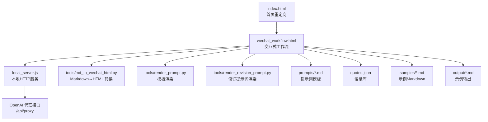
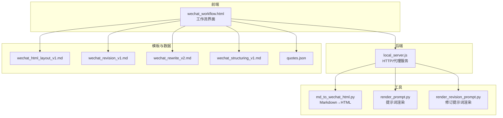
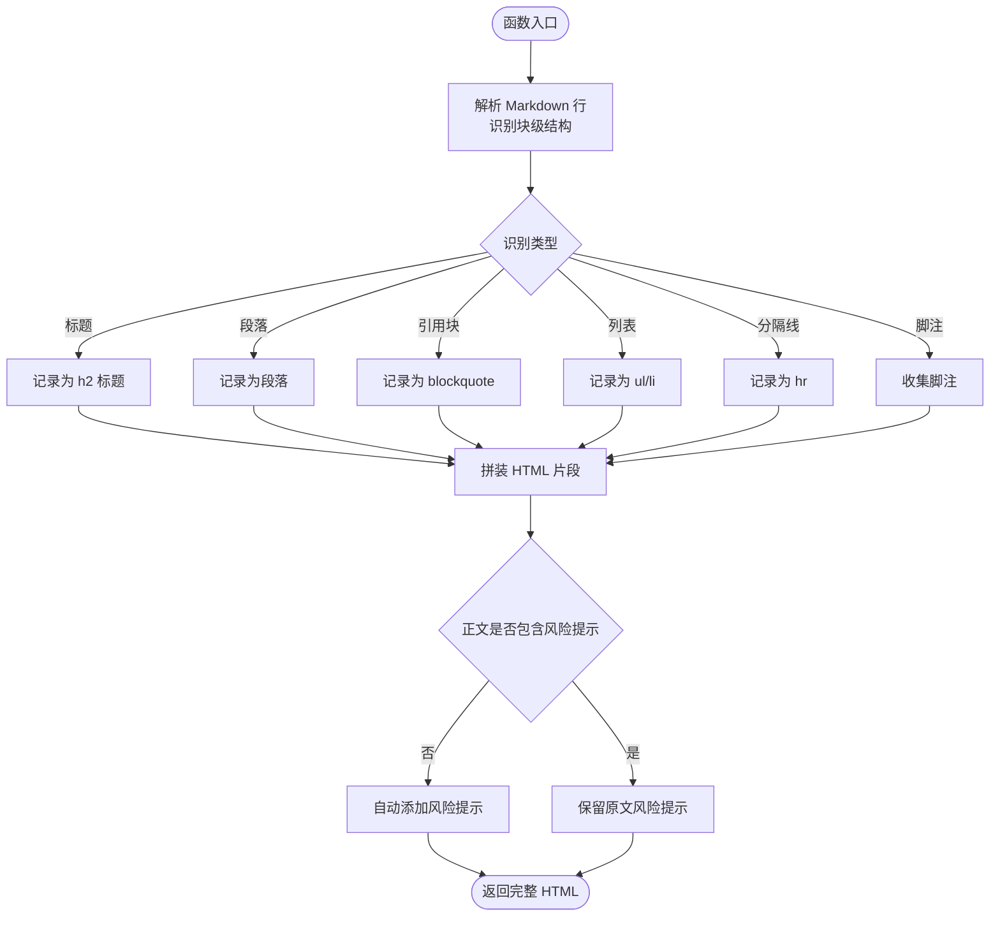
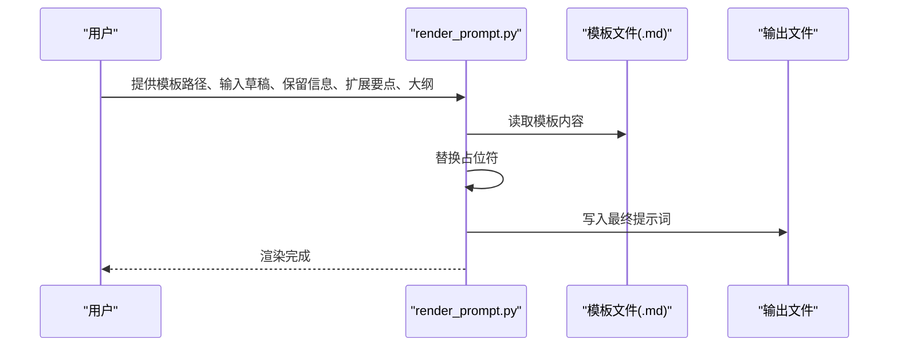
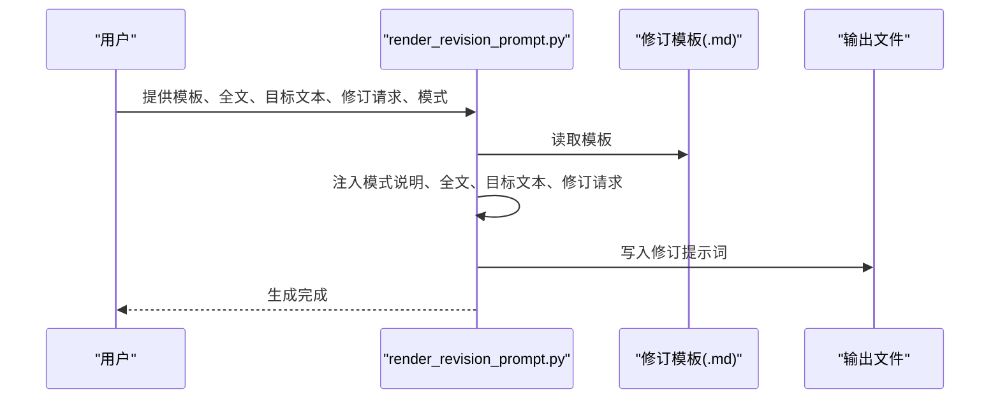
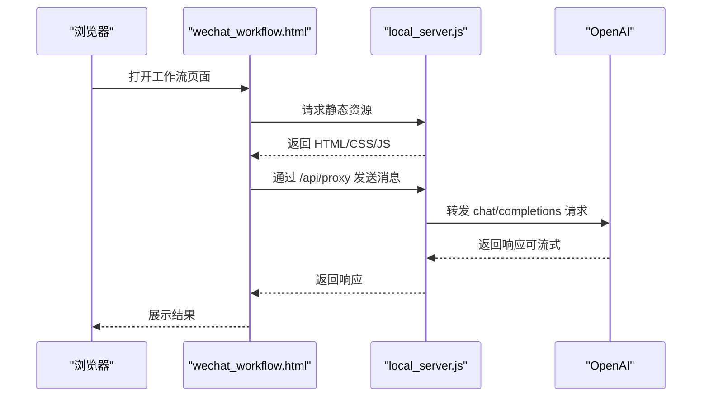
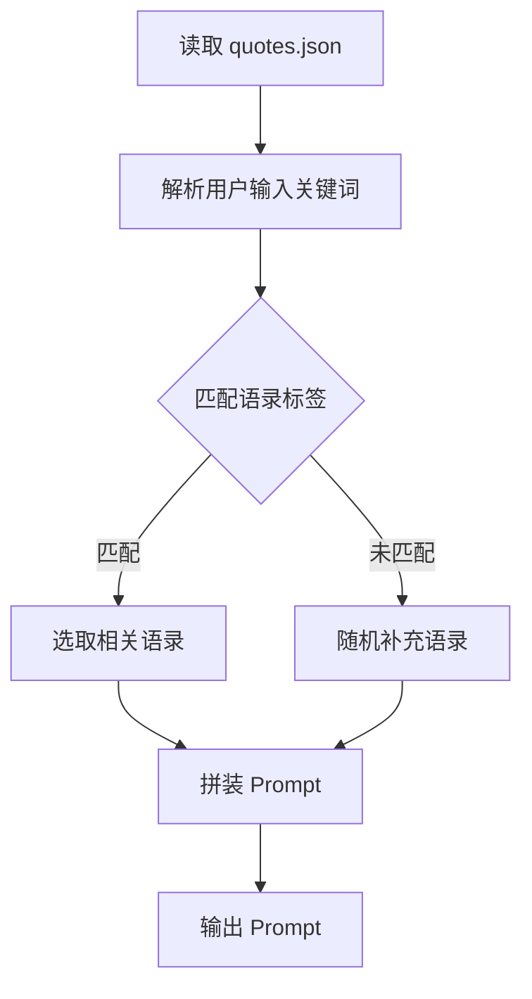
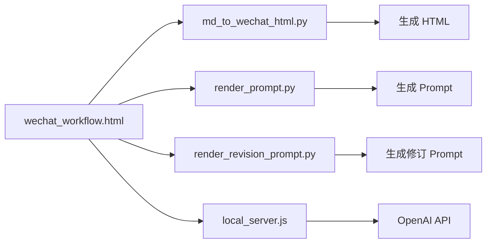

# 内容渲染系统

<cite>
**本文引用的文件**   
- [main.py](file://main.py)
- [md_to_wechat_html.py](file://tools/md_to_wechat_html.py)
- [render_prompt.py](file://tools/render_prompt.py)
- [render_revision_prompt.py](file://tools/render_revision_prompt.py)
- [wechat_workflow.html](file://wechat_workflow.html)
- [index.html](file://index.html)
- [local_server.js](file://local_server.js)
- [wechat_html_layout_v1.md](file://prompts/wechat_html_layout_v1.md)
- [wechat_revision_v1.md](file://prompts/wechat_revision_v1.md)
- [wechat_rewrite_v2.md](file://prompts/wechat_rewrite_v2.md)
- [wechat_structuring_v1.md](file://prompts/wechat_structuring_v1.md)
- [quotes.json](file://quotes.json)
- [samples/1月份的腾讯都没买的话这么多年的互联网白干了.md](file://samples/1月份的腾讯都没买的话这么多年的互联网白干了.md)
- [output/pop_mart_outline_test_html_prompt.md](file://output/pop_mart_outline_test_html_prompt.md)
- [output/pop_mart_outline_test_prompt.md](file://output/pop_mart_outline_test_prompt.md)
</cite>

## 目录
1. [简介](#简介)
2. [项目结构](#项目结构)
3. [核心组件](#核心组件)
4. [架构总览](#架构总览)
5. [详细组件分析](#详细组件分析)
6. [依赖分析](#依赖分析)
7. [性能考虑](#性能考虑)
8. [故障排查指南](#故障排查指南)
9. [结论](#结论)
10. [附录](#附录)

## 简介
本项目是一个面向微信公众号内容发布的“内容渲染系统”，提供从 Markdown 到 HTML 的端到端转换能力，配套提示词模板与本地开发服务器，支持：
- 将 Markdown 文本转换为适合复制到微信公众号编辑器的 HTML
- 基于预设风格的排版样式与风险提示策略
- 交互式网页工作流，支持草稿撰写、提示词渲染、修订提示词生成
- 本地代理与静态资源服务，便于在无公网环境部署

系统目标是“只做排版，不改内容”，确保复制到公众号后台后尽可能保留标题、小标题、引用块、列表、加粗与风险提示等视觉效果。

## 项目结构
- 根目录入口与页面
  - index.html：首页重定向到工作流页面
  - wechat_workflow.html：交互式网页工作流（输入、配置、预览、输出）
  - local_server.js：本地 HTTP 服务器，提供静态资源与 OpenAI 代理
- 工具脚本
  - tools/md_to_wechat_html.py：Markdown 到微信公众号 HTML 的转换器
  - tools/render_prompt.py：将模板与草稿组合生成最终提示词
  - tools/render_revision_prompt.py：生成修订/改稿提示词
- 提示词模板
  - prompts/wechat_html_layout_v1.md：公众号 HTML 排版模板
  - prompts/wechat_revision_v1.md：修订提示词模板
  - prompts/wechat_rewrite_v2.md：润色提示词模板
  - prompts/wechat_structuring_v1.md：选题策划提示词模板
- 示例与数据
  - samples/*：Markdown 示例
  - output/*：示例输出（含 HTML 排版提示词与润色提示词）
  - quotes.json：语录库，用于 Prompt 中的风格化引用

**图表来源**
- [index.html:1-16](file://index.html#L1-L16)
- [wechat_workflow.html:1-800](file://wechat_workflow.html#L1-L800)
- [local_server.js:1-204](file://local_server.js#L1-L204)
- [md_to_wechat_html.py:1-256](file://tools/md_to_wechat_html.py#L1-L256)
- [render_prompt.py:1-28](file://tools/render_prompt.py#L1-L28)
- [render_revision_prompt.py:1-44](file://tools/render_revision_prompt.py#L1-L44)
- [wechat_html_layout_v1.md:1-73](file://prompts/wechat_html_layout_v1.md#L1-L73)
- [quotes.json:1-108](file://quotes.json#L1-L108)
- [samples/1月份的腾讯都没买的话这么多年的互联网白干了.md:1-82](file://samples/1月份的腾讯都没买的话这么多年的互联网白干了.md#L1-L82)
- [output/pop_mart_outline_test_html_prompt.md:1-148](file://output/pop_mart_outline_test_html_prompt.md#L1-L148)
- [output/pop_mart_outline_test_prompt.md:1-146](file://output/pop_mart_outline_test_prompt.md#L1-L146)

**章节来源**
- [index.html:1-16](file://index.html#L1-L16)
- [wechat_workflow.html:1-800](file://wechat_workflow.html#L1-L800)
- [local_server.js:1-204](file://local_server.js#L1-L204)

## 核心组件
- Markdown 到 HTML 转换器
  - 功能：解析 Markdown 文本，识别标题、段落、引用块、列表、分隔线与脚注，生成内联样式的 HTML，并自动注入风险提示
  - 特性：支持三种预设风格；自动检测风险提示；支持自定义标题覆盖
- 提示词模板渲染器
  - 功能：将模板占位符替换为草稿、保留信息、扩展要点与大纲，生成最终提示词
- 修订提示词渲染器
  - 功能：根据全文与目标段落生成修订请求，支持全文重写与选区重写两种模式
- 本地工作流与服务器
  - 功能：提供网页界面、静态资源服务、OpenAI 代理、访问令牌校验与健康检查
- 语录库与风格化 Prompt
  - 功能：根据用户输入关键词匹配语录，生成风格一致的 Prompt，提升输出一致性

**章节来源**
- [md_to_wechat_html.py:86-233](file://tools/md_to_wechat_html.py#L86-L233)
- [render_prompt.py:5-23](file://tools/render_prompt.py#L5-L23)
- [render_revision_prompt.py:5-39](file://tools/render_revision_prompt.py#L5-L39)
- [main.py:32-127](file://main.py#L32-L127)
- [quotes.json:1-108](file://quotes.json#L1-L108)

## 架构总览
系统采用“前端工作流 + 本地服务器 + 工具脚本”的分层设计：
- 前端工作流（HTML/CSS/JS）：用户通过网页输入草稿、选择风格、生成提示词、预览与导出
- 本地服务器：提供静态资源与 OpenAI 代理，支持访问令牌控制与流式响应
- 工具脚本：独立命令行工具，完成 Markdown 到 HTML 的转换与提示词模板渲染

**图表来源**
- [wechat_workflow.html:1-800](file://wechat_workflow.html#L1-L800)
- [local_server.js:50-125](file://local_server.js#L50-L125)
- [md_to_wechat_html.py:236-251](file://tools/md_to_wechat_html.py#L236-L251)
- [render_prompt.py:5-23](file://tools/render_prompt.py#L5-L23)
- [render_revision_prompt.py:5-39](file://tools/render_revision_prompt.py#L5-L39)
- [wechat_html_layout_v1.md:1-73](file://prompts/wechat_html_layout_v1.md#L1-L73)
- [wechat_revision_v1.md:1-31](file://prompts/wechat_revision_v1.md#L1-L31)
- [wechat_rewrite_v2.md:1-105](file://prompts/wechat_rewrite_v2.md#L1-L105)
- [wechat_structuring_v1.md:1-33](file://prompts/wechat_structuring_v1.md#L1-L33)
- [quotes.json:1-108](file://quotes.json#L1-L108)

## 详细组件分析

### 组件A：Markdown 到 HTML 转换器
- 设计要点
  - 预设风格：提供“理性金融”“观点评论”“深度特征”三套样式，统一字体、字号、行高、颜色与区块样式
  - 结构映射：标题、段落、引用块、无序列表、分隔线、脚注与风险提示的识别与渲染
  - 安全处理：对 HTML 特殊字符进行转义，避免注入风险
  - 自动风险提示：若正文未包含风险提示，自动在末尾添加标准提示
- 数据流
  - 输入：Markdown 文本、可选标题覆盖、风格预设
  - 处理：逐行解析、块级结构识别、内联加粗渲染、样式拼装
  - 输出：完整 HTML 文档（包含 doctype、head、body 与内联样式）

**图表来源**
- [md_to_wechat_html.py:86-233](file://tools/md_to_wechat_html.py#L86-L233)

**章节来源**
- [md_to_wechat_html.py:6-52](file://tools/md_to_wechat_html.py#L6-L52)
- [md_to_wechat_html.py:55-83](file://tools/md_to_wechat_html.py#L55-L83)
- [md_to_wechat_html.py:86-233](file://tools/md_to_wechat_html.py#L86-L233)

### 组件B：提示词模板渲染器
- 设计要点
  - 占位符替换：将模板中的占位符替换为用户提供的草稿、保留信息、扩展要点与大纲
  - 输出：生成可用于发送给 LLM 的最终提示词
- 使用场景
  - 润色提示词：结合“rewrite”模板
  - HTML 排版提示词：结合“layout”模板
  - 选题策划提示词：结合“structuring”模板

**图表来源**
- [render_prompt.py:5-23](file://tools/render_prompt.py#L5-L23)

**章节来源**
- [render_prompt.py:5-23](file://tools/render_prompt.py#L5-L23)
- [wechat_rewrite_v2.md:1-105](file://prompts/wechat_rewrite_v2.md#L1-L105)
- [wechat_html_layout_v1.md:1-73](file://prompts/wechat_html_layout_v1.md#L1-L73)
- [wechat_structuring_v1.md:1-33](file://prompts/wechat_structuring_v1.md#L1-L33)

### 组件C：修订提示词渲染器
- 设计要点
  - 支持两种模式：全文重写与选区重写
  - 将全文、目标文本与修订请求注入模板，生成可直接用于改稿的提示词
- 使用场景
  - 用户希望对现有文章进行局部修改或整体润色时使用

**图表来源**
- [render_revision_prompt.py:5-39](file://tools/render_revision_prompt.py#L5-L39)

**章节来源**
- [render_revision_prompt.py:5-39](file://tools/render_revision_prompt.py#L5-L39)
- [wechat_revision_v1.md:1-31](file://prompts/wechat_revision_v1.md#L1-L31)

### 组件D：本地工作流与服务器
- 设计要点
  - 静态资源服务：自动识别扩展名并设置 Content-Type
  - OpenAI 代理：支持流式与非流式响应，支持访问令牌校验
  - 健康检查：提供状态接口，返回服务状态与授权信息
- 交互流程
  - 用户在工作流页面输入草稿、选择风格、生成提示词
  - 通过本地代理向上游 OpenAI 发起请求，接收响应并返回给前端

**图表来源**
- [wechat_workflow.html:1-800](file://wechat_workflow.html#L1-L800)
- [local_server.js:50-125](file://local_server.js#L50-L125)

**章节来源**
- [wechat_workflow.html:1-800](file://wechat_workflow.html#L1-L800)
- [local_server.js:1-204](file://local_server.js#L1-L204)

### 组件E：风格化 Prompt 生成器（基于语录库）
- 设计要点
  - 加载语录库，按关键词匹配相关语录
  - 生成包含角色设定、风格要求、上下文引用与任务说明的 Prompt
- 使用场景
  - 将用户草稿与语录融合，生成风格一致的写作提示词

**图表来源**
- [main.py:32-127](file://main.py#L32-L127)
- [quotes.json:1-108](file://quotes.json#L1-L108)

**章节来源**
- [main.py:32-127](file://main.py#L32-L127)
- [quotes.json:1-108](file://quotes.json#L1-L108)

## 依赖分析
- 组件耦合
  - 转换器与提示词模板：转换器不依赖模板，但工作流页面与模板配合使用
  - 服务器与上游 API：本地代理仅作为转发层，不引入额外业务逻辑
  - 语录库与 Prompt：语录库为可选依赖，用于增强风格一致性
- 外部依赖
  - OpenAI API：通过本地代理访问，支持流式响应
  - 浏览器与 Node.js：前端与后端运行环境

**图表来源**
- [md_to_wechat_html.py:236-251](file://tools/md_to_wechat_html.py#L236-L251)
- [render_prompt.py:5-23](file://tools/render_prompt.py#L5-L23)
- [render_revision_prompt.py:5-39](file://tools/render_revision_prompt.py#L5-L39)
- [local_server.js:50-125](file://local_server.js#L50-L125)
- [wechat_workflow.html:1-800](file://wechat_workflow.html#L1-L800)

**章节来源**
- [md_to_wechat_html.py:236-251](file://tools/md_to_wechat_html.py#L236-L251)
- [render_prompt.py:5-23](file://tools/render_prompt.py#L5-L23)
- [render_revision_prompt.py:5-39](file://tools/render_revision_prompt.py#L5-L39)
- [local_server.js:50-125](file://local_server.js#L50-L125)
- [wechat_workflow.html:1-800](file://wechat_workflow.html#L1-L800)

## 性能考虑
- 转换器
  - 时间复杂度：线性扫描 Markdown 行，O(n)，适合中等长度文章
  - 内存占用：按块组装 HTML 片段，内存友好
- 服务器
  - 流式响应：支持上游流式输出，降低前端等待时间
  - 缓存与压缩：可按需启用（当前实现为最小化代理）
- 前端
  - 静态资源：合理设置缓存与压缩，提升加载速度

[本节为通用指导，无需特定文件引用]

## 故障排查指南
- 无法访问本地服务
  - 检查端口占用与主机绑定，确认端口与主机配置
  - 参考：[local_server.js:198-203](file://local_server.js#L198-L203)
- 代理请求失败
  - 校验访问令牌与上游 API Key 配置
  - 参考：[local_server.js:15-32](file://local_server.js#L15-L32)
- 生成的 HTML 样式异常
  - 确认 Markdown 结构符合映射规则（标题、列表、引用块、分隔线）
  - 参考：[md_to_wechat_html.py:112-148](file://tools/md_to_wechat_html.py#L112-L148)
- 风险提示缺失
  - 若正文未包含风险提示，转换器会自动添加；若已存在，仅做内联样式处理
  - 参考：[md_to_wechat_html.py:224-229](file://tools/md_to_wechat_html.py#L224-L229)
- 提示词渲染为空或占位符未替换
  - 检查模板路径与输入参数是否正确
  - 参考：[render_prompt.py:15-23](file://tools/render_prompt.py#L15-L23)

**章节来源**
- [local_server.js:15-32](file://local_server.js#L15-L32)
- [local_server.js:198-203](file://local_server.js#L198-L203)
- [md_to_wechat_html.py:112-148](file://tools/md_to_wechat_html.py#L112-L148)
- [md_to_wechat_html.py:224-229](file://tools/md_to_wechat_html.py#L224-L229)
- [render_prompt.py:15-23](file://tools/render_prompt.py#L15-L23)

## 结论
本系统通过“提示词模板 + Markdown 转 HTML + 本地工作流”的组合，实现了从草稿到公众号 HTML 的高效转换与风格化输出。其核心优势在于：
- 严格的结构映射与内联样式，确保复制到公众号后台的视觉一致性
- 多种预设风格与自动风险提示，兼顾专业性与合规性
- 本地代理与工作流页面，降低部署与使用门槛
建议在实际使用中：
- 保持 Markdown 结构清晰，充分利用标题、列表与引用块
- 根据内容性质选择合适风格预设
- 使用提示词模板与修订模板迭代优化内容质量

[本节为总结，无需特定文件引用]

## 附录

### 使用示例：将 Markdown 转换为微信公众号 HTML
- 步骤
  - 准备 Markdown 文本（可包含标题、列表、引用块、分隔线等）
  - 选择风格预设（如“理性金融”）
  - 运行转换器，生成 HTML 文件
- 参考
  - [md_to_wechat_html.py:236-251](file://tools/md_to_wechat_html.py#L236-L251)
  - [samples/1月份的腾讯都没买的话这么多年的互联网白干了.md:1-82](file://samples/1月份的腾讯都没买的话这么多年的互联网白干了.md#L1-L82)

**章节来源**
- [md_to_wechat_html.py:236-251](file://tools/md_to_wechat_html.py#L236-L251)
- [samples/1月份的腾讯都没买的话这么多年的互联网白干了.md:1-82](file://samples/1月份的腾讯都没买的话这么多年的互联网白干了.md#L1-L82)

### 模板与风格配置
- HTML 排版模板
  - 描述：定义公众号 HTML 的结构映射、视觉规范与风险提示规则
  - 参考：[wechat_html_layout_v1.md:1-73](file://prompts/wechat_html_layout_v1.md#L1-L73)
- 风格预设
  - 位置：转换器内置三种风格，可直接选择
  - 参考：[md_to_wechat_html.py:6-52](file://tools/md_to_wechat_html.py#L6-L52)
- 语录库
  - 作用：为 Prompt 提供风格化引用，提升输出一致性
  - 参考：[quotes.json:1-108](file://quotes.json#L1-L108)

**章节来源**
- [wechat_html_layout_v1.md:1-73](file://prompts/wechat_html_layout_v1.md#L1-L73)
- [md_to_wechat_html.py:6-52](file://tools/md_to_wechat_html.py#L6-L52)
- [quotes.json:1-108](file://quotes.json#L1-L108)

### 输出优化技巧
- 结构化 Markdown
  - 使用清晰的标题层级与列表，减少转换歧义
- 风险提示
  - 若正文已包含风险提示，转换器将保留并内联样式；否则自动添加
- 样式一致性
  - 选择与内容风格匹配的预设，避免过度装饰
- 脚注与引用
  - 使用标准 Markdown 语法，确保转换器正确识别

**章节来源**
- [md_to_wechat_html.py:94-96](file://tools/md_to_wechat_html.py#L94-L96)
- [md_to_wechat_html.py:224-229](file://tools/md_to_wechat_html.py#L224-L229)