# 前端界面设计

<cite>
**本文档引用的文件**
- [wechat_workflow.html](file://wechat_workflow.html)
- [index.html](file://index.html)
- [local_server.js](file://local_server.js)
- [main.py](file://main.py)
- [md_to_wechat_html.py](file://tools/md_to_wechat_html.py)
- [wechat_html_layout_v1.md](file://prompts/wechat_html_layout_v1.md)
- [wechat_verify_v1.md](file://prompts/wechat_verify_v1.md)
- [quotes.json](file://quotes.json)
</cite>

## 目录
1. [项目概述](#项目概述)
2. [设计理念](#设计理念)
3. [视觉设计系统](#视觉设计系统)
4. [响应式布局架构](#响应式布局架构)
5. [核心组件分析](#核心组件分析)
6. [交互逻辑设计](#交互逻辑设计)
7. [状态管理系统](#状态管理系统)
8. [用户体验优化](#用户体验优化)
9. [浏览器兼容性](#浏览器兼容性)
10. [移动端适配方案](#移动端适配方案)
11. [性能优化策略](#性能优化策略)
12. [后端集成方案](#后端集成方案)
13. [安全机制设计](#安全机制设计)
14. [故障排除指南](#故障排除指南)
15. [总结](#总结)

## 项目概述

WeChat Writer Pro 是一个专为微信公众号写作设计的智能工作流界面，采用苹果风格UI设计，提供从内容创作到最终发布的完整解决方案。该系统集成了AI驱动的内容生成、实时预览、多格式导出等功能，为用户提供流畅的创作体验。

### 核心功能特性

- **三阶段工作流**：输入-编辑-输出的完整创作流程
- **苹果风格设计**：采用iOS设计语言，提供现代化视觉体验
- **实时AI生成**：支持流式AI内容生成和实时预览
- **多格式导出**：支持HTML、Markdown、纯文本等多种格式
- **本地草稿保存**：基于localStorage的草稿持久化机制
- **访问控制**：基于令牌的访问权限管理

## 设计理念

### 苹果风格UI设计原则

系统采用苹果公司的设计语言，强调简洁、直观和优雅的用户体验：

#### 视觉层次
- **色彩体系**：使用苹果标准配色方案，包括深蓝、浅灰、白色等
- **字体系统**：采用系统字体栈，确保跨平台一致性
- **间距规范**：严格的网格系统和间距标准
- **阴影效果**：微妙的阴影增强层次感

#### 交互哲学
- **渐进式披露**：逐步展示功能，避免信息过载
- **即时反馈**：所有用户操作都有明确的视觉反馈
- **一致性**：统一的交互模式和视觉语言
- **可预测性**：符合用户预期的操作流程

### 响应式设计原则

系统采用移动优先的设计策略，确保在各种设备上都能提供优质的用户体验：

#### 断点策略
- **桌面端**：1200px及以上，采用双栏布局
- **平板端**：900px-1199px，采用单栏布局
- **移动端**：900px以下，优化触摸交互

#### 自适应组件
- **弹性网格**：基于CSS Grid的自适应布局
- **流式媒体**：图片和视频的自适应缩放
- **触摸友好的控件**：合理的点击区域大小

## 视觉设计系统

### 色彩体系

系统采用苹果标准色彩方案，建立统一的品牌视觉识别：

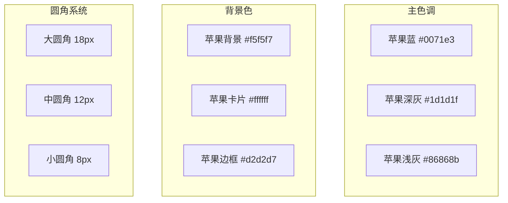
```mermaid
graph TB
subgraph "主色调"
A[苹果蓝 #0071e3]
B[苹果深灰 #1d1d1f]
C[苹果浅灰 #86868b]
end
subgraph "背景色"
D[苹果背景 #f5f5f7]
E[苹果卡片 #ffffff]
F[苹果边框 #d2d2d7]
end
subgraph "圆角系统"
G[大圆角 18px]
H[中圆角 12px]
I[小圆角 8px]
end
```

**图表来源**
- [wechat_workflow.html:10-21](file://wechat_workflow.html#L10-L21)

### 字体系统

采用苹果系统字体栈，确保跨平台一致的阅读体验：

- **系统字体**：-apple-system, BlinkMacSystemFont
- **中文支持**："SF Pro Text", "Segoe UI", "PingFang SC"
- **等宽字体**："SF Mono", "ui-monospace", "Consolas"

### 阴影和边框

通过CSS变量统一管理视觉效果：

- **卡片阴影**：0 4px 24px rgba(0, 0, 0, 0.04)
- **玻璃拟态**：rgba(255, 255, 255, 0.72) + blur滤镜
- **边框系统**：1px solid rgba(0, 0, 0, 0.04)

## 响应式布局架构

### 网格系统设计

系统采用CSS Grid和Flexbox相结合的混合布局方案：

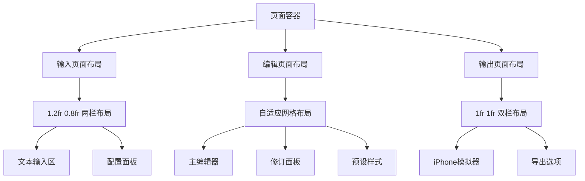
```mermaid
graph TD
A[页面容器] --> B[输入页面布局]
A --> C[编辑页面布局]
A --> D[输出页面布局]
B --> E[1.2fr 0.8fr 两栏布局]
C --> F[自适应网格布局]
D --> G[1fr 1fr 双栏布局]
E --> H[文本输入区]
E --> I[配置面板]
F --> J[主编辑器]
F --> K[修订面板]
F --> L[预设样式]
G --> M[iPhone模拟器]
G --> N[导出选项]
```

**图表来源**
- [wechat_workflow.html:105-111](file://wechat_workflow.html#L105-L111)
- [wechat_workflow.html:552-560](file://wechat_workflow.html#L552-L560)

### 媒体查询策略

针对不同屏幕尺寸优化布局：

```css
@media (max-width: 900px) {
    .refine-shell {
        padding: 0 20px;
        margin-bottom: 136px;
    }
    .refine-main-actions {
        display: grid;
        grid-template-columns: 1fr;
    }
    .layout-presets {
        grid-template-columns: 1fr;
    }
}
```

**图表来源**
- [wechat_workflow.html:807-842](file://wechat_workflow.html#L807-L842)

## 核心组件分析

### 导航栏组件

采用玻璃拟态设计，提供透明的视觉效果：

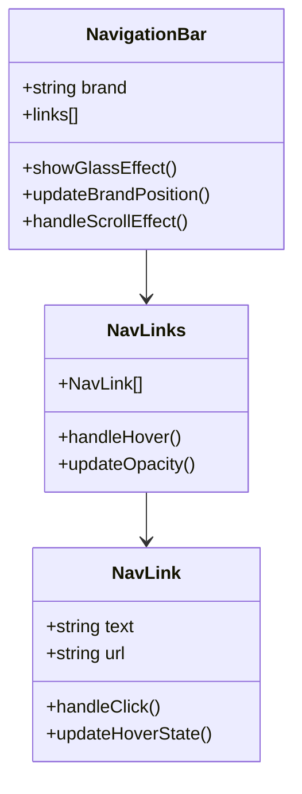
```mermaid
classDiagram
class NavigationBar {
+string brand
+links[]
+showGlassEffect()
+updateBrandPosition()
+handleScrollEffect()
}
class NavLinks {
+NavLink[]
+handleHover()
+updateOpacity()
}
class NavLink {
+string text
+string url
+handleClick()
+updateHoverState()
}
NavigationBar --> NavLinks
NavLinks --> NavLink
```

**图表来源**
- [wechat_workflow.html:34-66](file://wechat_workflow.html#L34-L66)

### 页面切换系统

实现三个主要页面的无缝切换：

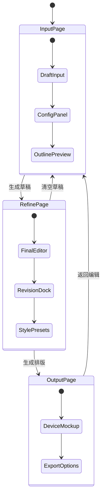
```mermaid
stateDiagram-v2
[*] --> InputPage
InputPage --> RefinePage : 生成草稿
RefinePage --> OutputPage : 生成排版
OutputPage --> InputPage : 返回编辑
RefinePage --> InputPage : 清空草稿
state InputPage {
[*] --> DraftInput
DraftInput --> ConfigPanel
ConfigPanel --> OutlinePreview
}
state RefinePage {
[*] --> FinalEditor
FinalEditor --> RevisionDock
RevisionDock --> StylePresets
}
state OutputPage {
[*] --> DeviceMockup
DeviceMockup --> ExportOptions
}
```

**图表来源**
- [wechat_workflow.html:1571-1597](file://wechat_workflow.html#L1571-L1597)

### 卡片组件系统

采用苹果风格的圆角卡片设计：

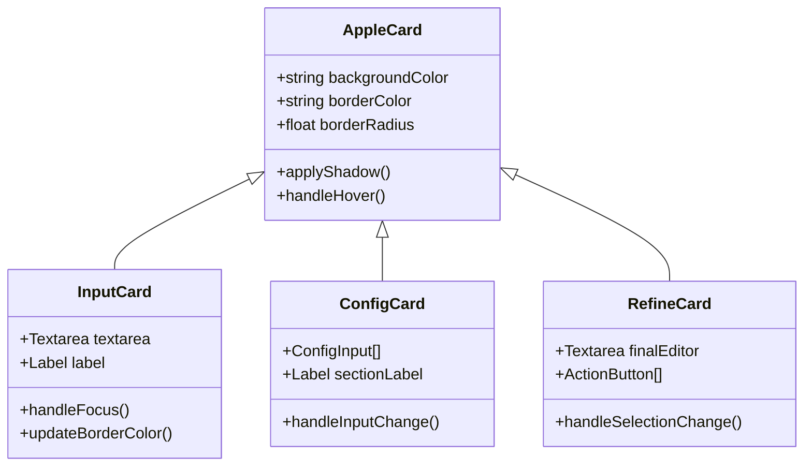
```mermaid
classDiagram
class AppleCard {
+string backgroundColor
+string borderColor
+float borderRadius
+applyShadow()
+handleHover()
}
class InputCard {
+Textarea textarea
+Label label
+handleFocus()
+updateBorderColor()
}
class ConfigCard {
+ConfigInput[]
+Label sectionLabel
+handleInputChange()
}
class RefineCard {
+Textarea finalEditor
+ActionButton[]
+handleSelectionChange()
}
AppleCard <|-- InputCard
AppleCard <|-- ConfigCard
AppleCard <|-- RefineCard
```

**图表来源**
- [wechat_workflow.html:114-120](file://wechat_workflow.html#L114-L120)
- [wechat_workflow.html:868-900](file://wechat_workflow.html#L868-L900)

## 交互逻辑设计

### 表单处理机制

系统实现了复杂的表单处理逻辑，支持实时验证和状态管理：

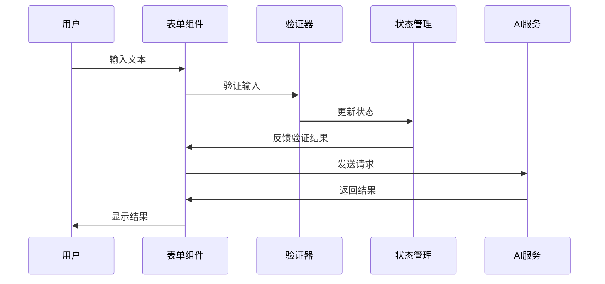
```mermaid
sequenceDiagram
participant User as 用户
participant Form as 表单组件
participant Validator as 验证器
participant State as 状态管理
participant AI as AI服务
User->>Form : 输入文本
Form->>Validator : 验证输入
Validator->>State : 更新状态
State->>Form : 反馈验证结果
Form->>AI : 发送请求
AI->>Form : 返回结果
Form->>User : 显示结果
```

**图表来源**
- [wechat_workflow.html:1754-1773](file://wechat_workflow.html#L1754-L1773)

### 状态管理模式

采用集中式状态管理，确保数据一致性：

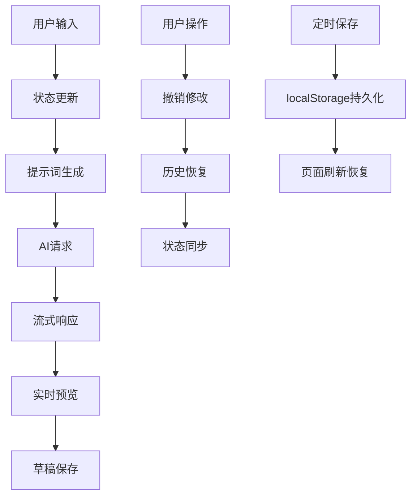
```mermaid
flowchart TD
A[用户输入] --> B[状态更新]
B --> C[提示词生成]
C --> D[AI请求]
D --> E[流式响应]
E --> F[实时预览]
F --> G[草稿保存]
H[用户操作] --> I[撤销修改]
I --> J[历史恢复]
J --> K[状态同步]
L[定时保存] --> M[localStorage持久化]
M --> N[页面刷新恢复]
```

**图表来源**
- [wechat_workflow.html:1463-1476](file://wechat_workflow.html#L1463-L1476)

### 用户反馈机制

系统提供了多层次的用户反馈：

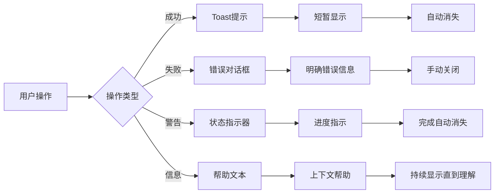
```mermaid
graph LR
A[用户操作] --> B{操作类型}
B --> |成功| C[Toast提示]
B --> |失败| D[错误对话框]
B --> |警告| E[状态指示器]
B --> |信息| F[帮助文本]
C --> G[短暂显示]
D --> H[明确错误信息]
E --> I[进度指示]
F --> J[上下文帮助]
G --> K[自动消失]
H --> L[手动关闭]
I --> M[完成自动消失]
J --> N[持续显示直到理解]
```

**图表来源**
- [wechat_workflow.html:690-707](file://wechat_workflow.html#L690-L707)

## 状态管理系统

### 全局状态结构

系统采用模块化的状态管理架构：

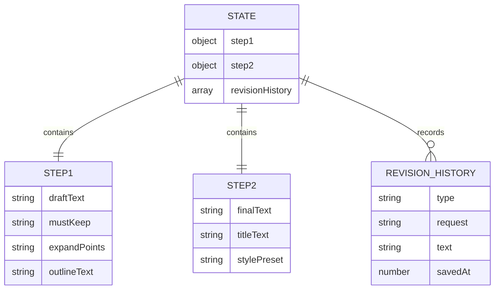
```mermaid
erDiagram
STATE {
object step1
object step2
array revisionHistory
}
STEP1 {
string draftText
string mustKeep
string expandPoints
string outlineText
}
STEP2 {
string finalText
string titleText
string stylePreset
}
REVISION_HISTORY {
string type
string request
string text
number savedAt
}
STATE ||--|| STEP1 : contains
STATE ||--|| STEP2 : contains
STATE ||--o{ REVISION_HISTORY : records
```

**图表来源**
- [wechat_workflow.html:1463-1476](file://wechat_workflow.html#L1463-L1476)

### 草稿持久化机制

实现智能的本地存储和恢复：

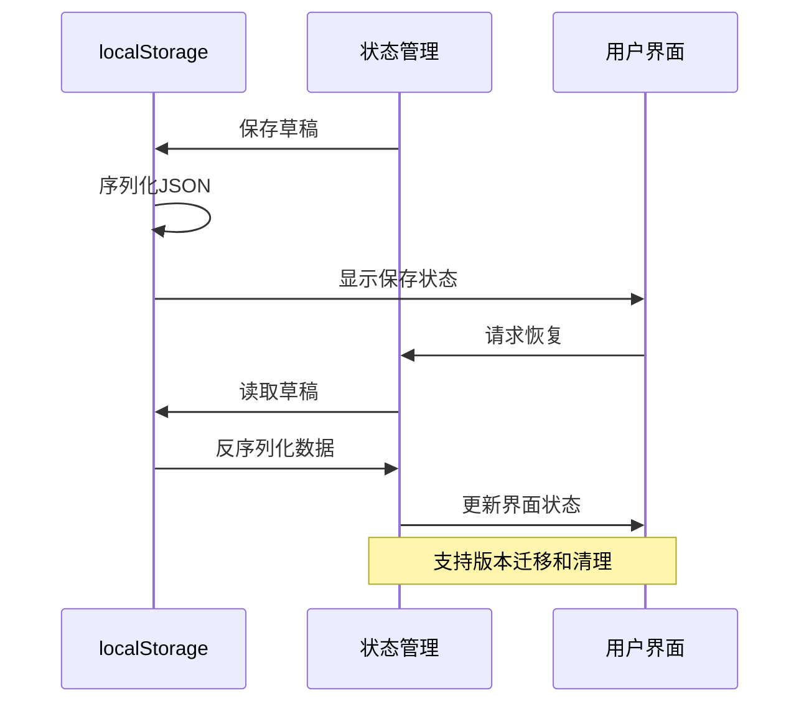
```mermaid
sequenceDiagram
participant Storage as localStorage
participant State as 状态管理
participant UI as 用户界面
State->>Storage : 保存草稿
Storage->>Storage : 序列化JSON
Storage->>UI : 显示保存状态
UI->>State : 请求恢复
State->>Storage : 读取草稿
Storage->>State : 反序列化数据
State->>UI : 更新界面状态
Note over State,UI : 支持版本迁移和清理
```

**图表来源**
- [wechat_workflow.html:1500-1543](file://wechat_workflow.html#L1500-L1543)

## 用户体验优化

### 加载状态管理

系统提供了丰富的加载状态反馈：

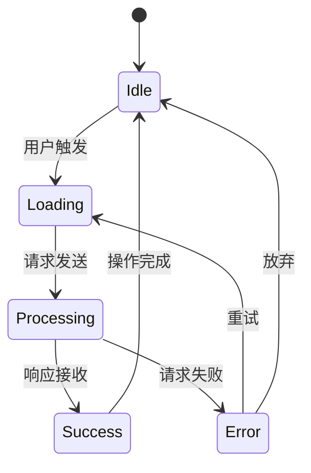
```mermaid
stateDiagram-v2
[*] --> Idle
Idle --> Loading : 用户触发
Loading --> Processing : 请求发送
Processing --> Success : 响应接收
Processing --> Error : 请求失败
Success --> Idle : 操作完成
Error --> Loading : 重试
Error --> Idle : 放弃
```

**图表来源**
- [wechat_workflow.html:2004-2133](file://wechat_workflow.html#L2004-L2133)

### 错误处理策略

采用渐进式的错误处理机制：

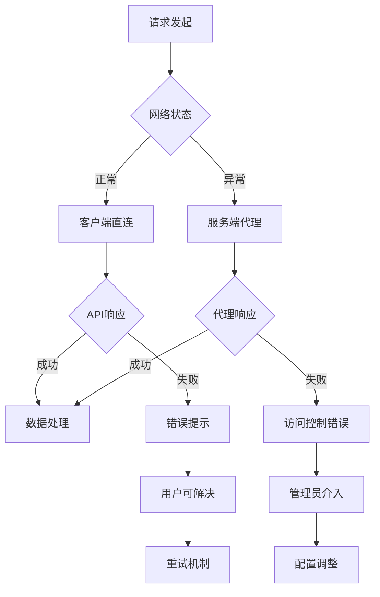
```mermaid
flowchart TD
A[请求发起] --> B{网络状态}
B --> |正常| C[客户端直连]
B --> |异常| D[服务端代理]
C --> E{API响应}
E --> |成功| F[数据处理]
E --> |失败| G[错误提示]
D --> H{代理响应}
H --> |成功| F
H --> |失败| I[访问控制错误]
G --> J[用户可解决]
I --> K[管理员介入]
J --> L[重试机制]
K --> M[配置调整]
```

**图表来源**
- [wechat_workflow.html:2084-2133](file://wechat_workflow.html#L2084-L2133)

### 性能监控

实现关键性能指标的监控：

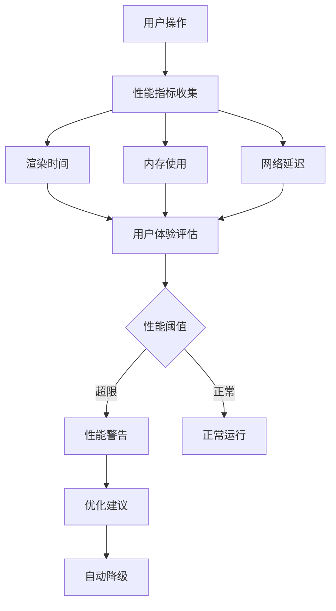
```mermaid
graph TB
A[用户操作] --> B[性能指标收集]
B --> C[渲染时间]
B --> D[内存使用]
B --> E[网络延迟]
C --> F[用户体验评估]
D --> F
E --> F
F --> G{性能阈值}
G --> |超限| H[性能警告]
G --> |正常| I[正常运行]
H --> J[优化建议]
J --> K[自动降级]
```

## 浏览器兼容性

### 支持的浏览器版本

系统确保在主流浏览器上的兼容性：

| 浏览器 | 最低版本 | 支持状态 |
|--------|----------|----------|
| Chrome | 80+ | ✅ 完全支持 |
| Firefox | 78+ | ✅ 完全支持 |
| Safari | 13.1+ | ✅ 完全支持 |
| Edge | 80+ | ✅ 完全支持 |
| IE | 不支持 | ❌ 不支持 |

### CSS特性支持

关键CSS特性的兼容性处理：

```css
/* 玻璃拟态效果的降级方案 */
.nav-glass {
    background: rgba(255, 255, 255, 0.9);
    backdrop-filter: blur(20px);
    -webkit-backdrop-filter: blur(20px);
}

/* 降级方案 */
.no-backdrop-filters .nav-glass {
    background: rgba(255, 255, 255, 0.95);
    border: 1px solid rgba(0, 0, 0, 0.08);
}
```

**图表来源**
- [wechat_workflow.html:34-49](file://wechat_workflow.html#L34-L49)

### JavaScript特性检测

采用特性检测而非浏览器检测：

```javascript
// 检测Clipboard API支持
if ('clipboard' in navigator) {
    // 使用现代API
    await navigator.clipboard.writeText(text);
} else {
    // 使用降级方案
    createHiddenTextarea(text);
}
```

## 移动端适配方案

### 触摸交互优化

针对移动设备优化触摸交互：

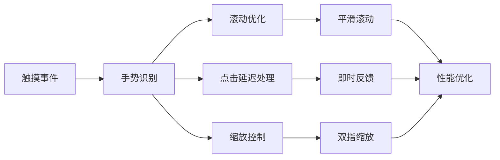
```mermaid
graph LR
A[触摸事件] --> B[手势识别]
B --> C[滚动优化]
B --> D[点击延迟处理]
B --> E[缩放控制]
C --> F[平滑滚动]
D --> G[即时反馈]
E --> H[双指缩放]
F --> I[性能优化]
G --> I
H --> I
```

### 移动端专用优化

```css
/* 移动端按钮尺寸优化 */
@media (max-width: 768px) {
    .btn-apple {
        padding: 16px 32px;
        font-size: 18px;
    }
    
    .final-editor {
        font-size: 18px;
        line-height: 1.9;
    }
    
    .nav-glass {
        padding: 0 20px;
    }
}
```

**图表来源**
- [wechat_workflow.html:807-842](file://wechat_workflow.html#L807-L842)

## 性能优化策略

### 资源加载优化

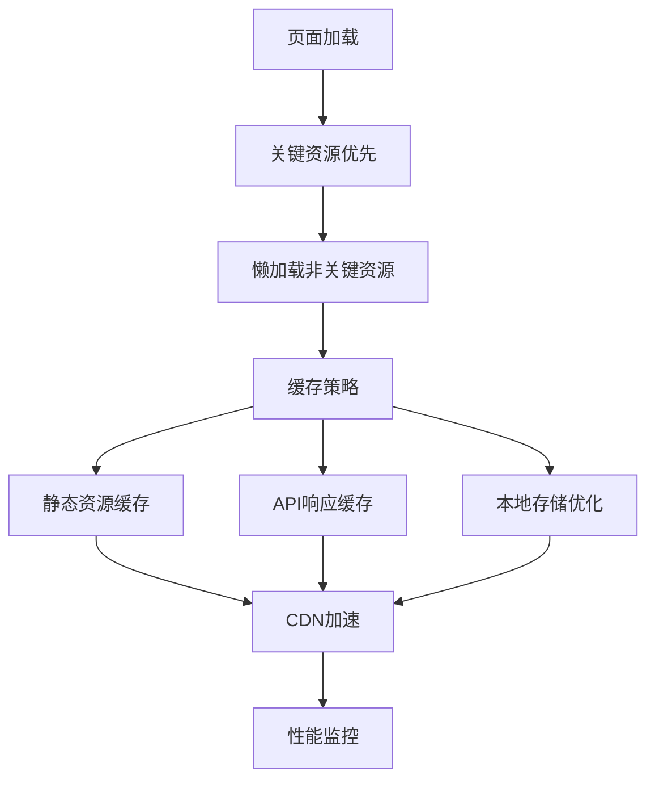
```mermaid
graph TB
A[页面加载] --> B[关键资源优先]
B --> C[懒加载非关键资源]
C --> D[缓存策略]
D --> E[静态资源缓存]
D --> F[API响应缓存]
D --> G[本地存储优化]
E --> H[CDN加速]
F --> H
G --> H
H --> I[性能监控]
```

### 内存管理

实现高效的内存使用策略：

```javascript
// 事件监听器管理
const eventHandlers = new Map();

function addHandler(element, event, handler) {
    const key = `${element.id}-${event}`;
    if (eventHandlers.has(key)) {
        element.removeEventListener(event, eventHandlers.get(key));
    }
    element.addEventListener(event, handler);
    eventHandlers.set(key, handler);
}

// DOM节点复用
function reuseElement(template, data) {
    const element = template.cloneNode(true);
    updateElement(element, data);
    return element;
}
```

### 网络优化

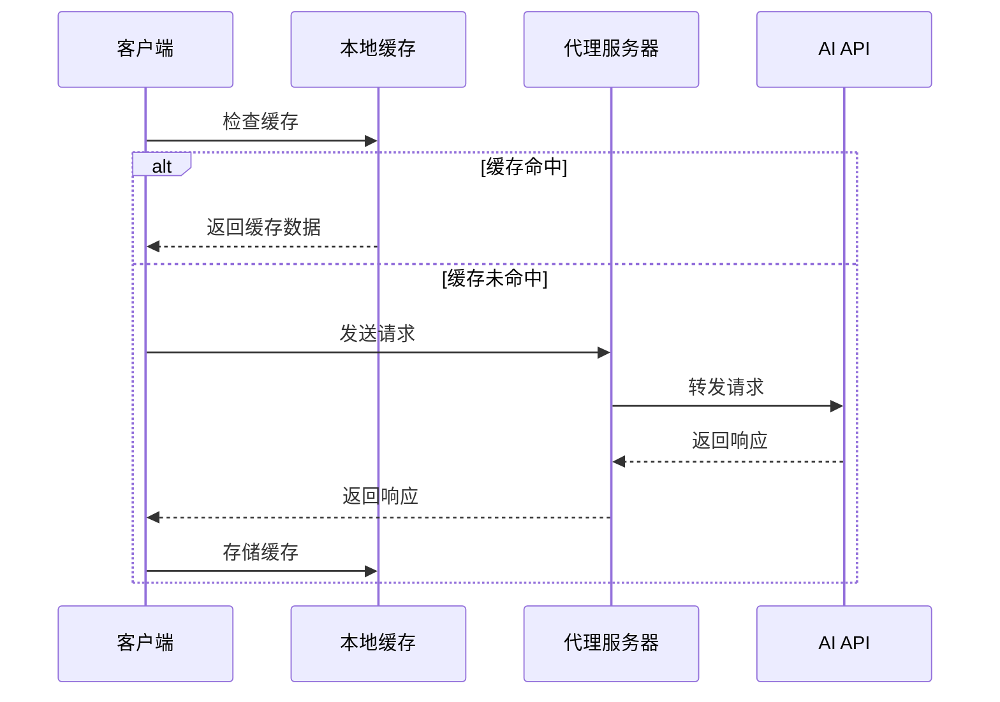
```mermaid
sequenceDiagram
participant Client as 客户端
participant Cache as 本地缓存
participant Proxy as 代理服务器
participant API as AI API
Client->>Cache : 检查缓存
alt 缓存命中
Cache-->>Client : 返回缓存数据
else 缓存未命中
Client->>Proxy : 发送请求
Proxy->>API : 转发请求
API-->>Proxy : 返回响应
Proxy-->>Client : 返回响应
Client->>Cache : 存储缓存
end
```

## 后端集成方案

### API架构设计

系统采用RESTful API设计，支持多种认证方式：

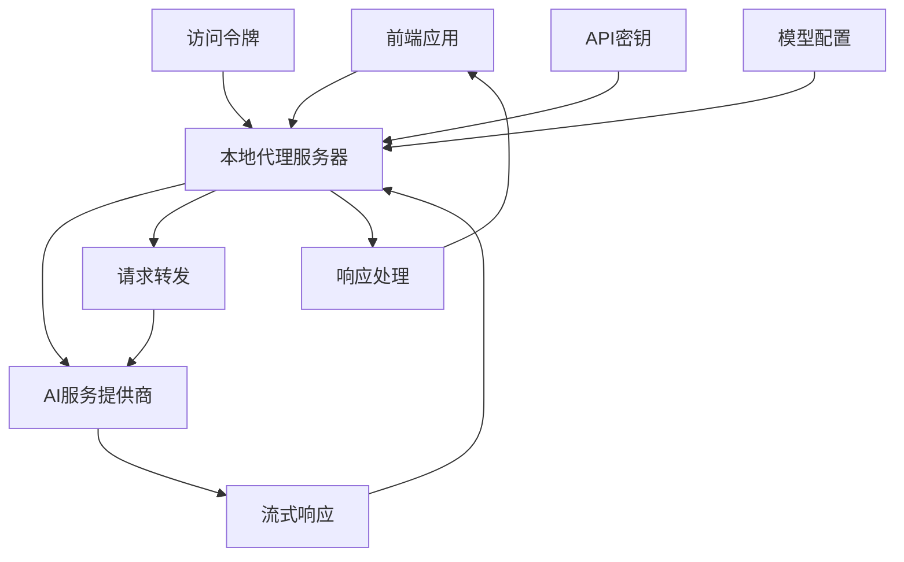
```mermaid
graph TB
A[前端应用] --> B[本地代理服务器]
B --> C[AI服务提供商]
D[访问令牌] --> B
E[API密钥] --> B
F[模型配置] --> B
B --> G[请求转发]
G --> C
C --> H[流式响应]
H --> B
B --> I[响应处理]
I --> A
```

**图表来源**
- [local_server.js:50-125](file://local_server.js#L50-L125)

### 认证机制

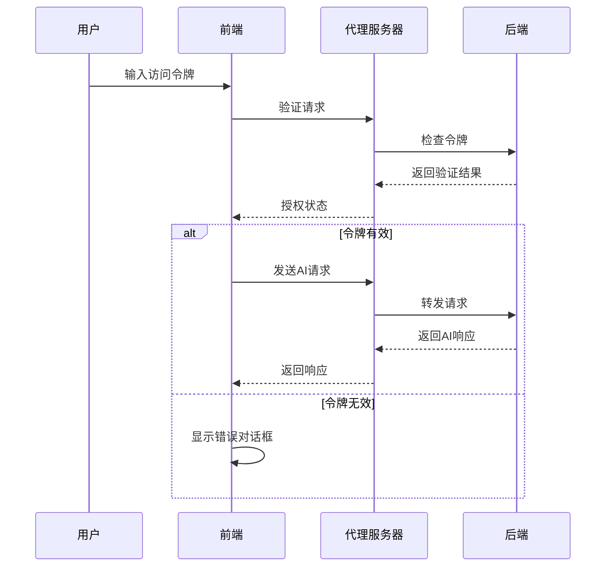
```mermaid
sequenceDiagram
participant User as 用户
participant Frontend as 前端
participant Server as 代理服务器
participant Backend as 后端
User->>Frontend : 输入访问令牌
Frontend->>Server : 验证请求
Server->>Backend : 检查令牌
Backend-->>Server : 返回验证结果
Server-->>Frontend : 授权状态
alt 令牌有效
Frontend->>Server : 发送AI请求
Server->>Backend : 转发请求
Backend-->>Server : 返回AI响应
Server-->>Frontend : 返回响应
else 令牌无效
Frontend->>Frontend : 显示错误对话框
end
```

**图表来源**
- [local_server.js:26-32](file://local_server.js#L26-L32)

### 数据流处理

实现高效的数据处理管道：

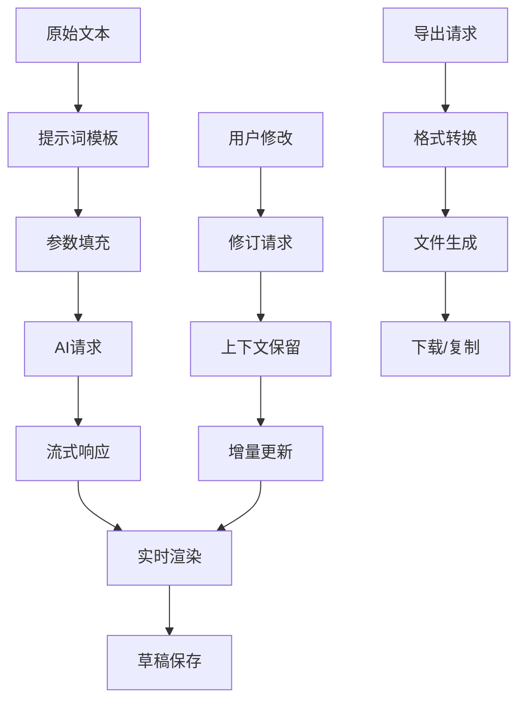
```mermaid
flowchart TD
A[原始文本] --> B[提示词模板]
B --> C[参数填充]
C --> D[AI请求]
D --> E[流式响应]
E --> F[实时渲染]
F --> G[草稿保存]
H[用户修改] --> I[修订请求]
I --> J[上下文保留]
J --> K[增量更新]
K --> F
L[导出请求] --> M[格式转换]
M --> N[文件生成]
N --> O[下载/复制]
```

**图表来源**
- [wechat_workflow.html:1607-1613](file://wechat_workflow.html#L1607-L1613)

## 安全机制设计

### 访问控制

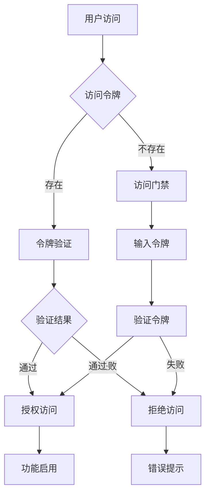
```mermaid
flowchart TD
A[用户访问] --> B{访问令牌}
B --> |存在| C[令牌验证]
B --> |不存在| D[访问门禁]
C --> E{验证结果}
E --> |通过| F[授权访问]
E --> |失败| G[拒绝访问]
D --> H[输入令牌]
H --> I[验证令牌]
I --> |通过| F
I --> |失败| G
F --> J[功能启用]
G --> K[错误提示]
```

**图表来源**
- [wechat_workflow.html:1892-1941](file://wechat_workflow.html#L1892-L1941)

### 数据保护

```mermaid
graph LR
A[敏感数据] --> B[本地存储]
A --> C[传输加密]
A --> D[访问控制]
B --> E[localStorage]
C --> F[HTTPS协议]
D --> G[令牌验证]
E --> H[最小化暴露]
F --> I[端到端加密]
G --> J[权限控制]
```

## 故障排除指南

### 常见问题诊断

```mermaid
flowchart TD
A[问题出现] --> B{问题类型}
B --> |加载失败| C[检查网络连接]
B --> |功能异常| D[查看浏览器控制台]
B --> |样式错乱| E[清除浏览器缓存]
B --> |性能问题| F[检查系统资源]
C --> G[重试请求]
D --> H[查看错误信息]
E --> I[强制刷新页面]
F --> J[关闭其他标签页]
G --> K[问题解决]
H --> L[联系技术支持]
I --> K
J --> K
```

### 性能问题排查

```mermaid
graph TB
A[性能问题] --> B[监控指标]
B --> C[内存泄漏]
B --> D[渲染阻塞]
B --> E[网络延迟]
C --> F[使用开发者工具]
D --> G[检查事件循环]
E --> H[优化网络请求]
F --> I[修复内存泄漏]
G --> J[优化渲染逻辑]
H --> K[使用CDN]
```

## 总结

WeChat Writer Pro 作为一个专业的微信公众号写作工具，展现了现代Web应用的最佳实践。通过苹果风格的UI设计、响应式布局架构、智能化的状态管理和完善的用户体验优化，为用户提供了专业级的创作体验。

### 技术优势

- **设计理念先进**：采用苹果设计语言，提供现代化视觉体验
- **架构设计合理**：模块化组件设计，便于维护和扩展
- **用户体验优秀**：流畅的交互流程和及时的反馈机制
- **性能表现优异**：优化的资源加载和内存管理策略
- **安全性可靠**：完善的访问控制和数据保护机制

### 未来发展

系统具备良好的扩展性，可以进一步集成更多AI功能、支持更多导出格式、优化移动端体验，并考虑添加团队协作功能，为企业用户提供更全面的解决方案。