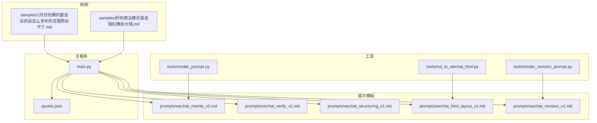
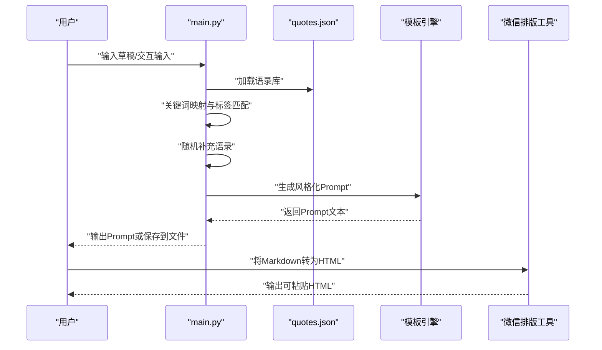
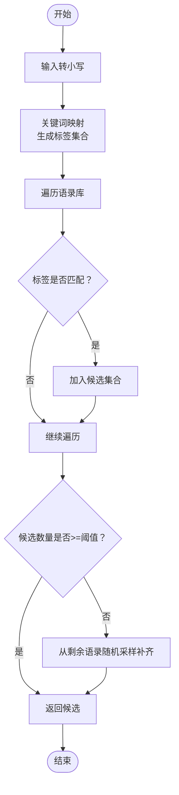
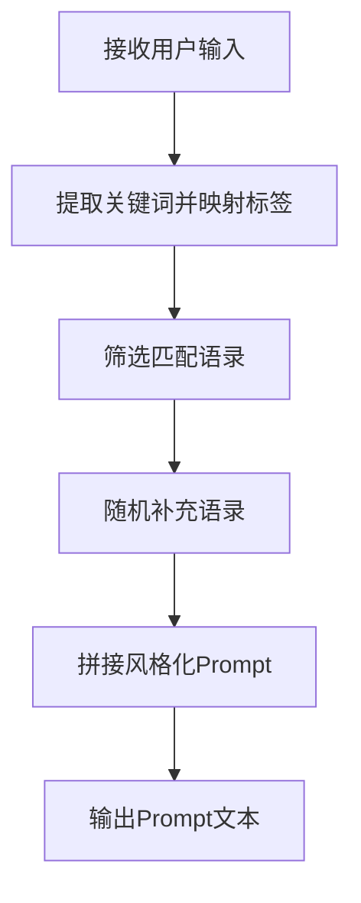
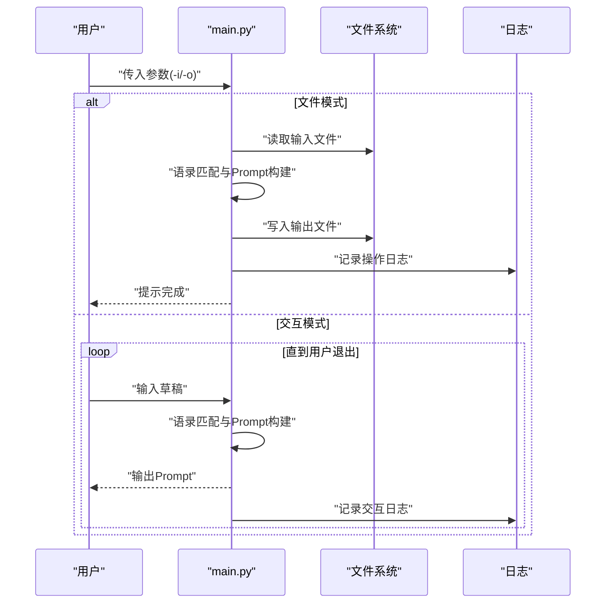
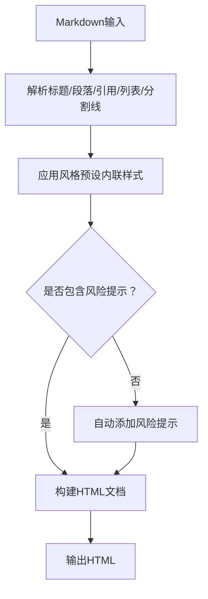
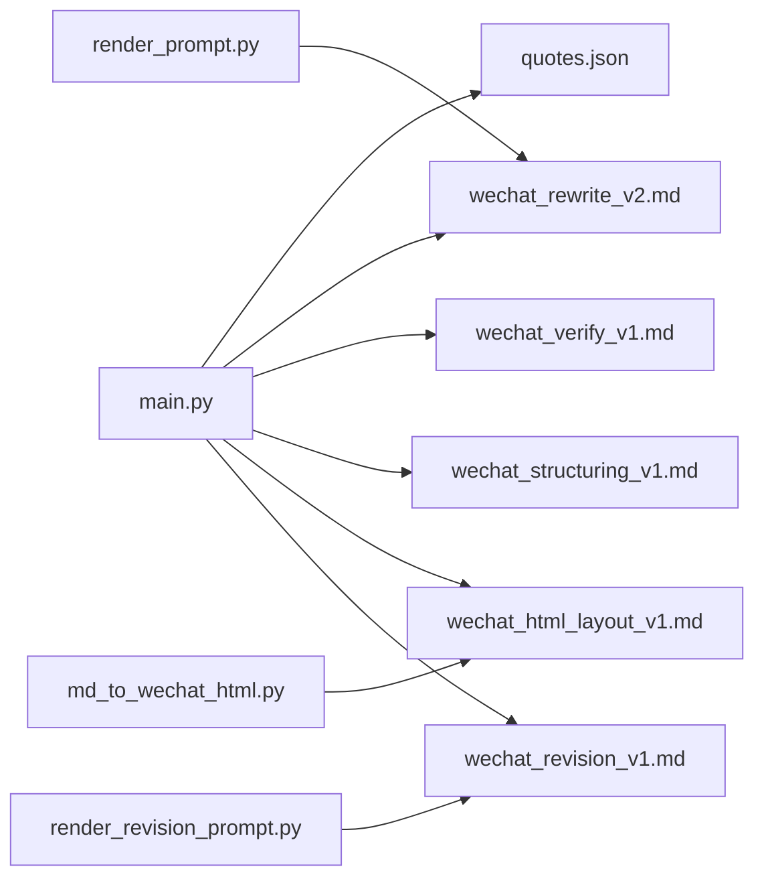

# 智能Prompt生成系统

<cite>
**本文档引用的文件**
- [main.py](file://main.py)
- [quotes.json](file://quotes.json)
- [tools/md_to_wechat_html.py](file://tools/md_to_wechat_html.py)
- [tools/render_prompt.py](file://tools/render_prompt.py)
- [tools/render_revision_prompt.py](file://tools/render_revision_prompt.py)
- [prompts/wechat_verify_v1.md](file://prompts/wechat_verify_v1.md)
- [prompts/wechat_html_layout_v1.md](file://prompts/wechat_html_layout_v1.md)
- [prompts/wechat_rewrite_v2.md](file://prompts/wechat_rewrite_v2.md)
- [prompts/wechat_structuring_v1.md](file://prompts/wechat_structuring_v1.md)
- [prompts/wechat_revision_v1.md](file://prompts/wechat_revision_v1.md)
- [README_DEPLOY.md](file://README_DEPLOY.md)
- [VERCEL_GUIDE.md](file://VERCEL_GUIDE.md)
- [samples/1月份的腾讯都没买的话这么多年的互联网白干了.md](file://samples/1月份的腾讯都没买的话这么多年的互联网白干了.md)
- [samples/好的商业模式是会轻松赚到大钱.md](file://samples/好的商业模式是会轻松赚到大钱.md)
</cite>

## 目录
1. [简介](#简介)
2. [项目结构](#项目结构)
3. [核心组件](#核心组件)
4. [架构总览](#架构总览)
5. [详细组件分析](#详细组件分析)
6. [依赖分析](#依赖分析)
7. [性能考量](#性能考量)
8. [故障排查指南](#故障排查指南)
9. [结论](#结论)
10. [附录](#附录)

## 简介
本项目是一个面向微信公众号内容创作的智能Prompt生成系统，核心目标是：
- 基于用户输入，自动匹配语录库中的相关语录，构建风格化、可复用的系统提示（System Prompt）。
- 通过“角色设定 + 写作风格 + 思维模型 + 任务指令”的结构化设计，确保输出内容符合“方伟式”克制、算账、讲人话的价值投资风格。
- 提供从Prompt生成到文章校验、再到HTML排版的完整工作流，支持命令行交互与文件批处理两种模式。

系统采用轻量Python脚本作为主入口，配合JSON语录库与若干提示模板，形成可扩展的Prompt工程化方案。

## 项目结构
- 根目录核心文件
  - main.py：主程序，包含语录加载、关键词匹配、Prompt构建与交互/批处理逻辑。
  - quotes.json：语录库，包含作者、中文译文、标签集合。
- 工具模块
  - tools/md_to_wechat_html.py：将Markdown转换为可直接粘贴到微信公众号后台的HTML。
  - tools/render_prompt.py：渲染通用Prompt模板，支持占位符替换。
  - tools/render_revision_prompt.py：渲染修订类Prompt模板，支持全文或选区修订。
- 提示模板
  - prompts/wechat_rewrite_v2.md：重写类Prompt模板，定义“方伟式”写作风格与结构骨架。
  - prompts/wechat_verify_v1.md：校验类Prompt模板，用于发布前三轮校验。
  - prompts/wechat_structuring_v1.md：选题策划类Prompt模板。
  - prompts/wechat_html_layout_v1.md：HTML排版类Prompt模板。
  - prompts/wechat_revision_v1.md：修订类Prompt模板。
- 示例与样例
  - samples/：存放已发布的文章样例，便于理解输出风格与结构。
- 部署与环境
  - README_DEPLOY.md、VERCEL_GUIDE.md：提供Vercel与本地部署指引及环境变量配置。

图表来源
- [main.py:1-195](file://main.py#L1-L195)
- [quotes.json:1-108](file://quotes.json#L1-L108)
- [tools/md_to_wechat_html.py:1-256](file://tools/md_to_wechat_html.py#L1-L256)
- [tools/render_prompt.py:1-28](file://tools/render_prompt.py#L1-L28)
- [tools/render_revision_prompt.py:1-44](file://tools/render_revision_prompt.py#L1-L44)
- [prompts/wechat_rewrite_v1.md:1-105](file://prompts/wechat_rewrite_v2.md#L1-L105)
- [prompts/wechat_verify_v1.md:1-48](file://prompts/wechat_verify_v1.md#L1-L48)
- [prompts/wechat_structuring_v1.md:1-33](file://prompts/wechat_structuring_v1.md#L1-L33)
- [prompts/wechat_html_layout_v1.md:1-73](file://prompts/wechat_html_layout_v1.md#L1-L73)
- [prompts/wechat_revision_v1.md:1-31](file://prompts/wechat_revision_v1.md#L1-L31)

章节来源
- [main.py:1-195](file://main.py#L1-L195)
- [README_DEPLOY.md:1-126](file://README_DEPLOY.md#L1-L126)
- [VERCEL_GUIDE.md:1-52](file://VERCEL_GUIDE.md#L1-L52)

## 核心组件
- 语录加载与匹配
  - load_quotes：从quotes.json加载语录库，异常时终止进程。
  - find_relevant_quotes：关键词映射 + 标签匹配 + 随机补充，返回指定数量的语录。
- Prompt构建
  - generate_prompt：将用户输入与精选语录拼接为风格化System Prompt。
- 交互与批处理
  - main：解析参数，支持文件模式与交互模式；记录操作日志。
- 工具链
  - md_to_wechat_html：将Markdown转换为微信可用HTML。
  - render_prompt：通用模板渲染器。
  - render_revision_prompt：修订类模板渲染器。

章节来源
- [main.py:32-195](file://main.py#L32-L195)
- [tools/md_to_wechat_html.py:1-256](file://tools/md_to_wechat_html.py#L1-L256)
- [tools/render_prompt.py:1-28](file://tools/render_prompt.py#L1-L28)
- [tools/render_revision_prompt.py:1-44](file://tools/render_revision_prompt.py#L1-L44)

## 架构总览
系统采用“主程序 + 模板 + 工具”的分层架构：
- 主程序负责业务逻辑与流程编排。
- 模板提供可复用的Prompt骨架，确保风格一致性。
- 工具提供数据转换与渲染能力，覆盖从草稿到HTML的全流程。

图表来源
- [main.py:129-195](file://main.py#L129-L195)
- [tools/md_to_wechat_html.py:236-256](file://tools/md_to_wechat_html.py#L236-L256)

## 详细组件分析

### 语录匹配算法
- 关键词映射机制
  - 用户输入统一转为小写，便于匹配。
  - 定义关键词到标签集合的映射表，覆盖“护城河、管理、价格/估值、价值、长期、生意/模式、错误、现金流、快乐、收藏、迪士尼”等。
  - 若用户输入包含某关键词，则将其对应的标签集合加入匹配集。
- 语录筛选逻辑
  - 遍历语录库，若某条语录的标签存在于匹配集中，则纳入候选。
  - 去重后截取前N条（默认3，文件模式可扩展至5）。
- 随机补充策略
  - 若候选数量不足阈值，从剩余语录中随机采样补齐，保证每次生成的Prompt具备一定多样性。
- 复杂度分析
  - 时间复杂度：O(U + L)，其中U为用户输入长度（小写化与关键词查找），L为语录库规模（逐条标签匹配）。
  - 空间复杂度：O(K + C)，K为关键词映射表大小，C为候选语录集合。
- 错误处理
  - 未找到quotes.json时，打印错误并退出，避免后续流程中断。
- 性能优化建议
  - 将关键词映射表与标签集合预构建为哈希结构，减少查找成本。
  - 对语录库按标签建立倒排索引，加速候选筛选。
  - 使用缓存命中策略，对相同输入的语录组合进行缓存。

图表来源
- [main.py:45-82](file://main.py#L45-L82)

章节来源
- [main.py:45-82](file://main.py#L45-L82)

### 风格化Prompt构建
- 角色设定
  - 明确“方伟式”价值投资者身份，强调对巴菲特、芒格、段永平理念的遵循。
- 写作风格
  - 冷静、克制、讲人话；结构为“结论 + 小标题层层展开”；强调“为什么/所以什么/怎么验证”的逻辑闭环。
- 思维模型
  - 真/假护城河区分、生意分类（躺赚/稳赚/辛苦钱）、长期确定性优先、极度关注现金流与时间价值。
- 任务指令
  - 将用户输入重写为投资笔记，保留原意、纠正误区、结构优化、输出Markdown。
- 语录引用
  - 将匹配到的语录自然融入上下文，增强权威性与说服力。

图表来源
- [main.py:84-127](file://main.py#L84-L127)

章节来源
- [main.py:84-127](file://main.py#L84-L127)

### 交互与批处理流程
- 文件模式
  - 读取输入文件，调用语录匹配与Prompt构建，可选输出到文件或标准输出。
- 交互模式
  - 循环接收用户输入，提示检索与构建过程，输出Prompt并记录日志。
- 日志记录
  - 统一记录操作状态、输入输出路径，便于审计与问题追踪。

图表来源
- [main.py:129-195](file://main.py#L129-L195)

章节来源
- [main.py:129-195](file://main.py#L129-L195)

### 微信排版工具
- 功能概述
  - 将Markdown转换为可直接复制到微信公众号后台的HTML，内联样式确保兼容性。
- 风格预设
  - 提供“理性金融”“观点评论”“深度特色”三种风格，分别定义标题、段落、强调、引用、列表、分割线、脚注与风险提示的内联样式。
- 自动风险提示
  - 若原文未包含风险提示，自动在文末补一段标准风险提示文本。
- 使用方式
  - 命令行参数指定输入、输出、标题与风格预设，直接生成HTML。

图表来源
- [tools/md_to_wechat_html.py:86-233](file://tools/md_to_wechat_html.py#L86-L233)

章节来源
- [tools/md_to_wechat_html.py:1-256](file://tools/md_to_wechat_html.py#L1-L256)

### 模板渲染工具
- render_prompt.py
  - 读取模板与草稿，替换占位符（草稿、必须保留信息、扩展点、大纲等），输出渲染后的文件。
- render_revision_prompt.py
  - 读取修订模板，支持全文或选区修订模式，输出可直接使用的修订Prompt。

章节来源
- [tools/render_prompt.py:1-28](file://tools/render_prompt.py#L1-L28)
- [tools/render_revision_prompt.py:1-44](file://tools/render_revision_prompt.py#L1-L44)

## 依赖分析
- 组件耦合
  - main.py与quotes.json强耦合（语录库依赖）。
  - main.py与各Prompt模板弱耦合（字符串拼接，可通过配置调整）。
  - 工具模块独立，与主流程松耦合，便于替换与扩展。
- 外部依赖
  - Python标准库（json、random、argparse、os、sys、datetime）。
  - 云端部署时依赖OPENAI_API_KEY、OPENAI_MODEL等环境变量（非本仓库核心逻辑）。

图表来源
- [main.py:1-195](file://main.py#L1-L195)
- [tools/render_prompt.py:1-28](file://tools/render_prompt.py#L1-L28)
- [tools/render_revision_prompt.py:1-44](file://tools/render_revision_prompt.py#L1-L44)
- [tools/md_to_wechat_html.py:1-256](file://tools/md_to_wechat_html.py#L1-L256)

章节来源
- [main.py:1-195](file://main.py#L1-L195)

## 性能考量
- 语录匹配
  - 当前实现为线性扫描，适合中小规模语录库；大规模场景建议：
    - 建立标签到语录ID的倒排索引，匹配阶段仅遍历索引。
    - 使用集合运算优化标签交集计算。
- Prompt构建
  - 字符串拼接为O(Σ长度)，建议使用生成器或缓冲区减少中间对象创建。
- I/O与日志
  - 文件读写与日志写入为瓶颈，建议异步写入或批量刷盘。
- 部署与并发
  - 云端部署时，合理设置并发与超时，避免API Key泄漏与资源争用。

## 故障排查指南
- quotes.json缺失
  - 现象：启动即退出并提示找不到文件。
  - 处理：确认quotes.json位于脚本同级目录，编码为UTF-8。
- 文件读写异常
  - 现象：文件模式下处理失败并记录失败日志。
  - 处理：检查输入路径权限、磁盘空间与文件完整性。
- 交互模式中断
  - 现象：键盘中断优雅退出。
  - 处理：正常流程，无需额外干预。
- 云端AI功能不可用
  - 现象：401错误或请求失败。
  - 处理：按部署指南配置OPENAI_API_KEY、OPENAI_MODEL等环境变量并重新部署。

章节来源
- [main.py:20-31](file://main.py#L20-L31)
- [README_DEPLOY.md:26-42](file://README_DEPLOY.md#L26-L42)
- [VERCEL_GUIDE.md:12-41](file://VERCEL_GUIDE.md#L12-L41)

## 结论
本系统通过“关键词映射 + 标签匹配 + 随机补充”的语录匹配算法，结合“角色设定 + 写作风格 + 思维模型 + 任务指令”的Prompt构建方法，实现了风格一致、可复用、可扩展的智能Prompt生成能力。配合模板渲染与微信排版工具，形成从草稿到发布的一体化工作流。建议在生产环境中引入索引与缓存机制，进一步提升性能与稳定性。

## 附录

### 使用示例与最佳实践
- 使用find_relevant_quotes函数进行语录匹配
  - 输入：用户文本（字符串）
  - 输出：精选语录列表（最多N条）
  - 路径参考：[main.py:45-82](file://main.py#L45-L82)
- 使用generate_prompt函数构建最终Prompt
  - 输入：用户文本、精选语录
  - 输出：风格化System Prompt（字符串）
  - 路径参考：[main.py:84-127](file://main.py#L84-L127)
- 渲染通用Prompt模板
  - 参数：模板路径、草稿路径、输出路径、必须保留信息、扩展点、大纲
  - 路径参考：[tools/render_prompt.py:5-23](file://tools/render_prompt.py#L5-L23)
- 渲染修订Prompt模板
  - 参数：模板路径、全文路径、输出路径、目标文本路径、修订请求、模式（全文/选区）
  - 路径参考：[tools/render_revision_prompt.py:5-39](file://tools/render_revision_prompt.py#L5-L39)
- 将Markdown转换为微信HTML
  - 参数：输入、输出、标题、风格预设
  - 路径参考：[tools/md_to_wechat_html.py:236-251](file://tools/md_to_wechat_html.py#L236-L251)

### 配置选项与环境变量
- 本地部署
  - 环境变量：PORT、HOST、OPENAI_BASE_URL、OPENAI_MODEL、OPENAI_REASONING_EFFORT、OPENAI_API_KEY、ARTICLE_JIKE_ACCESS_TOKEN
  - systemd服务示例与健康检查命令参考：[README_DEPLOY.md:74-125](file://README_DEPLOY.md#L74-L125)
- Vercel部署
  - 环境变量：OPENAI_API_KEY、OPENAI_BASE_URL、OPENAI_MODEL
  - 配置步骤与验证方法参考：[VERCEL_GUIDE.md:12-51](file://VERCEL_GUIDE.md#L12-L51)

### 参考样例
- 已发布文章样例，便于理解输出风格与结构
  - [samples/1月份的腾讯都没买的话这么多年的互联网白干了.md](file://samples/1月份的腾讯都没买的话这么多年的互联网白干了.md)
  - [samples/好的商业模式是会轻松赚到大钱.md](file://samples/好的商业模式是会轻松赚到大钱.md)