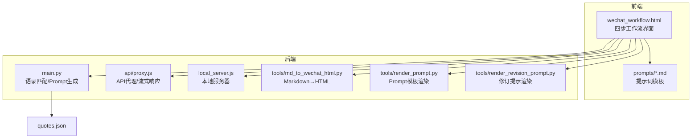
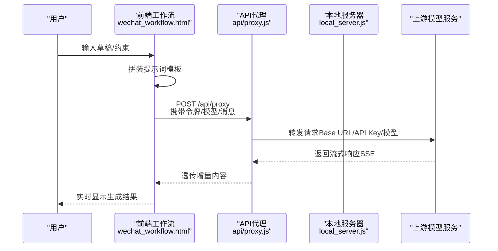
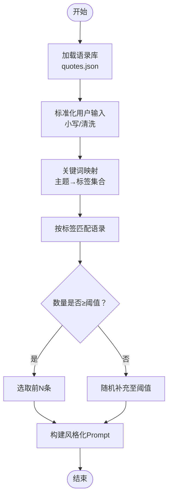
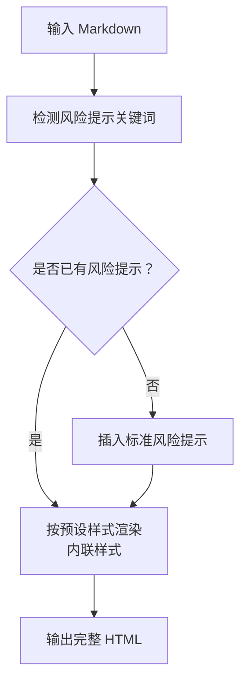
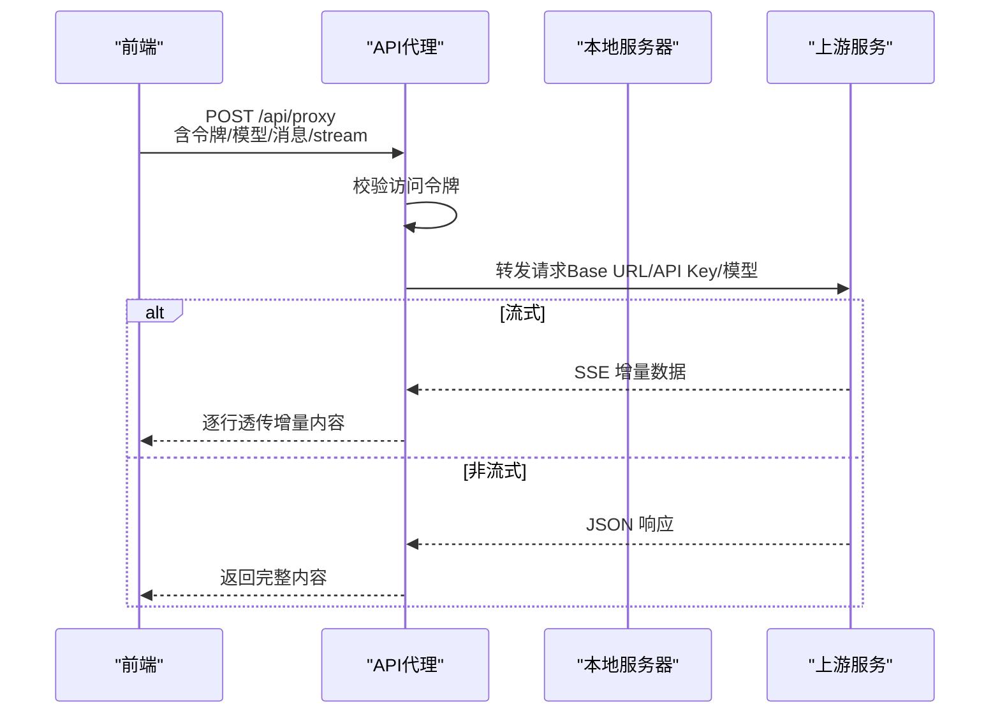
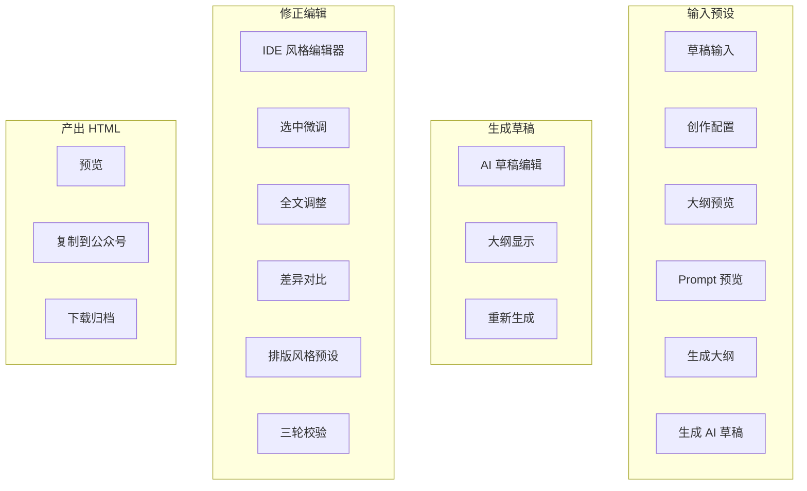
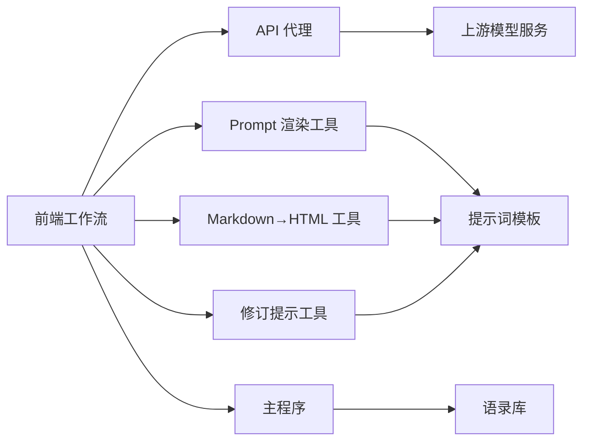

# 核心功能

<cite>
**本文引用的文件**
- [main.py](file://main.py)
- [proxy.js](file://api/proxy.js)
- [render_prompt.py](file://tools/render_prompt.py)
- [md_to_wechat_html.py](file://tools/md_to_wechat_html.py)
- [wechat_workflow.html](file://wechat_workflow.html)
- [render_revision_prompt.py](file://tools/render_revision_prompt.py)
- [wechat_html_layout_v1.md](file://prompts/wechat_html_layout_v1.md)
- [wechat_verify_v1.md](file://prompts/wechat_verify_v1.md)
- [quotes.json](file://quotes.json)
- [README_DEPLOY.md](file://README_DEPLOY.md)
- [VERCEL_GUIDE.md](file://VERCEL_GUIDE.md)
- [local_server.js](file://local_server.js)
- [samples/1月份的腾讯都没买的话这么多年的互联网白干了.md](file://samples/1月份的腾讯都没买的话这么多年的互联网白干了.md)
</cite>

## 更新摘要
**变更内容**
- 新增部署配置章节，详细说明 Vercel 和本地服务器部署方式
- 更新 API 代理服务章节，增加本地服务器实现细节
- 完善前端界面设计章节，补充 IDE 风格编辑器功能说明
- 新增内容渲染系统章节，详细说明三种排版风格预设
- 更新故障排查指南，增加部署相关问题解决方案

## 目录
1. [简介](#简介)
2. [项目结构](#项目结构)
3. [核心组件](#核心组件)
4. [架构总览](#架构总览)
5. [详细组件分析](#详细组件分析)
6. [部署配置](#部署配置)
7. [依赖分析](#依赖分析)
8. [性能考虑](#性能考虑)
9. [故障排查指南](#故障排查指南)
10. [结论](#结论)
11. [附录](#附录)

## 简介
本项目围绕"投资智慧回响"的四大核心功能，提供从语录驱动的智能 Prompt 生成、内容渲染与公众号 HTML 排版、API 代理与流式响应、到前端 WeChat 工作流界面的完整能力闭环。系统现已升级为四步工作流架构（输入预设 → 生成草稿 → 修正编辑 → 产出 HTML），并新增 IDE 风格编辑器与增强的提示渲染系统，用户可通过输入草稿与约束条件，经由多阶段提示词工程与模板渲染，生成符合公众号风格的高质量文章，并支持风险提示与多种排版风格。

## 项目结构
- 后端与工具层
  - Python 主程序：语录加载、关键词映射、Prompt 构建、日志记录
  - API 代理：访问令牌校验、上游 OpenAI/NewAPI 请求转发、流式响应透传
  - 渲染工具：Prompt 模板渲染、Markdown 到微信 HTML 的排版转换、修订提示渲染
- 前端与提示词
  - 单页应用：WeChat 工作流界面，含四阶段工作流与设置对话框
  - 提示词模板：策划、润色、校验、修订、排版、工作流说明
- 数据与资源
  - 语录库：quotes.json，用于 Prompt 中的语录注入
  - 样例与草稿：samples、prompts 下的 Markdown 模板

**图表来源**
- [wechat_workflow.html](file://wechat_workflow.html)
- [main.py](file://main.py)
- [proxy.js](file://api/proxy.js)
- [local_server.js](file://local_server.js)
- [md_to_wechat_html.py](file://tools/md_to_wechat_html.py)
- [render_prompt.py](file://tools/render_prompt.py)
- [render_revision_prompt.py](file://tools/render_revision_prompt.py)
- [wechat_html_layout_v1.md](file://prompts/wechat_html_layout_v1.md)
- [wechat_verify_v1.md](file://prompts/wechat_verify_v1.md)
- [quotes.json](file://quotes.json)

**章节来源**
- [wechat_workflow.html](file://wechat_workflow.html)
- [main.py](file://main.py)
- [proxy.js](file://api/proxy.js)
- [local_server.js](file://local_server.js)
- [md_to_wechat_html.py](file://tools/md_to_wechat_html.py)
- [render_prompt.py](file://tools/render_prompt.py)
- [render_revision_prompt.py](file://tools/render_revision_prompt.py)
- [wechat_html_layout_v1.md](file://prompts/wechat_html_layout_v1.md)
- [wechat_verify_v1.md](file://prompts/wechat_verify_v1.md)
- [quotes.json](file://quotes.json)

## 核心组件
- 智能 Prompt 生成系统
  - 语录匹配算法：基于关键词映射与标签过滤，结合随机补足，筛选相关语录
  - 关键词映射机制：将用户输入中的主题词映射到多语言标签集合
  - 风格化 Prompt 构建：将用户输入、约束与精选语录整合为系统 Prompt
- 内容渲染系统
  - Markdown 到 HTML：解析标题、段落、引用、列表、分隔线，生成完整 HTML
  - 风险提示生成：自动检测并插入标准风险提示，或保留原文风险提示
  - 样式模板配置：提供三种排版风格预设，内联样式保证公众号复制兼容
- API 代理服务
  - 访问令牌验证：支持请求头与 Bearer Token，支持服务端环境变量回退
  - 流式响应处理：透传上游 SSE 流，按行解析增量内容
  - 多 API 提供商支持：统一 Base URL 与模型参数，兼容 OpenAI/NewAPI
- 前端界面设计
  - WeChat 工作流界面：四页式流程（输入预设/生成草稿/修正编辑/产出 HTML），支持实时草稿与本地存储
  - IDE 风格编辑器：提供行号、选中文本微调、全文调整、差异对比等功能
  - 苹果风格 UI：玻璃拟态导航、卡片、圆角与阴影，深色模式编辑页
  - 响应式布局：移动端优先，断点适配与交互控件自适应

**章节来源**
- [main.py](file://main.py)
- [wechat_workflow.html](file://wechat_workflow.html)
- [md_to_wechat_html.py](file://tools/md_to_wechat_html.py)
- [proxy.js](file://api/proxy.js)

## 架构总览
整体采用"前端工作流 + 后端代理 + 模板与数据"的分层架构。前端负责用户交互与提示词拼装，后端负责访问控制与上游 API 转发，工具层负责内容渲染与 Prompt 模板填充，数据层提供语录库与提示词模板。系统现支持四步工作流：输入预设 → 生成草稿 → 修正编辑 → 产出 HTML。

**图表来源**
- [wechat_workflow.html](file://wechat_workflow.html)
- [proxy.js](file://api/proxy.js)
- [local_server.js](file://local_server.js)

## 详细组件分析

### 智能 Prompt 生成系统
- 语录匹配算法
  - 加载语录库：从 quotes.json 读取多条语录，包含中英文作者与标签
  - 关键词映射：将用户输入中的主题词映射到标签集合，支持中英关键词
  - 匹配与补足：按标签匹配语录，不足时随机补充，限制返回数量
- 关键词映射机制
  - 映射表：涵盖护城河、管理、价格、价值、长期、生意、错误、现金流、快乐、收藏、迪士尼等主题
  - 匹配策略：大小写无关，命中即纳入候选，避免重复
- 风格化 Prompt 构建
  - 角色设定：顶级价值投资者，风格克制、讲人话、善用对比与类比
  - 上下文注入：将精选语录自然融入 Prompt 的 Context 部分
  - 任务约束：保留原意、风格升华、纠正误区、结构优化、输出格式为 Markdown

**图表来源**
- [main.py](file://main.py)
- [quotes.json](file://quotes.json)

**章节来源**
- [main.py](file://main.py)
- [quotes.json](file://quotes.json)

### 内容渲染系统
- Markdown 到 HTML 转换
  - 解析规则：识别标题、段落、引用块、无序列表、分隔线、加粗
  - 风格预设：三种排版风格，内联样式保证公众号复制兼容
  - 风险提示：自动检测风险提示关键词，缺失时在文末补全
- 风险提示生成
  - 检测逻辑：包含"风险提示/不构成投资建议/市场有风险"等关键词
  - 插入策略：原文已有则保留样式，否则在末尾插入标准提示
- 样式模板配置
  - 预设样式：理性财经版、观点评论版、深度长文版
  - 内联样式：所有段落、标题、引用、列表均使用 style 属性

**图表来源**
- [md_to_wechat_html.py](file://tools/md_to_wechat_html.py)
- [wechat_html_layout_v1.md](file://prompts/wechat_html_layout_v1.md)

**章节来源**
- [md_to_wechat_html.py](file://tools/md_to_wechat_html.py)
- [wechat_html_layout_v1.md](file://prompts/wechat_html_layout_v1.md)

### API 代理服务
- 访问令牌验证
  - 令牌来源：请求头 X-Article-Jike-Access-Token、Authorization Bearer、请求体 accessToken
  - 校验策略：若服务端配置了期望令牌，则必须匹配；否则视为无需令牌
- 流式响应处理
  - 透传机制：读取上游响应流，按行解析 data: 行，提取 choices.delta.content
  - 错误处理：捕获解析异常，忽略部分片段，持续输出已解析内容
- 多 API 提供商支持
  - Base URL 优先级：请求体 baseUrl > 环境变量 > 默认值
  - 模型与参数：支持 model、messages、stream、reasoning_effort、max_tokens 等
  - 回退策略：客户端直连失败时自动回退至服务端代理

**图表来源**
- [proxy.js](file://api/proxy.js)
- [local_server.js](file://local_server.js)

**章节来源**
- [proxy.js](file://api/proxy.js)
- [local_server.js](file://local_server.js)

### 前端界面设计
- WeChat 工作流界面
  - 四步流程：输入预设（草稿/约束/Prompt 预览/大纲）、生成草稿（AI 草稿/大纲预览）、修正编辑（IDE 风格编辑器/修订/风格预设）、产出 HTML（预览/复制/下载）
  - 实时草稿：本地存储草稿与修订历史，支持恢复与撤销
  - 设置对话框：访问令牌、Base URL、API Key、模型参数
- IDE 风格编辑器
  - 行号显示：实时显示行号，支持长文本编辑
  - 选中微调：支持选中文本进行局部修订，提供差异对比面板
  - 全文调整：支持整篇文章的修订请求，内置预设芯片
  - 差异展示：提供接受/拒绝修改的可视化界面
- 苹果风格 UI
  - 设计语言：玻璃拟态导航、圆角卡片、阴影与动效
  - 深色模式：编辑页采用浅色背景与柔和阴影，提升可读性
- 响应式布局
  - 断点适配：移动端网格与按钮自适应，保证触控体验
  - 交互反馈：Toast 提示、按钮状态变化、滚动定位

**图表来源**
- [wechat_workflow.html](file://wechat_workflow.html)

**章节来源**
- [wechat_workflow.html](file://wechat_workflow.html)

## 部署配置
本项目支持多种部署方式，包括 Vercel 云端部署和本地服务器部署，满足不同使用场景的需求。

### Vercel 云端部署
- 环境变量配置
  - OPENAI_API_KEY：OpenAI API 密钥，用于访问上游模型服务
  - OPENAI_BASE_URL：OpenAI API 基础 URL，默认 https://api.openai.com/v1
  - OPENAI_MODEL：模型名称，默认 gpt-5.4
  - ARTICLE_JIKE_ACCESS_TOKEN：访问令牌，可选配置
- 部署步骤
  1. 安装 Vercel CLI 并登录
  2. 在项目根目录执行 `vercel --prod` 进行部署
  3. 配置环境变量并通过 `vercel env add` 添加所需变量
  4. 重新部署使配置生效

### 本地服务器部署
- 系统要求
  - Node.js 环境（版本 18+）
  - 支持 HTTP/HTTPS 协议
  - 端口 3001（可配置）开放访问
- 环境变量配置
  - PORT：服务器端口，默认 3001
  - HOST：绑定地址，默认 0.0.0.0
  - OPENAI_BASE_URL：OpenAI API 基础 URL
  - OPENAI_MODEL：模型名称，默认 gpt-5.4
  - OPENAI_REASONING_EFFORT：推理努力程度，默认 none
  - OPENAI_API_KEY：OpenAI API 密钥
  - ARTICLE_JIKE_ACCESS_TOKEN：访问令牌
- systemd 服务配置
  - 提供完整的 systemd 服务配置示例
  - 支持自动重启和健康检查
  - 端口放行和防火墙配置指导

**章节来源**
- [README_DEPLOY.md](file://README_DEPLOY.md)
- [VERCEL_GUIDE.md](file://VERCEL_GUIDE.md)
- [local_server.js](file://local_server.js)

## 依赖分析
- 组件耦合
  - 前端与后端：通过 /api/proxy 与 /api/status 通信，令牌与模型参数在前端本地存储
  - 前端与模板：动态加载 prompts/*.md，支持离线回退内置模板
  - 工具与数据：Python 工具依赖 quotes.json 与提示词模板；渲染工具独立执行
- 外部依赖
  - 上游模型服务：OpenAI/NewAPI，支持自定义 Base URL
  - 浏览器特性：Clipboard API、ReadableStream（SSE）、localStorage

**图表来源**
- [wechat_workflow.html](file://wechat_workflow.html)
- [proxy.js](file://api/proxy.js)
- [render_prompt.py](file://tools/render_prompt.py)
- [md_to_wechat_html.py](file://tools/md_to_wechat_html.py)
- [render_revision_prompt.py](file://tools/render_revision_prompt.py)
- [main.py](file://main.py)
- [wechat_html_layout_v1.md](file://prompts/wechat_html_layout_v1.md)
- [wechat_verify_v1.md](file://prompts/wechat_verify_v1.md)
- [quotes.json](file://quotes.json)

**章节来源**
- [wechat_workflow.html](file://wechat_workflow.html)
- [proxy.js](file://api/proxy.js)
- [render_prompt.py](file://tools/render_prompt.py)
- [md_to_wechat_html.py](file://tools/md_to_wechat_html.py)
- [render_revision_prompt.py](file://tools/render_revision_prompt.py)
- [main.py](file://main.py)
- [wechat_html_layout_v1.md](file://prompts/wechat_html_layout_v1.md)
- [wechat_verify_v1.md](file://prompts/wechat_verify_v1.md)
- [quotes.json](file://quotes.json)

## 性能考虑
- 语录匹配
  - 时间复杂度：O(N×M)，N 为语录条数，M 为关键词映射数量；建议在语录规模较大时引入倒排索引或向量化检索
  - I/O：一次性读取 quotes.json，建议缓存于内存或进程级缓存
- 流式响应
  - 前端：按行解析，逐块追加，避免阻塞 UI；建议增加背压控制与错误恢复
  - 后端：透传上游流，注意超时与连接复用；建议设置合理的读取超时与重试策略
- 渲染性能
  - HTML 渲染：内联样式减少外部依赖，建议在大规模内容时分片更新 DOM
  - 风格切换：预设样式集中管理，避免重复计算
- IDE 编辑器
  - 行号计算：对长文本进行行号更新时，建议采用虚拟滚动优化
  - 修订处理：差异对比功能可能影响性能，建议异步处理大文本

## 故障排查指南
- 访问令牌错误
  - 现象：401 Unauthorized 或 ACCESS_TOKEN_REQUIRED
  - 处理：确认前端设置中的访问令牌与服务端配置一致；必要时清除本地令牌并重新输入
- 代理请求失败
  - 现象：Client API Error 或 Proxy Error
  - 处理：检查 Base URL 与 API Key；若本地 Key 无效，尝试重新生成；若服务端认证失败，确认服务端已配置 OPENAI_API_KEY
- 流式响应中断
  - 现象：SSE 解析异常或内容截断
  - 处理：查看代理日志；确认上游服务稳定；前端可重试并继续接收后续增量
- 风险提示缺失
  - 现象：生成 HTML 缺失风险提示
  - 处理：在 Markdown 中添加风险提示段落，或确认模板规则被正确触发
- IDE 编辑器问题
  - 现象：行号不更新、选中微调不可用
  - 处理：检查浏览器控制台错误；确认文本内容长度；尝试刷新页面重新初始化编辑器
- 部署相关问题
  - 现象：Vercel 部署后 401 错误
  - 处理：确认已正确配置 OPENAI_API_KEY 环境变量并重新部署；检查 Base URL 是否正确
  - 现象：本地服务器无法访问
  - 处理：检查端口占用和防火墙设置；确认环境变量配置正确；查看服务器日志

**章节来源**
- [wechat_workflow.html](file://wechat_workflow.html)
- [proxy.js](file://api/proxy.js)
- [md_to_wechat_html.py](file://tools/md_to_wechat_html.py)
- [README_DEPLOY.md](file://README_DEPLOY.md)

## 结论
本项目通过"提示词工程 + 语录驱动 + 模板渲染 + 代理转发 + 前端工作流"的组合，实现了从输入草稿到公众号 HTML 的端到端能力。系统现已升级为四步工作流架构，新增 IDE 风格编辑器与增强的提示渲染系统，显著提升了内容创作的精细度与效率。系统具备良好的扩展性与可维护性：提示词模板可迭代、语录库可扩充、前端交互可定制、代理层可适配多提供商。建议在生产环境中进一步完善缓存、监控与可观测性，以提升稳定性与用户体验。

## 附录
- 使用方法与配置选项
  - 智能 Prompt 生成
    - 命令行：python main.py -i 输入文件 -o 输出文件
    - 交互模式：直接运行 python main.py，按提示输入草稿
    - 配置：quotes.json 中的语录条目与标签
  - 内容渲染
    - Markdown→HTML：python tools/md_to_wechat_html.py -i 输入 -o 输出 --preset 风格
    - Prompt 模板渲染：python tools/render_prompt.py -t 模板 -i 草稿 -o 输出 --must-keep --expand-points --outline
    - 修订提示渲染：python tools/render_revision_prompt.py -t 模板 -f 全文 -o 输出 --target-text 选区 --request 修订请求 --mode full|selection
  - API 代理
    - 环境变量：OPENAI_BASE_URL、OPENAI_API_KEY、OPENAI_MODEL、NEWAPI_*（同名前缀）
    - 请求体字段：baseUrl、apiKey、accessToken、model、messages、stream、reasoning_effort、max_tokens 等
  - 前端设置
    - 访问令牌：X-Article-Jike-Access-Token 或 Authorization Bearer
    - Base URL：OpenAI/NewAPI 自定义域名
    - API Key：本地覆盖（非必需）
    - 模型：默认 gpt-5.4，支持推理努力参数
  - 工作流操作
    - 四步工作流：输入预设 → 生成草稿 → 修正编辑 → 产出 HTML
    - IDE 编辑器：支持选中微调、全文调整、差异对比、排版预设切换
    - 实时保存：本地存储草稿与修订历史，支持恢复与撤销
  - 部署配置
    - Vercel：通过 vercel CLI 或网页端部署，配置环境变量
    - 本地服务器：通过 node local_server.js 启动，支持 systemd 服务管理
    - 环境变量：PORT、HOST、OPENAI_BASE_URL、OPENAI_MODEL、OPENAI_API_KEY、ARTICLE_JIKE_ACCESS_TOKEN

**章节来源**
- [main.py](file://main.py)
- [md_to_wechat_html.py](file://tools/md_to_wechat_html.py)
- [render_prompt.py](file://tools/render_prompt.py)
- [render_revision_prompt.py](file://tools/render_revision_prompt.py)
- [proxy.js](file://api/proxy.js)
- [wechat_workflow.html](file://wechat_workflow.html)
- [wechat_html_layout_v1.md](file://prompts/wechat_html_layout_v1.md)
- [wechat_verify_v1.md](file://prompts/wechat_verify_v1.md)
- [quotes.json](file://quotes.json)
- [README_DEPLOY.md](file://README_DEPLOY.md)
- [VERCEL_GUIDE.md](file://VERCEL_GUIDE.md)
- [local_server.js](file://local_server.js)
- [samples/1月份的腾讯都没买的话这么多年的互联网白干了.md](file://samples/1月份的腾讯都没买的话这么多年的互联网白干了.md)