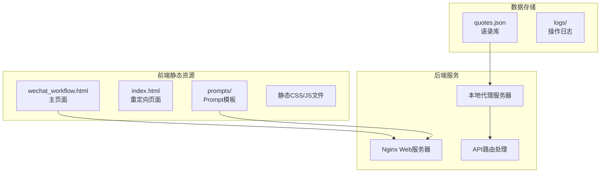
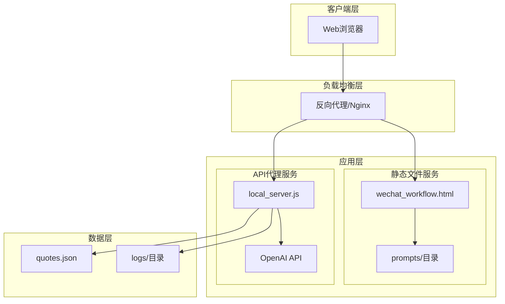
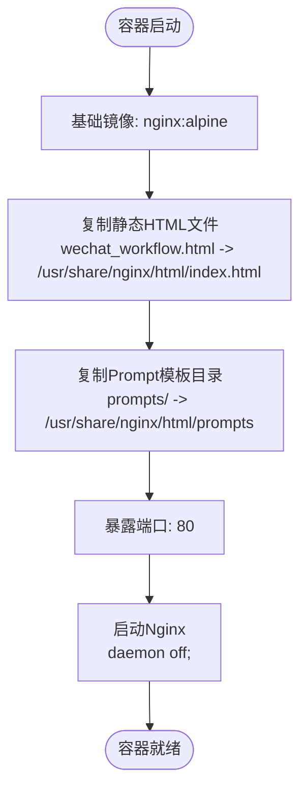
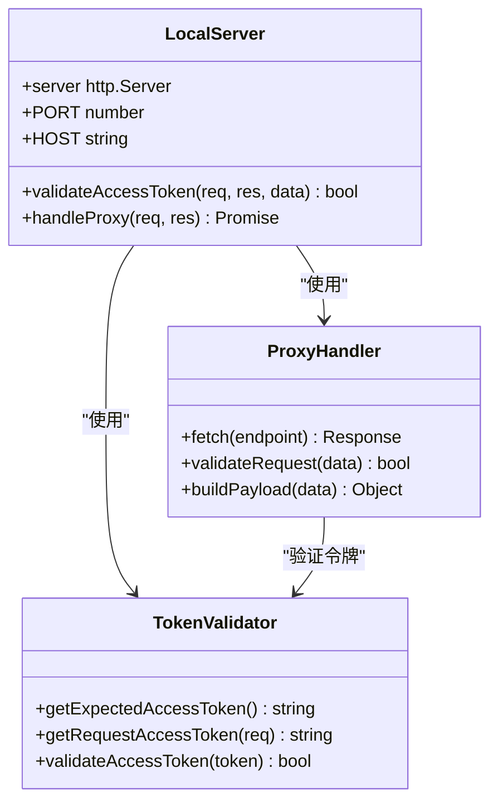
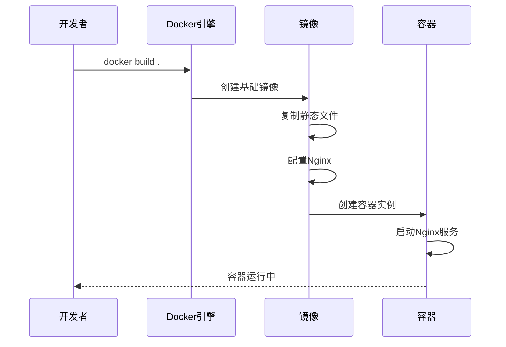

# Docker容器化部署

<cite>
**本文档引用的文件**
- [Dockerfile](file://Dockerfile)
- [README_DEPLOY.md](file://README_DEPLOY.md)
- [local_server.js](file://local_server.js)
- [wechat_workflow.html](file://wechat_workflow.html)
- [prompts/wechat_html_layout_v1.md](file://prompts/wechat_html_layout_v1.md)
- [prompts/wechat_verify_v1.md](file://prompts/wechat_verify_v1.md)
- [index.html](file://index.html)
- [vercel.json](file://vercel.json)
- [quotes.json](file://quotes.json)
</cite>

## 目录
1. [简介](#简介)
2. [项目结构](#项目结构)
3. [核心组件](#核心组件)
4. [架构概览](#架构概览)
5. [详细组件分析](#详细组件分析)
6. [Docker镜像构建](#docker镜像构建)
7. [Nginx配置与静态文件服务](#nginx配置与静态文件服务)
8. [容器运行与参数详解](#容器运行与参数详解)
9. [容器监控与运维](#容器监控与运维)
10. [Docker Compose多容器编排](#docker-compose多容器编排)
11. [性能考虑](#性能考虑)
12. [故障排除指南](#故障排除指南)
13. [结论](#结论)

## 简介

本文档提供了针对WeChat Writer Pro项目的全面Docker容器化部署指南。该项目是一个基于Web的公众号写作工具，集成了AI辅助写作功能，支持Prompt模板管理和微信公众号文章排版。系统采用Nginx作为静态文件服务器，提供现代化的Apple风格用户界面，并通过本地代理服务器实现OpenAI API的转发功能。

项目的核心特性包括：
- 响应式Apple风格UI设计
- AI驱动的写作辅助功能
- Prompt模板管理系统
- 微信公众号文章排版工具
- 支持访问令牌的安全控制
- 多种部署方式（Docker、Vercel、本地服务器）

## 项目结构

项目采用前后端分离的架构设计，主要包含以下核心组件：



**图表来源**
- [wechat_workflow.html:1-800](file://wechat_workflow.html#L1-L800)
- [Dockerfile:1-14](file://Dockerfile#L1-L14)
- [local_server.js:1-204](file://local_server.js#L1-L204)

**章节来源**
- [Dockerfile:1-14](file://Dockerfile#L1-L14)
- [wechat_workflow.html:1-800](file://wechat_workflow.html#L1-L800)
- [prompts/wechat_html_layout_v1.md:1-73](file://prompts/wechat_html_layout_v1.md#L1-L73)

## 核心组件

### Nginx静态文件服务器
项目使用Nginx作为轻量级Web服务器，专门处理静态文件服务。该服务器托管HTML页面、CSS样式、JavaScript文件以及Prompt模板文件。

### 本地代理服务器
基于Node.js的本地服务器提供API代理功能，实现以下核心功能：
- OpenAI API请求转发
- 访问令牌验证
- 健康检查接口
- 静态文件服务

### Prompt模板系统
项目内置了完整的Prompt模板管理系统，包含：
- 微信文章排版模板
- 文章质量审核模板
- 语录引用机制

**章节来源**
- [local_server.js:1-204](file://local_server.js#L1-L204)
- [prompts/wechat_html_layout_v1.md:1-73](file://prompts/wechat_html_layout_v1.md#L1-L73)
- [prompts/wechat_verify_v1.md:1-48](file://prompts/wechat_verify_v1.md#L1-L48)

## 架构概览

系统采用双服务器架构，结合静态文件服务和动态API代理：



**图表来源**
- [local_server.js:127-196](file://local_server.js#L127-L196)
- [Dockerfile:1-14](file://Dockerfile#L1-L14)

## 详细组件分析

### Nginx配置分析

Dockerfile中定义的Nginx配置具有以下特点：



**图表来源**
- [Dockerfile:1-14](file://Dockerfile#L1-L14)

### 本地代理服务器架构



**图表来源**
- [local_server.js:15-32](file://local_server.js#L15-L32)
- [local_server.js:50-125](file://local_server.js#L50-L125)

**章节来源**
- [local_server.js:1-204](file://local_server.js#L1-L204)

## Docker镜像构建

### Dockerfile指令详解

项目使用精简的Dockerfile来构建容器镜像：

| 指令 | 作用 | 配置选项 | 说明 |
|------|------|----------|------|
| FROM nginx:alpine | 基础镜像 | alpine版本 | 使用轻量级Alpine Linux |
| COPY wechat_workflow.html /usr/share/nginx/html/index.html | 文件复制 | 源路径/目标路径 | 复制主HTML页面 |
| COPY prompts /usr/share/nginx/html/prompts | 目录复制 | 源目录/目标目录 | 复制Prompt模板 |
| EXPOSE 80 | 端口暴露 | 80端口 | 暴露HTTP端口 |
| CMD ["nginx", "-g", "daemon off;"] | 启动命令 | daemon模式 | 前台运行Nginx |

### 构建过程分析



**图表来源**
- [Dockerfile:1-14](file://Dockerfile#L1-L14)

**章节来源**
- [Dockerfile:1-14](file://Dockerfile#L1-L14)

## Nginx配置与静态文件服务

### 静态文件组织结构

项目中的静态文件采用以下组织方式：

```mermaid
graph TD
Root[/usr/share/nginx/html] --> Index[index.html]
Root --> Main[wechat_workflow.html]
Root --> Prompts[prompts/目录]
Root --> Assets[静态资源]
Prompts --> Layout[wechat_html_layout_v1.md]
Prompts --> Verify[wechat_verify_v1.md]
Assets --> CSS[样式文件]
Assets --> JS[JavaScript文件]
Assets --> Images[图片资源]
```

**图表来源**
- [Dockerfile:4-7](file://Dockerfile#L4-L7)
- [wechat_workflow.html:1-800](file://wechat_workflow.html#L1-L800)

### Nginx配置特点

- **轻量级部署**: 使用Alpine Linux基础镜像，减小镜像体积
- **静态文件优化**: 直接由Nginx处理静态资源，无需额外中间件
- **端口配置**: 默认监听80端口，便于容器间通信
- **前台运行**: 使用`daemon off`确保容器进程正常工作

**章节来源**
- [Dockerfile:1-14](file://Dockerfile#L1-L14)

## 容器运行与参数详解

### 基础运行命令

```bash
# 基础容器运行
docker run -d \
  --name wechat-writer \
  -p 8080:80 \
  wechat-writer-pro:latest

# 带环境变量的运行
docker run -d \
  --name wechat-writer \
  -p 8080:80 \
  -e OPENAI_API_KEY=your_api_key \
  -e OPENAI_MODEL=gpt-4 \
  wechat-writer-pro:latest
```

### 端口映射说明

| 参数 | 作用 | 默认值 | 说明 |
|------|------|--------|------|
| -p 8080:80 | 端口映射 | 8080:80 | 将主机8080端口映射到容器80端口 |
| -p 80:80 | 直接暴露 | 80:80 | 直接使用主机80端口 |
| -p 443:80 | HTTPS映射 | 443:80 | 配合SSL证书使用 |

### 卷挂载配置

```bash
# 挂载日志目录
docker run -d \
  --name wechat-writer \
  -p 8080:80 \
  -v ./logs:/app/logs \
  wechat-writer-pro:latest

# 挂载自定义配置
docker run -d \
  --name wechat-writer \
  -p 8080:80 \
  -v ./custom-prompts:/usr/share/nginx/html/prompts \
  wechat-writer-pro:latest
```

### 环境变量配置

| 环境变量 | 类型 | 必需 | 默认值 | 说明 |
|----------|------|------|--------|------|
| OPENAI_API_KEY | 字符串 | 否 | 无 | OpenAI API密钥 |
| OPENAI_MODEL | 字符串 | 否 | gpt-4 | AI模型名称 |
| OPENAI_BASE_URL | 字符串 | 否 | https://api.openai.com/v1 | API基础URL |
| ARTICLE_JIKE_ACCESS_TOKEN | 字符串 | 否 | 无 | 访问令牌 |
| PORT | 数字 | 否 | 3001 | 服务器端口 |
| HOST | 字符串 | 否 | 0.0.0.0 | 绑定地址 |

**章节来源**
- [README_DEPLOY.md:78-88](file://README_DEPLOY.md#L78-L88)
- [local_server.js:198-199](file://local_server.js#L198-L199)

## 容器监控与运维

### 健康检查

```bash
# 检查容器状态
docker ps -a

# 查看容器日志
docker logs wechat-writer

# 实时查看日志
docker logs -f wechat-writer

# 查看容器资源使用
docker stats wechat-writer
```

### 重启策略

```bash
# 设置重启策略
docker run --restart=always wechat-writer-pro:latest

# 常用重启策略
docker run --restart=no wechat-writer-pro:latest          # 不重启
docker run --restart=on-failure wechat-writer-pro:latest  # 失败时重启
docker run --restart=unless-stopped wechat-writer-pro:latest  # 停止后重启
```

### 日志管理

```bash
# 查看最近日志
docker logs --tail=100 wechat-writer

# 查看特定时间段日志
docker logs --since="2024-01-01" wechat-writer

# 日志轮转
docker update --log-opt max-size=10m wechat-writer
```

**章节来源**
- [README_DEPLOY.md:114-123](file://README_DEPLOY.md#L114-L123)

## Docker Compose多容器编排

### 基础Compose配置

```yaml
version: '3.8'

services:
  wechat-writer:
    image: wechat-writer-pro:latest
    container_name: wechat-writer
    ports:
      - "8080:80"
    restart: unless-stopped
    environment:
      - OPENAI_API_KEY=${OPENAI_API_KEY}
      - OPENAI_MODEL=${OPENAI_MODEL}
      - ARTICLE_JIKE_ACCESS_TOKEN=${ARTICLE_JIKE_ACCESS_TOKEN}
    volumes:
      - ./logs:/app/logs
    networks:
      - app-network

  nginx-proxy:
    image: nginx:alpine
    container_name: nginx-proxy
    ports:
      - "80:80"
      - "443:443"
    volumes:
      - ./nginx.conf:/etc/nginx/nginx.conf
      - ./ssl:/etc/nginx/ssl
    depends_on:
      - wechat-writer
    networks:
      - app-network

networks:
  app-network:
    driver: bridge
```

### 生产环境Compose配置

```yaml
version: '3.8'

services:
  wechat-writer:
    image: wechat-writer-pro:latest
    container_name: wechat-writer
    restart: unless-stopped
    environment:
      - OPENAI_API_KEY=${OPENAI_API_KEY}
      - OPENAI_MODEL=${OPENAI_MODEL}
      - ARTICLE_JIKE_ACCESS_TOKEN=${ARTICLE_JIKE_ACCESS_TOKEN}
      - PORT=${PORT:-80}
    volumes:
      - ./logs:/app/logs
      - ./prompts:/usr/share/nginx/html/prompts
    expose:
      - "80"
    healthcheck:
      test: ["CMD", "wget", "-qO-", "http://localhost/api/status"]
      interval: 30s
      timeout: 10s
      retries: 3
    logging:
      driver: "json-file"
      options:
        max-size: "10m"
        max-file: "3"
    networks:
      - app-network

  redis-cache:
    image: redis:alpine
    container_name: redis-cache
    restart: unless-stopped
    volumes:
      - redis-data:/data
    expose:
      - "6379"
    networks:
      - app-network

volumes:
  redis-data:

networks:
  app-network:
    driver: bridge
```

**章节来源**
- [README_DEPLOY.md:74-126](file://README_DEPLOY.md#L74-L126)

## 性能考虑

### 镜像优化

- **基础镜像选择**: 使用Alpine Linux减小镜像体积
- **多阶段构建**: 可考虑添加构建阶段优化
- **缓存策略**: 利用Docker层缓存提高构建效率

### 容器性能调优

```bash
# 设置内存限制
docker run --memory=512m wechat-writer-pro:latest

# 设置CPU配额
docker run --cpus=0.5 wechat-writer-pro:latest

# 设置资源限制
docker run --memory=1g --cpus=1 wechat-writer-pro:latest
```

### Nginx性能配置

- **worker进程**: 根据CPU核心数配置
- **连接数**: 优化最大连接数设置
- **静态文件缓存**: 配置适当的缓存头

## 故障排除指南

### 常见问题诊断

```bash
# 检查端口占用
netstat -tlnp | grep :8080

# 检查容器健康状态
docker inspect wechat-writer | grep -A 20 "Health"

# 查看网络连接
docker network ls
docker network inspect app-network
```

### 日志分析

```bash
# 查看Nginx错误日志
docker exec wechat-writer cat /var/log/nginx/error.log

# 查看应用日志
docker exec wechat-writer cat /app/logs/operations.log

# 实时监控日志
docker logs -f --since="5m" wechat-writer
```

### 环境变量验证

```bash
# 检查环境变量
docker exec wechat-writer env | grep OPENAI

# 验证API连通性
docker exec wechat-writer curl -I https://api.openai.com/v1/models
```

**章节来源**
- [README_DEPLOY.md:114-123](file://README_DEPLOY.md#L114-L123)

## 结论

本文档提供了WeChat Writer Pro项目的完整Docker容器化部署指南。项目采用简洁高效的架构设计，通过Nginx提供静态文件服务，结合本地代理服务器实现AI功能集成。

关键优势包括：
- **轻量级部署**: 基于Alpine Linux的精简镜像
- **快速启动**: 单容器部署，无需复杂的数据库依赖
- **灵活配置**: 支持多种环境变量和卷挂载
- **易于扩展**: 可通过Docker Compose实现多容器编排

建议的生产部署实践：
1. 使用独立的网络隔离容器
2. 配置适当的健康检查
3. 设置合理的资源限制
4. 建立完善的日志监控体系
5. 考虑使用反向代理提供SSL支持

通过遵循本文档的指导，可以快速、可靠地部署和运维WeChat Writer Pro项目。