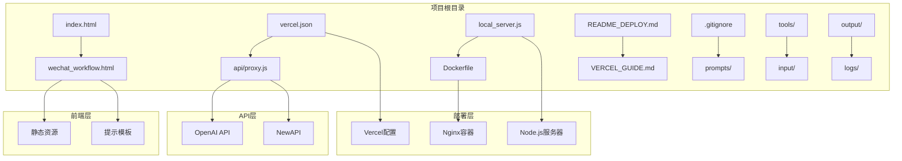
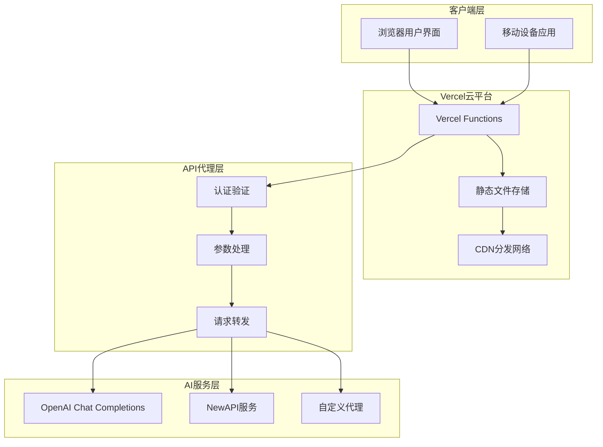
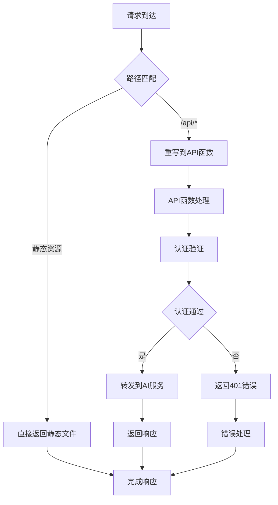
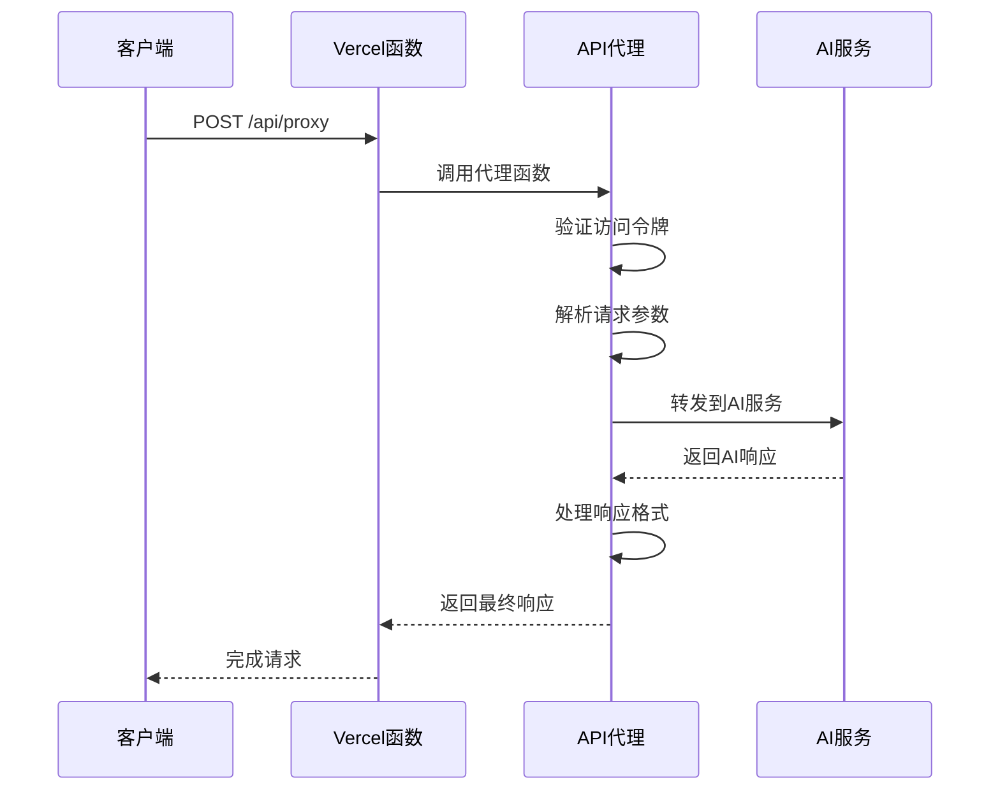
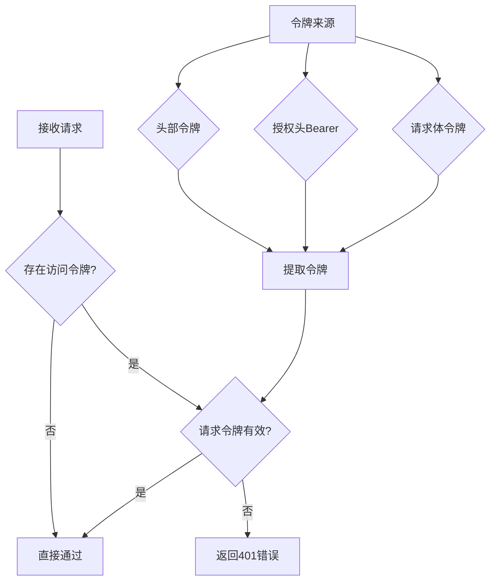
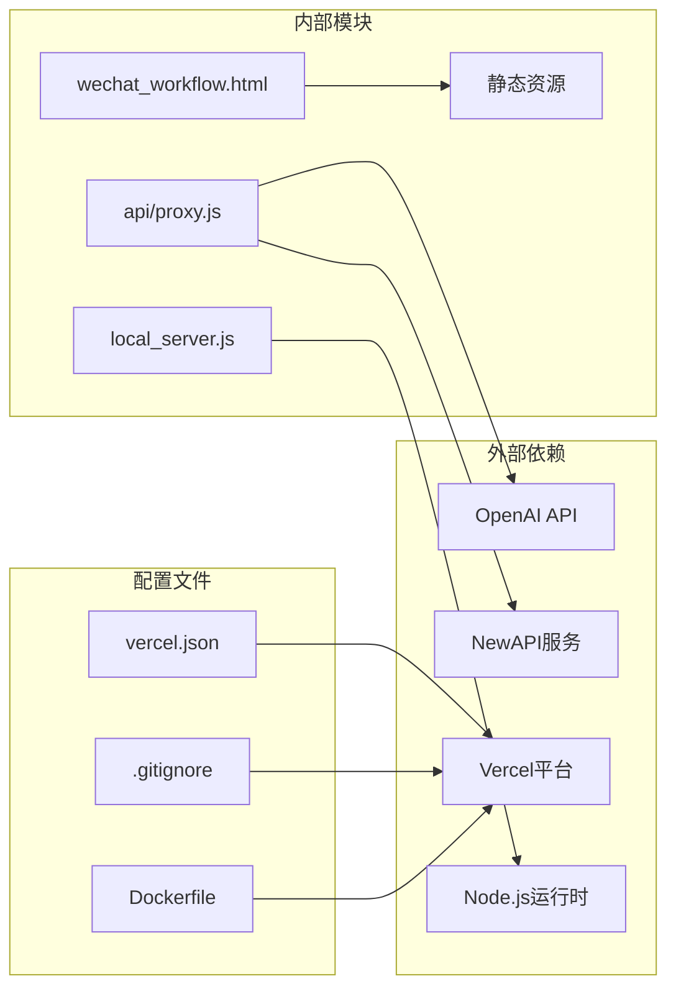
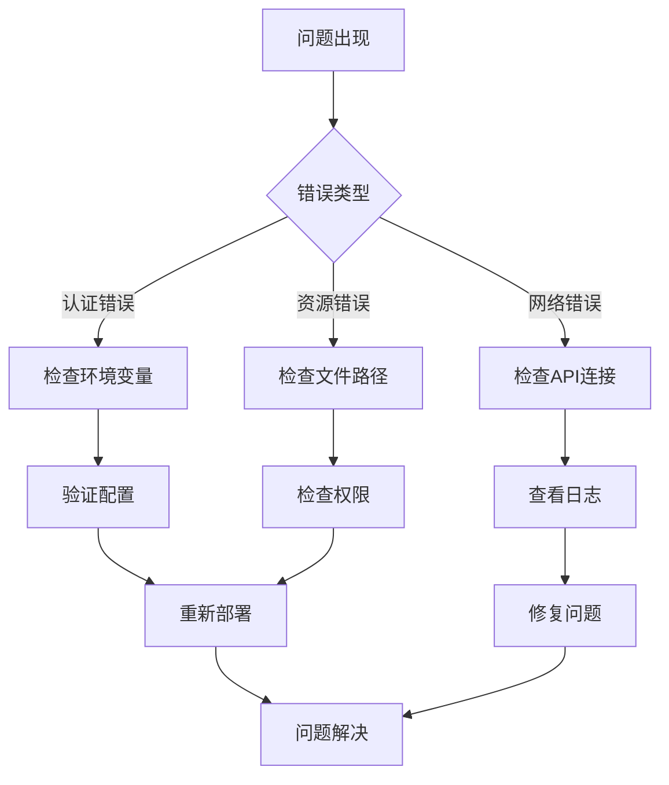

# Vercel平台部署

<cite>
**本文档引用的文件**
- [vercel.json](file://vercel.json)
- [README_DEPLOY.md](file://README_DEPLOY.md)
- [VERCEL_GUIDE.md](file://VERCEL_GUIDE.md)
- [.gitignore](file://.gitignore)
- [api/proxy.js](file://api/proxy.js)
- [local_server.js](file://local_server.js)
- [Dockerfile](file://Dockerfile)
- [index.html](file://index.html)
- [wechat_workflow.html](file://wechat_workflow.html)
</cite>

## 目录
1. [简介](#简介)
2. [项目结构](#项目结构)
3. [核心组件](#核心组件)
4. [架构概览](#架构概览)
5. [详细组件分析](#详细组件分析)
6. [依赖关系分析](#依赖关系分析)
7. [性能考虑](#性能考虑)
8. [故障排除指南](#故障排除指南)
9. [结论](#结论)
10. [附录](#附录)

## 简介

这是一个基于Web的微信公众号写作工具，集成了AI生成功能。该项目支持多种部署方式，包括Vercel云函数部署、传统服务器部署和Docker容器部署。项目采用前后端分离架构，前端为静态HTML页面，后端通过API代理实现与OpenAI等AI服务的通信。

## 项目结构

项目采用模块化的文件组织方式，主要包含以下核心目录和文件：

**图表来源**
- [vercel.json:1-5](file://vercel.json#L1-L5)
- [wechat_workflow.html:1-16](file://wechat_workflow.html#L1-L16)
- [api/proxy.js:1-119](file://api/proxy.js#L1-L119)

**章节来源**
- [vercel.json:1-5](file://vercel.json#L1-L5)
- [README_DEPLOY.md:1-126](file://README_DEPLOY.md#L1-L126)
- [wechat_workflow.html:1-800](file://wechat_workflow.html#L1-L800)

## 核心组件

### Vercel配置组件

Vercel平台的核心配置通过`vercel.json`文件定义，目前包含基本的URL重写规则：

- **重写规则**：将所有`/api/*`请求转发到对应的API处理程序
- **部署目标**：支持静态文件和API函数的混合部署

### API代理组件

`api/proxy.js`实现了核心的API代理功能：

- **认证机制**：支持访问令牌验证，可选的客户端认证
- **多API支持**：兼容OpenAI和NewAPI等多种AI服务提供商
- **流式响应**：支持实时流式数据传输
- **参数透传**：完整保留原始请求参数和头部信息

### 本地服务器组件

`local_server.js`提供了完整的本地开发和部署解决方案：

- **静态文件服务**：提供HTML、CSS、JavaScript等静态资源
- **API代理功能**：与Vercel函数相同的代理逻辑
- **健康检查**：提供`/api/status`端点用于部署验证
- **环境变量支持**：支持`.env.local`文件加载

**章节来源**
- [vercel.json:1-5](file://vercel.json#L1-L5)
- [api/proxy.js:1-119](file://api/proxy.js#L1-L119)
- [local_server.js:1-204](file://local_server.js#L1-L204)

## 架构概览

项目采用三层架构设计，支持云端和本地两种部署模式：

**图表来源**
- [api/proxy.js:23-119](file://api/proxy.js#L23-L119)
- [local_server.js:127-196](file://local_server.js#L127-L196)

## 详细组件分析

### Vercel配置文件分析

`vercel.json`文件定义了项目的核心部署配置：

**图表来源**
- [vercel.json:2-4](file://vercel.json#L2-L4)

**章节来源**
- [vercel.json:1-5](file://vercel.json#L1-L5)

### API代理组件详细分析

API代理组件实现了完整的请求处理流程：

**图表来源**
- [api/proxy.js:23-119](file://api/proxy.js#L23-L119)

**章节来源**
- [api/proxy.js:1-119](file://api/proxy.js#L1-L119)

### 认证机制分析

系统实现了多层次的认证保护机制：

**图表来源**
- [api/proxy.js:12-21](file://api/proxy.js#L12-L21)

**章节来源**
- [api/proxy.js:1-119](file://api/proxy.js#L1-L119)

## 依赖关系分析

项目的主要依赖关系如下：

**图表来源**
- [api/proxy.js:35-37](file://api/proxy.js#L35-L37)
- [local_server.js:198-199](file://local_server.js#L198-L199)

**章节来源**
- [vercel.json:1-5](file://vercel.json#L1-L5)
- [api/proxy.js:1-119](file://api/proxy.js#L1-L119)
- [local_server.js:1-204](file://local_server.js#L1-L204)

## 性能考虑

### 部署性能优化

1. **静态资源优化**
   - 使用Vercel CDN进行全球分发
   - 自动压缩和缓存静态文件
   - 支持HTTP/2和HTTPS加速

2. **API响应优化**
   - 流式响应支持实时数据传输
   - 最小化网络往返次数
   - 智能超时和重试机制

3. **内存管理**
   - 无状态函数设计
   - 自动扩缩容机制
   - 内存使用监控

### 性能监控建议

- 监控API响应时间分布
- 关注冷启动延迟
- 跟踪并发连接数
- 监控错误率和成功率

## 故障排除指南

### 常见部署问题

1. **401未授权错误**
   - 检查环境变量配置
   - 验证访问令牌设置
   - 确认API密钥有效性

2. **API调用失败**
   - 检查网络连通性
   - 验证AI服务可用性
   - 查看请求超时设置

3. **静态资源加载失败**
   - 检查文件路径配置
   - 验证CDN缓存状态
   - 确认MIME类型设置

### 调试技巧

**章节来源**
- [README_DEPLOY.md:26-42](file://README_DEPLOY.md#L26-L42)
- [VERCEL_GUIDE.md:12-31](file://VERCEL_GUIDE.md#L12-L31)

## 结论

本项目提供了完整的AI驱动微信公众号写作解决方案，支持灵活的部署方式和强大的功能特性。通过Vercel平台部署，用户可以获得高可用、高性能的云端服务，同时保持较低的运维成本。

项目的关键优势包括：
- 简化的部署流程和配置
- 强大的API代理功能
- 多种认证和安全机制
- 良好的扩展性和维护性

## 附录

### 部署前准备清单

- 准备有效的OpenAI API密钥
- 配置必要的环境变量
- 准备GitHub/GitLab仓库
- 确认域名和DNS设置

### 环境变量配置参考

| 变量名 | 必需性 | 默认值 | 描述 |
|--------|--------|--------|------|
| OPENAI_API_KEY | 必需 | 无 | OpenAI API密钥 |
| OPENAI_BASE_URL | 可选 | https://api.openai.com/v1 | API基础URL |
| OPENAI_MODEL | 可选 | gpt-5.4 | AI模型名称 |
| ARTICLE_JIKE_ACCESS_TOKEN | 可选 | 无 | 访问令牌 |
| PORT | 可选 | 3001 | 服务器端口 |
| HOST | 可选 | 0.0.0.0 | 绑定地址 |

### 版本控制集成

项目已配置.gitignore文件，排除了敏感文件和临时文件：

- `.env`系列文件
- `.DS_Store`系统文件
- `.vercel/`部署缓存
- `node_modules/`依赖包

**章节来源**
- [.gitignore:1-7](file://.gitignore#L1-L7)
- [README_DEPLOY.md:78-88](file://README_DEPLOY.md#L78-L88)