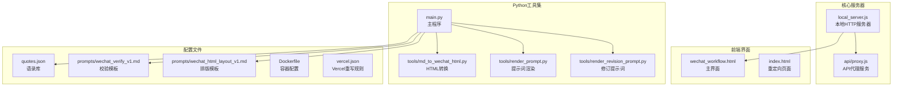

# 本地部署

<cite>
**本文档引用的文件**
- [README_DEPLOY.md](file://README_DEPLOY.md)
- [local_server.js](file://local_server.js)
- [main.py](file://main.py)
- [api/proxy.js](file://api/proxy.js)
- [wechat_workflow.html](file://wechat_workflow.html)
- [tools/md_to_wechat_html.py](file://tools/md_to_wechat_html.py)
- [tools/render_prompt.py](file://tools/render_prompt.py)
- [tools/render_revision_prompt.py](file://tools/render_revision_prompt.py)
- [prompts/wechat_verify_v1.md](file://prompts/wechat_verify_v1.md)
- [prompts/wechat_html_layout_v1.md](file://prompts/wechat_html_layout_v1.md)
- [quotes.json](file://quotes.json)
- [index.html](file://index.html)
- [Dockerfile](file://Dockerfile)
- [vercel.json](file://vercel.json)
</cite>

## 目录
1. [简介](#简介)
2. [项目结构](#项目结构)
3. [前置条件](#前置条件)
4. [环境变量配置](#环境变量配置)
5. [本地服务器启动](#本地服务器启动)
6. [开发调试方法](#开发调试方法)
7. [日志查看技巧](#日志查看技巧)
8. [部署前检查清单](#部署前检查清单)
9. [部署后验证步骤](#部署后验证步骤)
10. [常见问题排查](#常见问题排查)
11. [性能考虑](#性能考虑)
12. [故障排除指南](#故障排除指南)
13. [结论](#结论)

## 简介

这是一个基于 Node.js 的本地部署工具，提供了完整的微信公众号文章写作和排版工作流程。项目包含本地 HTTP 服务器、OpenAI API 代理、Python 工具集以及完整的前端界面，支持从草稿到最终 HTML 的全流程自动化处理。

## 项目结构

项目采用模块化设计，主要包含以下组件：



**图表来源**
- [local_server.js:1-204](file://local_server.js#L1-L204)
- [api/proxy.js:1-119](file://api/proxy.js#L1-L119)
- [wechat_workflow.html:1-800](file://wechat_workflow.html#L1-L800)
- [main.py:1-195](file://main.py#L1-L195)

**章节来源**
- [README_DEPLOY.md:74-126](file://README_DEPLOY.md#L74-L126)
- [local_server.js:127-196](file://local_server.js#L127-L196)

## 前置条件

### Node.js 环境要求

- **Node.js 版本**: 建议使用 Node.js 18+ 版本
- **内存要求**: 至少 512MB RAM
- **存储空间**: 至少 100MB 可用空间

### Python 环境要求

- **Python 版本**: Python 3.6+
- **必需依赖**: 
  - argparse (标准库)
  - json (标准库)
  - os (标准库)
  - sys (标准库)
  - datetime (标准库)

### 必要依赖包

```bash
# Node.js 依赖（自动安装）
npm install

# Python 依赖（系统自带，无需额外安装）
# argparse, json, os, sys, datetime
```

### 系统要求

- **操作系统**: Linux, macOS, Windows
- **网络**: 需要访问 OpenAI API 或其他 LLM 服务
- **防火墙**: 需要开放指定端口（默认 3001）

**章节来源**
- [README_DEPLOY.md:74-88](file://README_DEPLOY.md#L74-L88)
- [local_server.js:198-203](file://local_server.js#L198-L203)

## 环境变量配置

### 必需环境变量

| 变量名 | 默认值 | 描述 |
|--------|--------|------|
| PORT | 3001 | 服务器监听端口 |
| HOST | 0.0.0.0 | 服务器绑定地址 |
| OPENAI_API_KEY | 无 | OpenAI API 密钥 |
| OPENAI_BASE_URL | https://api.openai.com/v1 | OpenAI API 基础URL |
| OPENAI_MODEL | gpt-5.4 | 默认使用的模型 |

### 可选环境变量

| 变量名 | 默认值 | 描述 |
|--------|--------|------|
| ARTICLE_JIKE_ACCESS_TOKEN | 无 | 访问令牌，启用访问控制 |
| OPENAI_REASONING_EFFORT | none | 推理努力程度 |
| APP_ACCESS_TOKEN | 无 | 应用访问令牌（备用） |

### 环境变量配置方法

#### 方法一：使用 .env.local 文件

在项目根目录创建 `.env.local` 文件：

```bash
# 基础配置
PORT=3001
HOST=0.0.0.0

# OpenAI 配置
OPENAI_BASE_URL=https://api.openai.com/v1
OPENAI_MODEL=gpt-5.4
OPENAI_REASONING_EFFORT=none

# API 密钥
OPENAI_API_KEY=your_openai_api_key_here

# 访问控制
ARTICLE_JIKE_ACCESS_TOKEN=your_access_token_here
```

#### 方法二：直接设置环境变量

```bash
# Linux/macOS
export PORT=3001
export OPENAI_API_KEY=your_key_here
export ARTICLE_JIKE_ACCESS_TOKEN=your_token_here

# Windows
set PORT=3001
set OPENAI_API_KEY=your_key_here
set ARTICLE_JIKE_ACCESS_TOKEN=your_token_here
```

#### 方法三：systemd 服务配置

创建 `/etc/article-jike.env` 文件：

```bash
PORT=3001
HOST=0.0.0.0
OPENAI_BASE_URL=https://api.openai.com/v1
OPENAI_MODEL=gpt-5.4
OPENAI_REASONING_EFFORT=none
OPENAI_API_KEY=your_openai_api_key
ARTICLE_JIKE_ACCESS_TOKEN=your_access_token
```

**章节来源**
- [README_DEPLOY.md:78-88](file://README_DEPLOY.md#L78-L88)
- [local_server.js:34-48](file://local_server.js#L34-L48)
- [local_server.js:15-32](file://local_server.js#L15-L32)

## 本地服务器启动

### 启动步骤

1. **克隆项目并进入目录**
   ```bash
   git clone <repository-url>
   cd article_jike
   ```

2. **安装依赖**
   ```bash
   # Node.js 依赖（自动安装）
   npm install
   
   # Python 依赖（系统自带）
   # 无需额外安装
   ```

3. **配置环境变量**
   ```bash
   # 创建 .env.local 文件
   cp .env.local.example .env.local
   # 编辑 .env.local 文件，添加您的配置
   ```

4. **启动本地服务器**
   ```bash
   node local_server.js
   ```

### 命令行参数说明

| 参数 | 类型 | 默认值 | 描述 |
|------|------|--------|------|
| --port | 数字 | 3001 | 服务器端口号 |
| --host | 字符串 | 0.0.0.0 | 绑定主机地址 |
| --config | 文件路径 | .env.local | 环境变量配置文件 |

### 服务器功能

本地服务器提供以下功能：

1. **静态文件服务**: 提供 HTML、CSS、JS、图片等静态资源
2. **API 代理服务**: 转发 OpenAI API 请求
3. **健康检查**: 提供 `/api/status` 端点
4. **访问控制**: 支持基于令牌的访问控制

**章节来源**
- [README_DEPLOY.md:76-88](file://README_DEPLOY.md#L76-L88)
- [local_server.js:127-196](file://local_server.js#L127-L196)

## 开发调试方法

### 日志级别

服务器支持多种日志级别：

```javascript
// 服务器启动日志
console.log(`Server running at http://${HOST}:${PORT}/`);

// API 调试日志
console.log('[Local Proxy]', { baseUrl, hasApiKey: !!apiKey, model, isStream });

// 错误日志
console.error(e);
```

### 调试技巧

1. **启用详细日志**
   ```bash
   # 设置 Node.js 调试模式
   export NODE_OPTIONS="--inspect-brk=9229"
   node --inspect-brk local_server.js
   ```

2. **检查 API 连接**
   ```bash
   # 测试 API 代理
   curl -X POST http://localhost:3001/api/proxy \
     -H "Content-Type: application/json" \
     -d '{"messages": [{"role": "user", "content": "Hello"}]}'
   ```

3. **验证配置**
   ```bash
   # 检查环境变量
   node -e "console.log(process.env.OPENAI_API_KEY)"
   ```

### 开发模式启动

```bash
# 启动开发服务器
npm run dev

# 或者直接启动
node local_server.js
```

**章节来源**
- [local_server.js:71](file://local_server.js#L71)
- [local_server.js:200-203](file://local_server.js#L200-L203)

## 日志查看技巧

### 日志位置

- **服务器日志**: 控制台输出
- **操作日志**: `logs/operations.log` 文件
- **Python 工具日志**: 控制台输出

### 日志格式

```python
# Python 操作日志格式
[YYYY-MM-DD HH:MM:SS] Status: SUCCESS | Input: input_file | Output: output_file
```

### 日志查看命令

```bash
# 查看服务器日志
tail -f server.log

# 查看操作日志
tail -f logs/operations.log

# 查看实时日志
journalctl -u article-jike.service -f
```

### 日志分析

1. **正常运行状态**
   ```
   Server running at http://0.0.0.0:3001/
   Using API Base: https://api.openai.com/v1
   ```

2. **API 调用日志**
   ```
   [Local Proxy] { baseUrl: "https://api.openai.com/v1", hasApiKey: true, model: "gpt-5.4", isStream: false }
   ```

3. **错误日志**
   ```
   Error: API key missing
   ```

**章节来源**
- [main.py:20-31](file://main.py#L20-L31)
- [main.py:156-159](file://main.py#L156-L159)

## 部署前检查清单

### 系统检查

- [ ] Node.js 版本 >= 18
- [ ] Python 版本 >= 3.6
- [ ] 网络连接正常
- [ ] 防火墙端口已开放

### 配置检查

- [ ] `.env.local` 文件已创建
- [ ] OpenAI API 密钥已配置
- [ ] 访问令牌已设置（如需要）
- [ ] 端口配置正确

### 权限检查

- [ ] 项目目录读写权限
- [ ] 环境变量文件权限
- [ ] 日志目录写权限

### 依赖检查

- [ ] Node.js 依赖安装完成
- [ ] Python 标准库可用
- [ ] 系统网络访问权限

**章节来源**
- [README_DEPLOY.md:114-126](file://README_DEPLOY.md#L114-L126)

## 部署后验证步骤

### 基础验证

1. **服务器启动验证**
   ```bash
   # 检查进程
   ps aux | grep node
   
   # 检查端口占用
   netstat -tlnp | grep :3001
   
   # 检查服务状态
   systemctl is-active article-jike.service
   ```

2. **健康检查**
   ```bash
   # 基础健康检查
   curl -I http://localhost:3001/api/status
   
   # 页面访问测试
   curl http://localhost:3001/wechat_workflow.html
   ```

3. **API 功能测试**
   ```bash
   # API 代理测试
   curl -X POST http://localhost:3001/api/proxy \
     -H "Content-Type: application/json" \
     -d '{"messages": [{"role": "user", "content": "test"}], "stream": false}'
   ```

### 功能验证

1. **前端界面验证**
   - [ ] 页面加载正常
   - [ ] 样式显示正确
   - [ ] JavaScript 功能正常

2. **Python 工具验证**
   - [ ] 提示词生成工具
   - [ ] HTML 转换工具
   - [ ] 修订提示词工具

3. **API 连接验证**
   - [ ] OpenAI API 连接
   - [ ] 访问令牌验证
   - [ ] 代理功能测试

### 性能验证

```bash
# 响应时间测试
ab -n 100 -c 10 http://localhost:3001/api/status

# 并发测试
wrk -t12 -c400 -d30s http://localhost:3001/
```

**章节来源**
- [README_DEPLOY.md:114-123](file://README_DEPLOY.md#L114-L123)

## 常见问题排查

### 启动问题

**问题**: 服务器无法启动
**解决方法**:
```bash
# 检查端口占用
lsof -i :3001

# 检查 Node.js 版本
node --version

# 检查依赖安装
npm install --production
```

**问题**: 环境变量未生效
**解决方法**:
```bash
# 检查 .env.local 文件
cat .env.local

# 验证环境变量
node -e "console.log(process.env.PORT)"

# 重启服务
sudo systemctl restart article-jike.service
```

### API 连接问题

**问题**: OpenAI API 连接失败
**解决方法**:
```bash
# 检查 API 密钥
echo $OPENAI_API_KEY

# 测试 API 连接
curl -H "Authorization: Bearer $OPENAI_API_KEY" \
  https://api.openai.com/v1/models

# 检查网络访问
ping api.openai.com
```

**问题**: 401 未授权错误
**解决方法**:
```bash
# 检查访问令牌
echo $ARTICLE_JIKE_ACCESS_TOKEN

# 验证令牌格式
curl -H "x-article-jike-access-token: $ARTICLE_JIKE_ACCESS_TOKEN" \
  http://localhost:3001/api/status
```

### 性能问题

**问题**: 服务器响应慢
**解决方法**:
```bash
# 检查系统资源
htop

# 检查日志
tail -f logs/operations.log

# 优化配置
export NODE_ENV=production
```

### 文件权限问题

**问题**: 日志文件无法写入
**解决方法**:
```bash
# 检查目录权限
ls -la logs/

# 修复权限
chmod 755 logs/
chown -R ubuntu:ubuntu logs/
```

**章节来源**
- [README_DEPLOY.md:114-126](file://README_DEPLOY.md#L114-L126)
- [local_server.js:119-124](file://local_server.js#L119-L124)

## 性能考虑

### 内存优化

- **Node.js 内存限制**: 建议设置为 512MB-1GB
- **垃圾回收**: 使用适当的 GC 参数
- **缓存策略**: 合理使用内存缓存

### 网络优化

- **连接池**: 复用 HTTP 连接
- **超时设置**: 合理设置请求超时
- **重试机制**: 实现指数退避重试

### 并发处理

```javascript
// Node.js 并发处理
const cluster = require('cluster');
const numCPUs = require('os').cpus().length;

if (cluster.isMaster) {
  for (let i = 0; i < numCPUs; i++) {
    cluster.fork();
  }
} else {
  // 启动服务器
  server.listen(PORT, HOST);
}
```

### 监控指标

- **CPU 使用率**: < 80%
- **内存使用**: < 70%
- **响应时间**: < 2 秒
- **错误率**: < 1%

## 故障排除指南

### 系统级故障

**故障**: 服务无法启动
```bash
# 检查 systemd 服务
sudo systemctl status article-jike.service

# 查看服务日志
sudo journalctl -u article-jike.service -n 50

# 检查依赖
sudo systemctl daemon-reload
sudo systemctl enable article-jike.service
```

**故障**: 端口被占用
```bash
# 查找占用进程
lsof -i :3001

# 终止占用进程
kill -9 $(lsof -t -i :3001)

# 更改端口
export PORT=3002
```

### 配置故障

**故障**: 环境变量不生效
```bash
# 检查环境变量文件
cat /etc/article-jike.env

# 验证文件权限
ls -la /etc/article-jike.env

# 重新加载配置
sudo systemctl daemon-reload
sudo systemctl restart article-jike.service
```

**故障**: 访问令牌验证失败
```bash
# 检查令牌配置
echo "ARTICLE_JIKE_ACCESS_TOKEN=$ARTICLE_JIKE_ACCESS_TOKEN"

# 测试令牌
curl -H "x-article-jike-access-token: $ARTICLE_JIKE_ACCESS_TOKEN" \
  http://localhost:3001/api/status

# 重置令牌
export ARTICLE_JIKE_ACCESS_TOKEN="new_token"
```

### 网络故障

**故障**: API 连接超时
```bash
# 检查网络连通性
ping api.openai.com

# 检查 DNS 解析
nslookup api.openai.com

# 检查代理设置
echo $http_proxy
echo $https_proxy
```

### 存储故障

**故障**: 日志文件写入失败
```bash
# 检查磁盘空间
df -h .

# 检查目录权限
ls -la logs/

# 清理旧日志
find logs/ -name "*.log" -mtime +7 -delete

# 重启服务
sudo systemctl restart article-jike.service
```

**章节来源**
- [README_DEPLOY.md:114-126](file://README_DEPLOY.md#L114-L126)
- [local_server.js:198-203](file://local_server.js#L198-L203)

## 结论

本地部署文档提供了完整的部署指南，包括前置条件、环境配置、启动步骤、调试方法和故障排除。通过遵循这些步骤，您可以成功部署和运行该工具。

### 关键要点

1. **环境准备**: 确保 Node.js 和 Python 环境正确配置
2. **配置管理**: 使用 .env.local 文件管理环境变量
3. **服务监控**: 建立完善的日志和监控体系
4. **故障预防**: 制定详细的故障排除计划

### 后续步骤

1. **生产环境部署**: 参考 systemd 服务配置
2. **监控设置**: 配置日志轮转和告警
3. **备份策略**: 建立配置和数据备份
4. **性能优化**: 根据实际使用情况进行优化