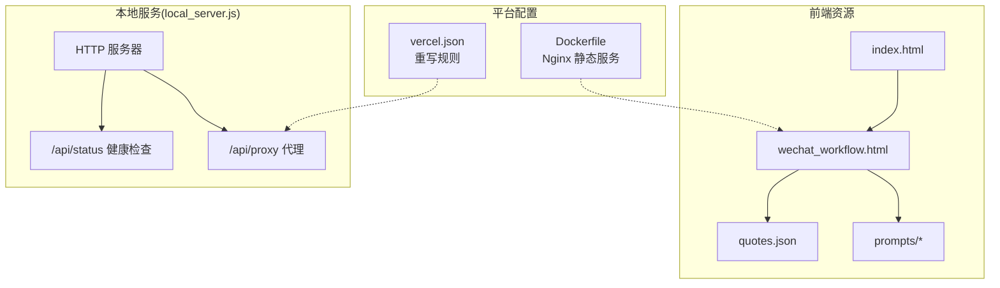
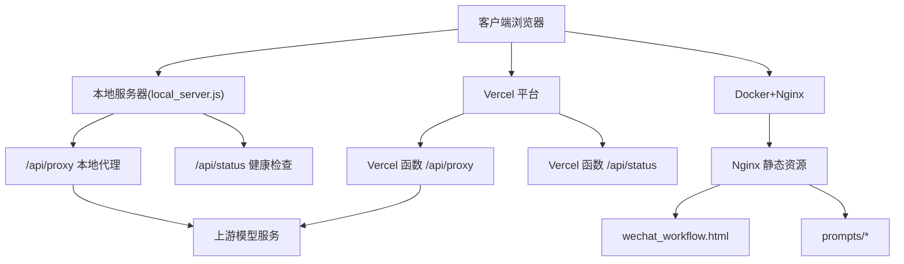
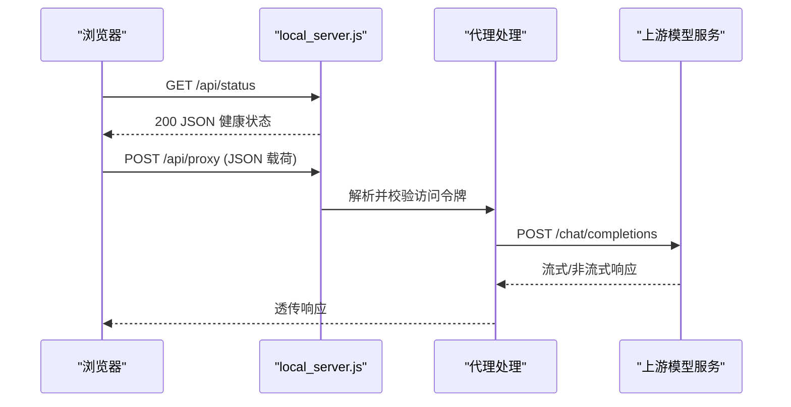
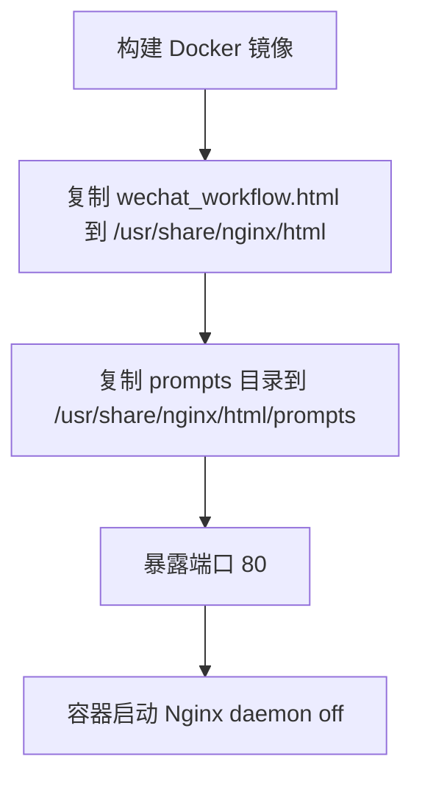
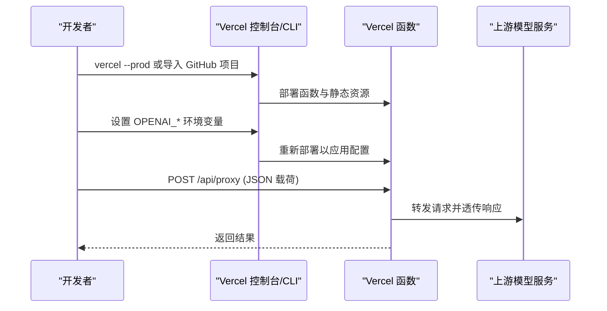
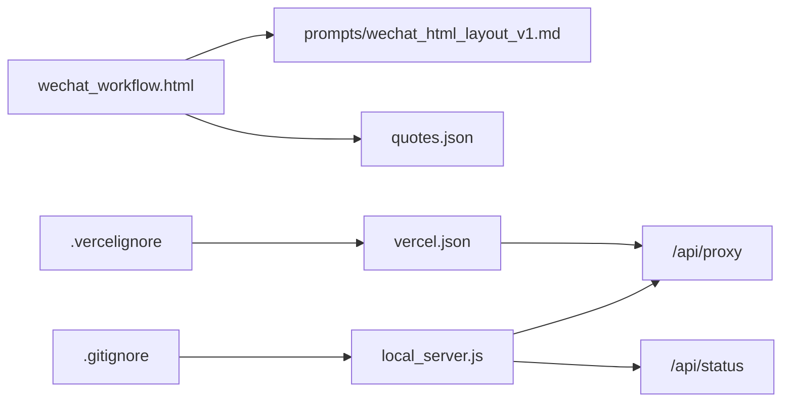

# 部署指南

<cite>
**本文引用的文件**   
- [README_DEPLOY.md](file://README_DEPLOY.md)
- [VERCEL_GUIDE.md](file://VERCEL_GUIDE.md)
- [Dockerfile](file://Dockerfile)
- [vercel.json](file://vercel.json)
- [local_server.js](file://local_server.js)
- [api/proxy.js](file://api/proxy.js)
- [api/status.js](file://api/status.js)
- [wechat_workflow.html](file://wechat_workflow.html)
- [.gitignore](file://.gitignore)
- [.vercelignore](file://.vercelignore)
- [index.html](file://index.html)
- [quotes.json](file://quotes.json)
- [prompts/wechat_html_layout_v1.md](file://prompts/wechat_html_layout_v1.md)
</cite>

## 目录
1. [简介](#简介)
2. [项目结构](#项目结构)
3. [核心组件](#核心组件)
4. [架构总览](#架构总览)
5. [详细组件分析](#详细组件分析)
6. [依赖关系分析](#依赖关系分析)
7. [性能考虑](#性能考虑)
8. [故障排查指南](#故障排查指南)
9. [结论](#结论)
10. [附录](#附录)

## 简介
本指南面向不同技术背景的用户，提供三种部署方式的完整操作流程：本地部署（环境变量配置、本地服务器启动、开发调试方法）、Docker 容器化部署（镜像构建、Nginx 配置、容器运行）、Vercel 平台部署（平台配置要求、重写规则设置、环境变量配置）。同时给出部署前准备清单、部署后验证方法、常见问题解决与性能优化建议。

## 项目结构
该项目是一个前后端一体化的静态 Web 应用，前端页面通过本地代理接口对接第三方大模型服务。核心文件包括：
- 前端页面与资源：入口页面、主工作流页面、提示词模板、语录数据
- 本地代理与静态资源服务：Node.js 本地服务器
- 平台部署配置：Vercel 重写规则、Dockerfile
- API 适配：Vercel 函数代理与状态接口

图表来源
- [index.html:1-16](file://index.html#L1-L16)
- [wechat_workflow.html:1-800](file://wechat_workflow.html#L1-L800)
- [local_server.js:127-196](file://local_server.js#L127-L196)
- [vercel.json:1-5](file://vercel.json#L1-L5)
- [Dockerfile:1-14](file://Dockerfile#L1-L14)

章节来源
- [index.html:1-16](file://index.html#L1-L16)
- [wechat_workflow.html:1-800](file://wechat_workflow.html#L1-L800)
- [local_server.js:127-196](file://local_server.js#L127-L196)
- [vercel.json:1-5](file://vercel.json#L1-L5)
- [Dockerfile:1-14](file://Dockerfile#L1-L14)

## 核心组件
- 本地代理与静态资源服务：提供 /api/proxy 代理与 /api/status 健康检查，支持访问令牌校验与流式响应转发。
- Vercel 函数代理：适配平台函数运行时，实现与本地代理一致的代理逻辑与参数透传。
- 健康检查接口：返回服务状态、模型配置、鉴权开关与可用性信息。
- 前端页面与资源：主工作流页面加载提示词模板与语录数据，支持本地代理请求。
- 平台重写与容器化：Vercel 重写规则将 /api/* 转发到函数；Dockerfile 使用 Nginx 提供静态页面与提示词资源。

章节来源
- [local_server.js:50-125](file://local_server.js#L50-L125)
- [api/proxy.js:23-118](file://api/proxy.js#L23-L118)
- [api/status.js:12-28](file://api/status.js#L12-L28)
- [wechat_workflow.html:1-800](file://wechat_workflow.html#L1-L800)
- [vercel.json:1-5](file://vercel.json#L1-L5)
- [Dockerfile:1-14](file://Dockerfile#L1-L14)

## 架构总览
三种部署方式共享同一前端页面与提示词资源，差异在于后端代理与静态资源提供方式：
- 本地部署：Node.js 本地服务器同时提供静态页面与代理接口。
- Vercel 部署：静态页面由平台托管，/api/* 通过函数代理转发到上游模型服务。
- Docker 部署：使用 Nginx 提供静态页面与提示词资源，适合仅静态场景或边缘分流。

图表来源
- [local_server.js:127-196](file://local_server.js#L127-L196)
- [api/proxy.js:23-118](file://api/proxy.js#L23-L118)
- [api/status.js:12-28](file://api/status.js#L12-L28)
- [Dockerfile:1-14](file://Dockerfile#L1-L14)
- [vercel.json:1-5](file://vercel.json#L1-L5)

## 详细组件分析

### 本地部署（环境变量、本地服务器、开发调试）
- 环境变量
  - 推荐变量：端口、主机绑定、基础 URL、模型、推理强度、API Key、访问令牌
  - 可选变量：兼容旧环境变量别名
- 启动方式
  - 直接运行本地服务器，同时提供静态页面、提示词与 /api/proxy 代理
- 访问令牌控制
  - 支持从请求头或 Bearer Token 校验，未配置则视为无需鉴权
- 健康检查
  - /api/status 返回服务状态、模型、推理强度、鉴权开关与可用性信息
- 开发调试
  - 本地读取 .env.local 并注入进程环境变量
  - 通过 curl 或浏览器访问 /api/status 与 /api/proxy 验证

图表来源
- [local_server.js:140-154](file://local_server.js#L140-L154)
- [local_server.js:50-125](file://local_server.js#L50-L125)

章节来源
- [README_DEPLOY.md:74-126](file://README_DEPLOY.md#L74-L126)
- [local_server.js:34-48](file://local_server.js#L34-L48)
- [local_server.js:140-154](file://local_server.js#L140-L154)
- [local_server.js:50-125](file://local_server.js#L50-L125)

### Docker 容器化部署（镜像构建、Nginx 配置、容器运行）
- 镜像构建
  - 基于 alpine 版 Nginx，复制主页面与提示词目录，暴露 80 端口
- 容器运行
  - 以前台守护方式启动 Nginx，提供静态页面与提示词资源
- 适用场景
  - 仅静态页面与提示词资源的场景；如需代理功能，建议结合后端服务或使用 Vercel

图表来源
- [Dockerfile:1-14](file://Dockerfile#L1-L14)

章节来源
- [Dockerfile:1-14](file://Dockerfile#L1-L14)

### Vercel 平台部署（CLI/GitHub 导入、重写规则、环境变量）
- 部署方式
  - CLI 部署：安装 vercel CLI、登录、在项目根目录执行生产部署
  - GitHub 导入：推送仓库后在 Vercel 导入并配置环境变量
- 重写规则
  - vercel.json 将 /api/* 重写到同源目标，便于函数代理
- 环境变量
  - OPENAI_API_KEY：模型服务密钥
  - OPENAI_BASE_URL：模型服务基础 URL
  - OPENAI_MODEL：默认模型名称
  - 可选：OPENAI_REASONING_EFFORT、ARTICLE_JIKE_ACCESS_TOKEN
- 配置步骤
  - 在项目设置中添加环境变量并重新部署
  - 部署完成后进行功能验证

图表来源
- [README_DEPLOY.md:5-71](file://README_DEPLOY.md#L5-L71)
- [VERCEL_GUIDE.md:1-52](file://VERCEL_GUIDE.md#L1-L52)
- [vercel.json:1-5](file://vercel.json#L1-L5)
- [api/proxy.js:23-118](file://api/proxy.js#L23-L118)

章节来源
- [README_DEPLOY.md:5-71](file://README_DEPLOY.md#L5-L71)
- [VERCEL_GUIDE.md:1-52](file://VERCEL_GUIDE.md#L1-L52)
- [vercel.json:1-5](file://vercel.json#L1-L5)

## 依赖关系分析
- 前端依赖
  - 主页面依赖提示词模板与语录数据，用于生成系统 Prompt
- 本地服务依赖
  - 通过 /api/proxy 代理上游模型服务，支持流式与非流式响应
  - /api/status 提供健康检查与配置状态
- 平台依赖
  - vercel.json 重写 /api/* 到函数
  - .vercelignore 控制忽略上传的目录与文件
  - .gitignore 控制本地忽略的文件类型

图表来源
- [wechat_workflow.html:1-800](file://wechat_workflow.html#L1-L800)
- [prompts/wechat_html_layout_v1.md:1-73](file://prompts/wechat_html_layout_v1.md#L1-L73)
- [quotes.json:1-108](file://quotes.json#L1-L108)
- [local_server.js:127-196](file://local_server.js#L127-L196)
- [vercel.json:1-5](file://vercel.json#L1-L5)
- [.gitignore:1-6](file://.gitignore#L1-L6)
- [.vercelignore:1-7](file://.vercelignore#L1-L7)

章节来源
- [.gitignore:1-6](file://.gitignore#L1-L6)
- [.vercelignore:1-7](file://.vercelignore#L1-L7)

## 性能考虑
- 本地部署
  - 使用 Node.js 原生 ReadableStream 读取上游响应，减少中间缓冲
  - 合理设置模型参数（温度、采样上限等）以平衡质量与延迟
- Vercel 部署
  - 函数冷启动可能带来首包延迟，建议在低频时段触发预热或使用边缘缓存策略
  - 通过重写规则与函数隔离 /api/*，避免不必要的静态资源开销
- Docker 部署
  - Nginx 静态资源具备良好并发能力，建议配合 CDN 与压缩策略进一步优化

## 故障排查指南
- 401 未授权
  - 本地：检查是否配置访问令牌，或确认未启用访问控制
  - Vercel：确认已添加并保存 OPENAI_API_KEY 等环境变量，并重新部署
- 400 参数缺失
  - 检查请求载荷是否包含基础 URL、模型、消息数组等必要字段
- 405 方法不允许
  - 代理接口仅支持 POST 方法
- 健康检查失败
  - 通过 /api/status 检查服务状态、模型与鉴权开关
- 部署后页面空白或资源 404
  - 确认静态资源路径正确，Docker 镜像已复制提示词目录，Vercel 重写规则生效

章节来源
- [local_server.js:50-125](file://local_server.js#L50-L125)
- [api/proxy.js:23-118](file://api/proxy.js#L23-L118)
- [api/status.js:12-28](file://api/status.js#L12-L28)
- [README_DEPLOY.md:26-42](file://README_DEPLOY.md#L26-L42)
- [VERCEL_GUIDE.md:32-41](file://VERCEL_GUIDE.md#L32-L41)

## 结论
本项目提供了灵活的部署方案：本地开发快速迭代、Docker 静态分发、Vercel 平台托管。无论选择哪种方式，均需正确配置环境变量与重写规则，并通过 /api/status 与 /api/proxy 进行部署后验证。根据业务规模与运维偏好，可进一步引入 CDN、监控与告警体系以保障稳定性与性能。

## 附录

### 部署前准备清单
- 准备 OpenAI API Key 与模型名称
- 准备访问令牌（如需启用访问控制）
- 准备静态资源（主页面、提示词模板、语录数据）
- 准备部署环境（本地 Node.js、Docker 或 Vercel）

章节来源
- [README_DEPLOY.md:78-88](file://README_DEPLOY.md#L78-L88)
- [VERCEL_GUIDE.md:12-31](file://VERCEL_GUIDE.md#L12-L31)

### 部署后验证方法
- 本地：访问 /api/status 与 /api/proxy，确认返回正常
- Vercel：在控制台查看部署状态，访问线上地址进行功能验证
- Docker：进入容器确认 Nginx 正常运行并可访问静态资源

章节来源
- [README_DEPLOY.md:114-123](file://README_DEPLOY.md#L114-L123)
- [VERCEL_GUIDE.md:42-52](file://VERCEL_GUIDE.md#L42-L52)