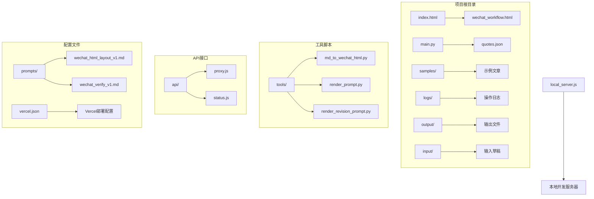
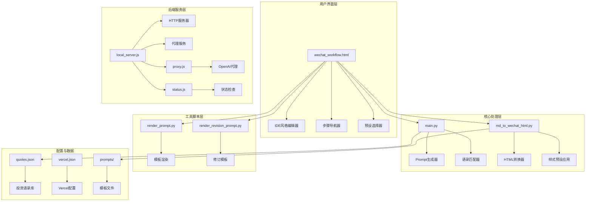
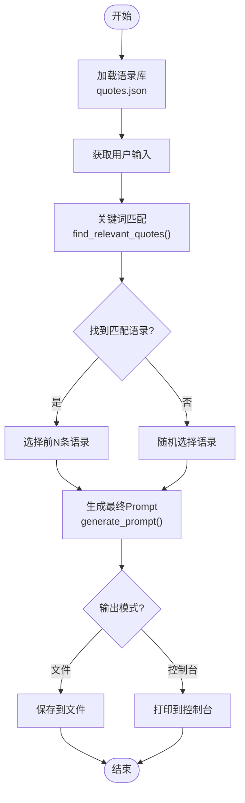
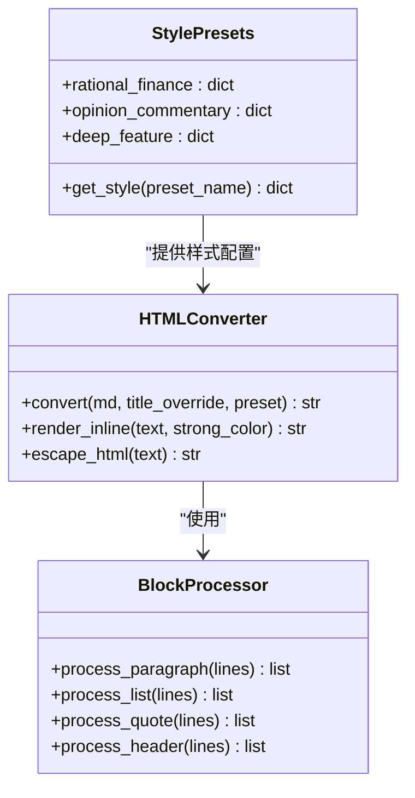
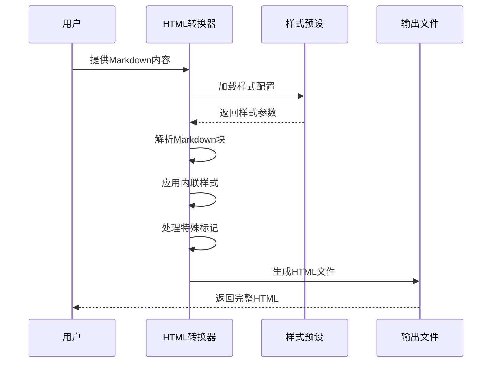
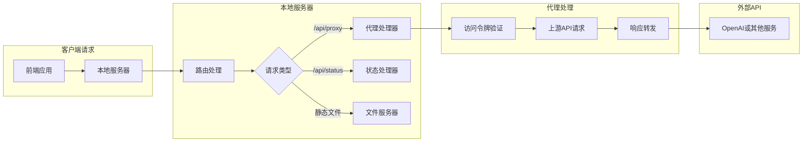
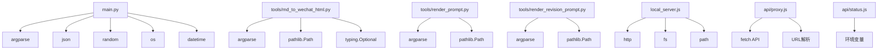
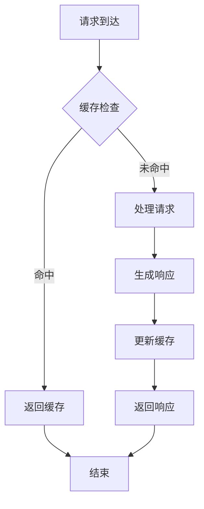
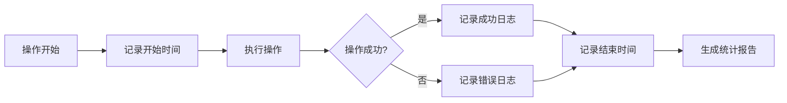

# 工具脚本使用

<cite>
**本文档引用的文件**
- [main.py](file://main.py)
- [md_to_wechat_html.py](file://tools/md_to_wechat_html.py)
- [render_prompt.py](file://tools/render_prompt.py)
- [render_revision_prompt.py](file://tools/render_revision_prompt.py)
- [quotes.json](file://quotes.json)
- [wechat_workflow.html](file://wechat_workflow.html)
- [local_server.js](file://local_server.js)
- [proxy.js](file://api/proxy.js)
- [status.js](file://api/status.js)
- [wechat_html_layout_v1.md](file://prompts/wechat_html_layout_v1.md)
- [wechat_verify_v1.md](file://prompts/wechat_verify_v1.md)
- [index.html](file://index.html)
- [vercel.json](file://vercel.json)
</cite>

## 目录
1. [简介](#简介)
2. [项目结构](#项目结构)
3. [核心组件](#核心组件)
4. [架构概览](#架构概览)
5. [详细组件分析](#详细组件分析)
6. [依赖关系分析](#依赖关系分析)
7. [性能考虑](#性能考虑)
8. [故障排除指南](#故障排除指南)
9. [结论](#结论)

## 简介

这是一个专为微信公众号写作设计的智能工具集，旨在帮助用户创作高质量的投资分析文章。该系统提供了完整的写作工作流程，从草稿生成到最终排版，支持多种输出格式和定制化选项。

系统的核心功能包括：
- 智能Prompt生成器，基于巴菲特、芒格等投资大师的理念
- 多种排版风格预设，适配不同类型的公众号内容
- 交互式IDE风格编辑器，支持精确的文本修订
- 自动化的HTML排版转换，确保公众号兼容性
- 完整的发布前校验流程

## 项目结构

**图表来源**
- [index.html:1-16](file://index.html#L1-L16)
- [wechat_workflow.html:1-800](file://wechat_workflow.html#L1-L800)
- [main.py:1-195](file://main.py#L1-L195)

**章节来源**
- [index.html:1-16](file://index.html#L1-L16)
- [wechat_workflow.html:1-800](file://wechat_workflow.html#L1-L800)
- [main.py:1-195](file://main.py#L1-L195)

## 核心组件

### 主要Python脚本

#### Prompt生成器 (main.py)
- **功能**：根据用户输入和投资主题自动生成专业的写作Prompt
- **特性**：智能语录匹配、交互式模式、批量处理模式
- **输出**：符合巴菲特投资理念的专业写作指导

#### 微信HTML转换器 (tools/md_to_wechat_html.py)
- **功能**：将Markdown内容转换为微信公众号可用的HTML格式
- **特性**：三种排版风格预设、风险提示自动处理、内联样式优化
- **输出**：完全兼容微信公众号编辑器的HTML文件

### 工具脚本集合

#### Prompt模板渲染器 (tools/render_prompt.py)
- **功能**：将模板与用户输入结合生成最终Prompt
- **参数**：模板文件、输入内容、必须保留信息、扩展要点

#### 修订Prompt渲染器 (tools/render_revision_prompt.py)
- **功能**：生成文章修订专用的Prompt模板
- **模式**：全文修订或局部修订两种模式

**章节来源**
- [main.py:84-127](file://main.py#L84-L127)
- [md_to_wechat_html.py:86-233](file://tools/md_to_wechat_html.py#L86-L233)
- [render_prompt.py:5-24](file://tools/render_prompt.py#L5-L24)
- [render_revision_prompt.py:5-39](file://tools/render_revision_prompt.py#L5-L39)

## 架构概览

**图表来源**
- [wechat_workflow.html:1-800](file://wechat_workflow.html#L1-L800)
- [main.py:129-195](file://main.py#L129-L195)
- [md_to_wechat_html.py:236-256](file://tools/md_to_wechat_html.py#L236-L256)
- [local_server.js:127-204](file://local_server.js#L127-L204)

## 详细组件分析

### Prompt生成器系统

#### 核心算法流程

**图表来源**
- [main.py:45-82](file://main.py#L45-L82)
- [main.py:84-127](file://main.py#L84-L127)
- [main.py:129-195](file://main.py#L129-L195)

#### 语录匹配机制

系统实现了智能的关键词匹配算法：

| 关键词类别 | 中文关键词 | 英文关键词 |
|------------|------------|------------|
| 护城河 | 护城河 | moat |
| 管理 | 管理 | management |
| 价格 | 价格, 估值 | price, valuation |
| 长期 | 长期, 时间 | long, time |
| 生意 | 生意, 模式 | business, model |
| 现金流 | 现金流 | cash |

**章节来源**
- [main.py:45-82](file://main.py#L45-L82)
- [quotes.json:1-108](file://quotes.json#L1-L108)

### HTML转换器系统

#### 样式预设架构

**图表来源**
- [md_to_wechat_html.py:6-52](file://tools/md_to_wechat_html.py#L6-L52)
- [md_to_wechat_html.py:86-233](file://tools/md_to_wechat_html.py#L86-L233)

#### 转换流程

**图表来源**
- [md_to_wechat_html.py:86-233](file://tools/md_to_wechat_html.py#L86-L233)

**章节来源**
- [md_to_wechat_html.py:86-233](file://tools/md_to_wechat_html.py#L86-L233)

### 本地开发服务器

#### 代理服务架构

**图表来源**
- [local_server.js:50-125](file://local_server.js#L50-L125)
- [local_server.js:127-204](file://local_server.js#L127-L204)

**章节来源**
- [local_server.js:50-125](file://local_server.js#L50-L125)
- [local_server.js:127-204](file://local_server.js#L127-L204)

## 依赖关系分析

### Python脚本依赖图

**图表来源**
- [main.py:1-8](file://main.py#L1-L8)
- [md_to_wechat_html.py:1-4](file://tools/md_to_wechat_html.py#L1-L4)
- [render_prompt.py:1-3](file://tools/render_prompt.py#L1-L3)
- [render_revision_prompt.py:1-3](file://tools/render_revision_prompt.py#L1-L3)

### 环境配置依赖

| 组件 | 必需环境变量 | 描述 |
|------|-------------|------|
| 本地服务器 | OPENAI_API_KEY | OpenAI API密钥 |
| 本地服务器 | OPENAI_BASE_URL | API基础URL |
| 本地服务器 | OPENAI_MODEL | 默认模型名称 |
| 本地服务器 | ARTICLE_JIKE_ACCESS_TOKEN | 访问令牌 |
| 代理服务 | NEWAPI_API_KEY | 新API密钥 |
| 代理服务 | NEWAPI_BASE_URL | 新API基础URL |
| 代理服务 | NEWAPI_MODEL | 新API模型 |

**章节来源**
- [local_server.js:15-32](file://local_server.js#L15-L32)
- [proxy.js:35-38](file://api/proxy.js#L35-L38)

## 性能考虑

### 内存使用优化

1. **流式处理**：代理服务使用流式响应处理，避免大响应内容的内存堆积
2. **渐进式渲染**：前端IDE编辑器采用渐进式渲染，优化大数据量文本的显示性能
3. **缓存策略**：样式预设和模板文件在内存中缓存，减少重复解析开销

### 并发处理能力

- **异步I/O**：Node.js服务器支持高并发请求处理
- **连接池**：上游API请求使用连接复用
- **超时控制**：合理的请求超时设置，防止资源泄露

### 缓存机制

## 故障排除指南

### 常见问题诊断

#### API连接问题
- **症状**：代理请求失败，返回500错误
- **排查步骤**：
  1. 检查API密钥配置
  2. 验证网络连接
  3. 确认上游API可达性
  4. 查看服务器日志

#### 文件处理错误
- **症状**：文件转换失败或输出为空
- **排查步骤**：
  1. 验证输入文件编码（UTF-8）
  2. 检查文件路径权限
  3. 确认目标目录存在且可写
  4. 查看详细的错误日志

#### 样式渲染异常
- **症状**：HTML输出样式不正确
- **排查步骤**：
  1. 验证Markdown语法正确性
  2. 检查样式预设配置
  3. 确认特殊标记使用规范
  4. 测试最小化示例

**章节来源**
- [local_server.js:119-124](file://local_server.js#L119-L124)
- [proxy.js:112-118](file://api/proxy.js#L112-L118)

### 日志分析

系统提供了完善的日志记录机制：

**章节来源**
- [main.py:20-31](file://main.py#L20-L31)

## 结论

这个工具脚本系统为微信公众号写作提供了完整的解决方案，具有以下优势：

1. **专业性**：基于巴菲特、芒格等投资大师的理念，提供专业的写作指导
2. **灵活性**：支持多种输出格式和定制化选项
3. **易用性**：提供直观的Web界面和命令行工具
4. **可扩展性**：模块化设计，便于功能扩展和维护

通过合理配置和使用这些工具，用户可以显著提高投资分析文章的质量和效率，同时确保内容的专业性和合规性。