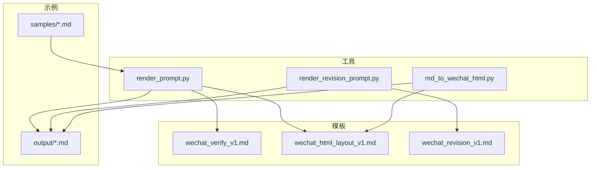
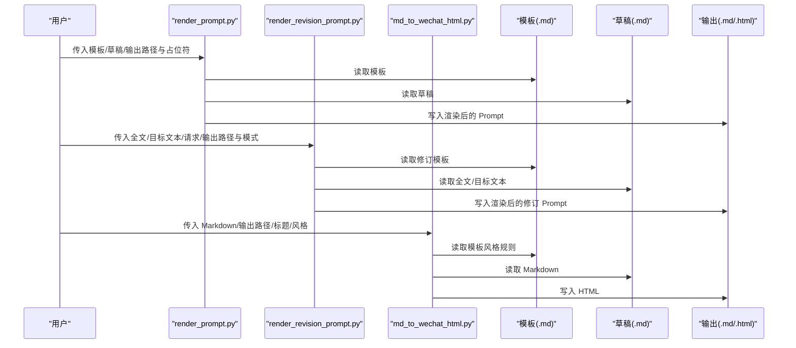
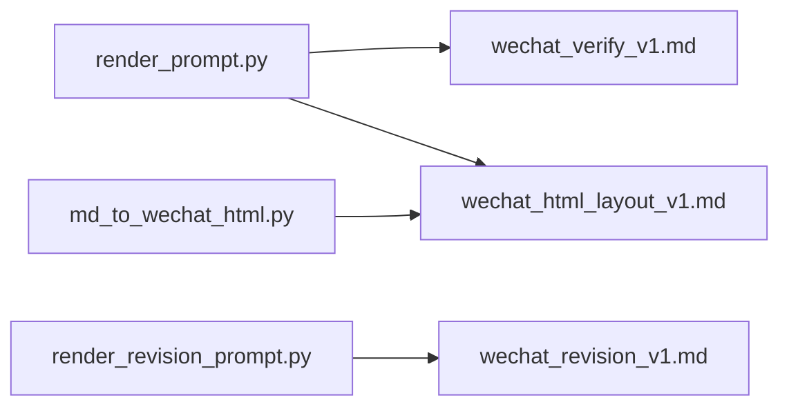

# 工具脚本使用

<cite>
**本文档引用的文件**
- [render_prompt.py](file://tools/render_prompt.py)
- [render_revision_prompt.py](file://tools/render_revision_prompt.py)
- [md_to_wechat_html.py](file://tools/md_to_wechat_html.py)
- [wechat_verify_v1.md](file://prompts/wechat_verify_v1.md)
- [wechat_html_layout_v1.md](file://prompts/wechat_html_layout_v1.md)
- [wechat_revision_v1.md](file://prompts/wechat_revision_v1.md)
- [pop_mart_prompt.md](file://output/pop_mart_prompt.md)
- [pop_mart_revision_prompt.md](file://output/pop_mart_revision_prompt.md)
- [pop_mart_outline_test_prompt.md](file://output/pop_mart_outline_test_prompt.md)
- [samples/1月份的腾讯都没买的话这么多年的互联网白干了.md](file://samples/1月份的腾讯都没买的话这么多年的互联网白干了.md)
</cite>

## 目录
1. [简介](#简介)
2. [项目结构](#项目结构)
3. [核心组件](#核心组件)
4. [架构总览](#架构总览)
5. [详细组件分析](#详细组件分析)
6. [依赖关系分析](#依赖关系分析)
7. [性能与批处理建议](#性能与批处理建议)
8. [故障排除指南](#故障排除指南)
9. [结论](#结论)
10. [附录](#附录)

## 简介
本文件面向使用者，系统讲解两个 Prompt 渲染工具的使用方法与最佳实践，帮助你自动化生成与处理公众号风格的 Prompt，从而提升内容创作与排版的效率。工具包括：
- Prompt 渲染工具：将草稿文本与模板结合，生成可直接交给大模型的 Prompt。
- 修订 Prompt 渲染工具：根据用户的新要求，生成针对整文或选中段落的修订 Prompt。
- HTML 排版工具：将 Markdown 转为微信公众号可用的 HTML，支持多种排版风格预设。

通过这些工具，你可以实现从草稿到可发布内容的标准化流程，降低重复劳动，提高一致性与质量。

## 项目结构
本项目采用“工具 + 模板 + 示例”的组织方式，便于在本地或 CI 中批量执行：
- tools：工具脚本目录，包含 Prompt 渲染与 HTML 排版工具。
- prompts：各类 Prompt 模板，用于指导大模型生成符合公众号风格的内容。
- samples：示例草稿，展示输入文本的典型结构。
- output：工具执行后的中间产物与示例输出，便于对照与复用。

图表来源
- [render_prompt.py:1-28](file://tools/render_prompt.py#L1-L28)
- [render_revision_prompt.py:1-44](file://tools/render_revision_prompt.py#L1-L44)
- [md_to_wechat_html.py:1-256](file://tools/md_to_wechat_html.py#L1-L256)
- [wechat_verify_v1.md:1-48](file://prompts/wechat_verify_v1.md#L1-L48)
- [wechat_html_layout_v1.md:1-73](file://prompts/wechat_html_layout_v1.md#L1-L73)
- [wechat_revision_v1.md:1-31](file://prompts/wechat_revision_v1.md#L1-L31)

章节来源
- [render_prompt.py:1-28](file://tools/render_prompt.py#L1-L28)
- [render_revision_prompt.py:1-44](file://tools/render_revision_prompt.py#L1-L44)
- [md_to_wechat_html.py:1-256](file://tools/md_to_wechat_html.py#L1-L256)

## 核心组件
- Prompt 渲染工具（render_prompt.py）
  - 功能：将草稿文本与模板结合，注入“必须保留”“扩展要点”“大纲”等占位符，生成可直接交给大模型的 Prompt。
  - 输入：模板文件路径、草稿输入文件路径、输出文件路径，以及若干可选占位符参数。
  - 输出：渲染后的 Prompt 文本文件。
- 修订 Prompt 渲染工具（render_revision_prompt.py）
  - 功能：根据用户的新要求，生成针对整文或选中段落的修订 Prompt，支持两种模式：整文重写与选中段落重写。
  - 输入：模板文件路径、全文输入文件路径、目标文本输入文件路径（可选）、请求说明、输出文件路径、模式选择。
  - 输出：渲染后的修订 Prompt 文本文件。
- HTML 排版工具（md_to_wechat_html.py）
  - 功能：将 Markdown 转为微信公众号可用的 HTML，内置多种排版风格预设，自动处理标题、列表、引用块、分隔线、风险提示等。
  - 输入：Markdown 输入文件路径、输出 HTML 文件路径、可选标题覆盖与风格预设。
  - 输出：完整的 HTML 文件。

章节来源
- [render_prompt.py:5-28](file://tools/render_prompt.py#L5-L28)
- [render_revision_prompt.py:5-44](file://tools/render_revision_prompt.py#L5-L44)
- [md_to_wechat_html.py:86-256](file://tools/md_to_wechat_html.py#L86-L256)

## 架构总览
下图展示了工具与模板之间的关系，以及典型的执行流程：先用草稿与模板生成 Prompt，再用修订模板生成修订 Prompt，最后将 Markdown 转为 HTML。

图表来源
- [render_prompt.py:15-23](file://tools/render_prompt.py#L15-L23)
- [render_revision_prompt.py:20-39](file://tools/render_revision_prompt.py#L20-L39)
- [md_to_wechat_html.py:249-251](file://tools/md_to_wechat_html.py#L249-L251)

## 详细组件分析

### Prompt 渲染工具（render_prompt.py）
- 命令行参数
  - -t/--template：模板文件路径（必需）
  - -i/--input：草稿输入文件路径（必需）
  - -o/--output：输出文件路径（必需）
  - --must-keep：必须保留的句子/信息（可选）
  - --expand-points：希望重点扩写的点（可选）
  - --outline：已确认的标题/大纲（可选）
- 占位符替换
  - 模板中包含占位符，工具会将草稿与各占位符替换到对应位置，生成最终 Prompt。
- 输入输出格式
  - 输入：草稿为 Markdown 文本；模板为 Markdown 文本。
  - 输出：渲染后的 Prompt 文本文件。
- 执行示例
  - 使用草稿与模板生成 Prompt，同时传入“必须保留”“扩展要点”“大纲”等占位符，输出到指定文件。
- 参数组合方案
  - 仅草稿与模板：适用于通用 Prompt 生成。
  - 增加 must-keep：确保关键信息不被改动。
  - 增加 expand-points：引导模型在特定点进行扩写。
  - 增加 outline：提供结构化的标题/大纲，提升生成一致性。
- 常见使用场景
  - 从提纲生成可直接交给大模型的 Prompt。
  - 为不同风格或主题定制 Prompt，统一输出格式。
- 批处理模式
  - 可循环遍历多个草稿与模板组合，批量生成 Prompt 文件，便于后续统一处理。

章节来源
- [render_prompt.py:6-23](file://tools/render_prompt.py#L6-L23)
- [wechat_verify_v1.md:39-47](file://prompts/wechat_verify_v1.md#L39-L47)
- [pop_mart_outline_test_prompt.md:84-145](file://output/pop_mart_outline_test_prompt.md#L84-L145)

### 修订 Prompt 渲染工具（render_revision_prompt.py）
- 命令行参数
  - -t/--template：修订模板文件路径（默认为 prompts/wechat_revision_v1.md）
  - -f/--full-text：全文输入文件路径（必需）
  - -o/--output：输出文件路径（必需）
  - --target-text：目标文本输入文件路径（可选，默认使用全文）
  - --request：修订请求说明（必需）
  - --mode：模式选择，full（整文重写）或 selection（选中段落重写，默认 full）
- 占位符替换
  - 模板中包含“修改模式”“全文”“目标文本”“修改要求”等占位符，工具会根据模式与输入进行替换。
- 输入输出格式
  - 输入：全文与目标文本均为 Markdown 文本；模板为 Markdown 文本。
  - 输出：渲染后的修订 Prompt 文本文件。
- 执行示例
  - 传入全文与修订请求，选择整文重写模式，输出修订 Prompt。
  - 传入全文与目标文本，选择选中段落重写模式，输出仅包含目标段落的修订 Prompt。
- 参数组合方案
  - 整文重写：适用于整体结构调整、语气统一、结论强化等。
  - 选中段落重写：适用于局部修改、补充论据、调整表达等。
  - 结合 must-keep：在修订过程中保留关键信息。
- 常见使用场景
  - 对初稿进行二次加工，确保风格一致、逻辑严密、表达克制。
  - 针对特定段落进行精细化修改，避免整文重写带来的冗余工作。
- 批处理模式
  - 可批量处理多个修订请求，生成多个修订 Prompt，便于后续统一交由大模型处理。

章节来源
- [render_revision_prompt.py:6-39](file://tools/render_revision_prompt.py#L6-L39)
- [wechat_revision_v1.md:7-27](file://prompts/wechat_revision_v1.md#L7-L27)
- [pop_mart_revision_prompt.md:206-210](file://output/pop_mart_revision_prompt.md#L206-L210)

### HTML 排版工具（md_to_wechat_html.py）
- 命令行参数
  - -i/--input：Markdown 输入文件路径（必需）
  - -o/--output：HTML 输出文件路径（必需）
  - --title：标题覆盖（可选）
  - --preset：排版风格预设（默认 rational_finance，可选 opinion_commentary、deep_feature）
- 功能特性
  - 自动识别标题、列表、引用块、分隔线等 Markdown 结构，转换为内联样式的 HTML。
  - 自动插入风险提示段落，确保合规。
  - 支持多种风格预设，满足不同内容风格需求。
- 输入输出格式
  - 输入：Markdown 文本。
  - 输出：完整的 HTML 文件，包含 doctype、head、body 与内联样式。
- 执行示例
  - 将 Markdown 转为 HTML，并指定风格预设与标题覆盖。
- 参数组合方案
  - 默认预设：适用于常规投资类内容。
  - 选配标题：当 Markdown 未包含标题时，可手动指定标题。
  - 选配风格：根据内容风格选择 opinion_commentary 或 deep_feature。
- 常见使用场景
  - 将最终 Markdown 直接转为公众号可用的 HTML，减少人工排版成本。
  - 统一排版风格，确保复制到公众号后台后样式基本保留。
- 批处理模式
  - 可批量处理多个 Markdown 文件，生成对应的 HTML 文件，便于统一发布。

章节来源
- [md_to_wechat_html.py:236-251](file://tools/md_to_wechat_html.py#L236-L251)
- [wechat_html_layout_v1.md:10-72](file://prompts/wechat_html_layout_v1.md#L10-L72)

## 依赖关系分析
- 工具与模板的耦合
  - render_prompt.py 与 render_revision_prompt.py 依赖模板中的占位符约定，确保渲染结果与模板结构一致。
  - md_to_wechat_html.py 依赖模板中的风格规则与结构映射，确保输出 HTML 符合公众号排版规范。
- 外部依赖
  - 工具均为纯 Python 脚本，不引入额外第三方库，便于在本地或 CI 环境中直接运行。
- 潜在循环依赖
  - 工具之间无直接依赖，不存在循环依赖风险。

图表来源
- [render_prompt.py:15-23](file://tools/render_prompt.py#L15-L23)
- [render_revision_prompt.py:20-39](file://tools/render_revision_prompt.py#L20-L39)
- [md_to_wechat_html.py:249-251](file://tools/md_to_wechat_html.py#L249-L251)

## 性能与批处理建议
- 批处理策略
  - 使用循环或并行任务批量处理多个草稿与模板组合，显著提升效率。
  - 将草稿与模板路径、输出路径、占位符参数写入配置文件或清单，便于统一调度。
- 性能考量
  - 工具均为文本替换与文件读写，耗时主要取决于文件大小与磁盘 I/O。
  - 建议在本地 SSD 上执行批处理，避免频繁的磁盘切换。
- 并发执行
  - 在多核环境下，可并行执行多个脚本实例，充分利用 CPU 与 I/O 资源。
- 缓存与增量
  - 对于重复使用的模板与草稿，可考虑缓存中间产物，减少重复渲染。

## 故障排除指南
- 常见问题
  - 模板占位符未被替换：检查模板中是否存在与工具约定一致的占位符名称。
  - 输出为空或异常：检查输入文件编码是否为 UTF-8，路径是否正确。
  - 修订模式无效：确认 --mode 仅接受 full 或 selection。
  - 风格预设错误：确认 --preset 为内置预设之一。
- 排错步骤
  - 验证输入文件存在且可读。
  - 检查模板文件是否包含必要的占位符。
  - 使用最小参数集先行测试，逐步添加占位符与选项。
  - 查看输出文件内容，确认是否符合预期结构。
- 建议
  - 在 CI 中加入失败告警与日志记录，便于定位问题。
  - 对关键模板与草稿建立版本控制，便于回滚与对比。

## 结论
通过 Prompt 渲染工具与修订 Prompt 渲染工具，你可以将草稿标准化为高质量的 Prompt，再通过修订工具进行精细化调整；配合 HTML 排版工具，最终输出符合公众号规范的 HTML。该流程有助于提升内容生产的效率与一致性，适合在本地或 CI 环境中进行批处理与自动化集成。

## 附录
- 示例参考
  - 从草稿到 Prompt 的示例：[pop_mart_outline_test_prompt.md:84-145](file://output/pop_mart_outline_test_prompt.md#L84-L145)
  - 从草稿到修订 Prompt 的示例：[pop_mart_revision_prompt.md:206-210](file://output/pop_mart_revision_prompt.md#L206-L210)
  - 从草稿到 HTML 的示例：[pop_mart_prompt.md:1-77](file://output/pop_mart_prompt.md#L1-L77)
  - 示例草稿：[samples/1月份的腾讯都没买的话这么多年的互联网白干了.md:1-82](file://samples/1月份的腾讯都没买的话这么多年的互联网白干了.md#L1-L82)