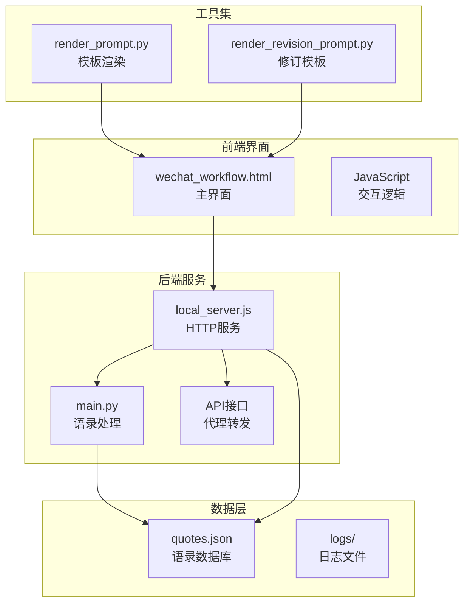
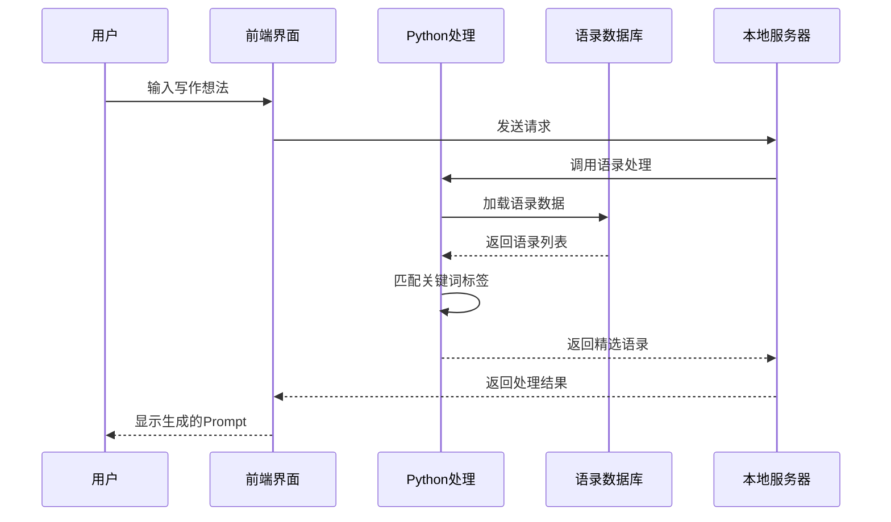
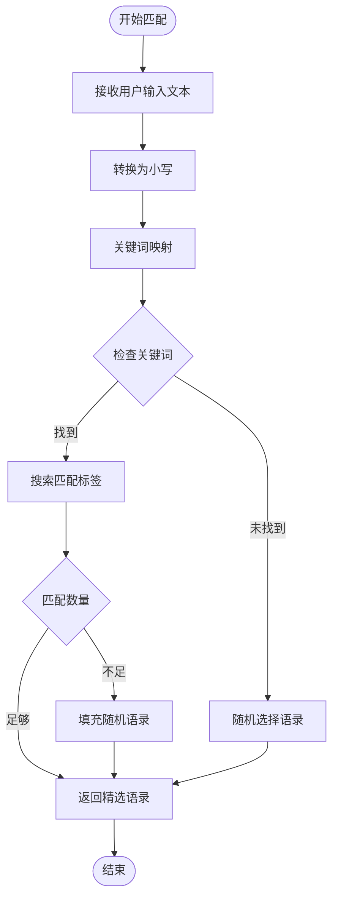
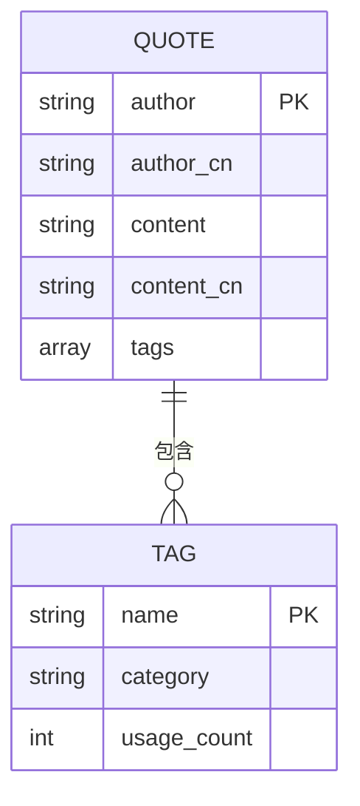
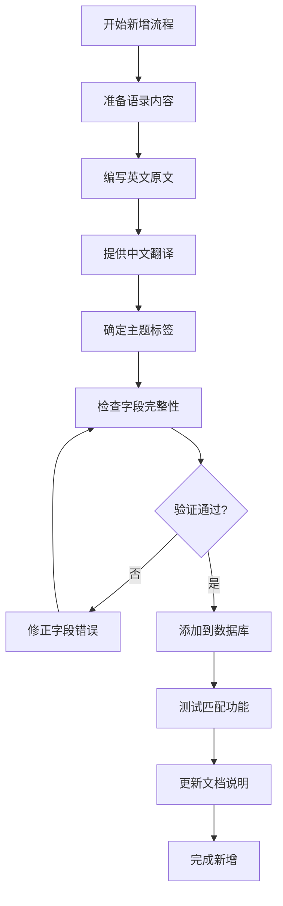
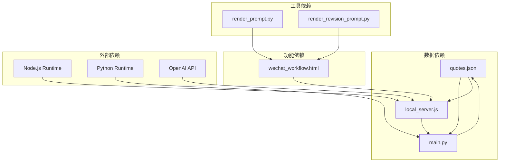

# 数据配置

<cite>
**本文档引用的文件**
- [quotes.json](file://quotes.json)
- [main.py](file://main.py)
- [local_server.js](file://local_server.js)
- [README_DEPLOY.md](file://README_DEPLOY.md)
- [render_prompt.py](file://tools/render_prompt.py)
- [render_revision_prompt.py](file://tools/render_revision_prompt_prompt.py)
- [wechat_workflow.html](file://wechat_workflow.html)
</cite>

## 目录
1. [简介](#简介)
2. [项目结构](#项目结构)
3. [核心组件](#核心组件)
4. [架构概览](#架构概览)
5. [详细组件分析](#详细组件分析)
6. [依赖关系分析](#依赖关系分析)
7. [性能考虑](#性能考虑)
8. [故障排除指南](#故障排除指南)
9. [结论](#结论)

## 简介

本文档详细说明了语录数据库（quotes.json）的结构和配置方法。quotes.json是项目的核心数据源，为AI写作工具提供投资智慧和商业洞察。该数据库采用JSON格式存储，包含英文原文、中文翻译以及主题标签，支持智能匹配和语录筛选功能。

该项目是一个基于Node.js和Python的AI写作辅助工具，主要服务于微信公众号内容创作，特别专注于价值投资领域的写作指导。系统通过语录数据库为用户提供权威的投资理念和商业洞察。

## 项目结构

项目采用前后端分离的架构设计，主要包含以下核心组件：

**图表来源**
- [wechat_workflow.html:1-800](file://wechat_workflow.html#L1-L800)
- [local_server.js:1-204](file://local_server.js#L1-L204)
- [main.py:1-195](file://main.py#L1-L195)

**章节来源**
- [wechat_workflow.html:1-800](file://wechat_workflow.html#L1-L800)
- [local_server.js:1-204](file://local_server.js#L1-L204)
- [main.py:1-195](file://main.py#L1-L195)

## 核心组件

### 语录数据库结构

quotes.json采用数组格式存储多个语录条目，每个条目包含以下标准化字段：

| 字段名称 | 类型 | 必填 | 描述 | 示例值 |
|---------|------|------|------|--------|
| author | string | 是 | 英文作者姓名 | "Warren Buffett" |
| author_cn | string | 是 | 中文作者姓名 | "巴菲特" |
| content | string | 是 | 英文语录内容 | "Investment is simple, but not easy." |
| content_cn | string | 是 | 中文翻译内容 | "投资很简单，但并不容易。" |
| tags | array | 是 | 主题标签数组 | ["general", "psychology"] |

### 数据验证规则

系统对quotes.json实施严格的验证机制：

1. **必需字段完整性**：每个语录条目必须包含所有五个字段
2. **数据类型验证**：确保字段类型符合预期
3. **编码规范**：统一使用UTF-8编码
4. **标签标准化**：标签应使用小写字母和连字符

**章节来源**
- [quotes.json:1-108](file://quotes.json#L1-L108)
- [main.py:32-44](file://main.py#L32-L44)

## 架构概览

系统采用模块化设计，语录数据库作为核心数据源为多个组件提供服务：

**图表来源**
- [main.py:45-82](file://main.py#L45-L82)
- [local_server.js:127-196](file://local_server.js#L127-L196)

**章节来源**
- [main.py:129-195](file://main.py#L129-L195)
- [local_server.js:127-196](file://local_server.js#L127-L196)

## 详细组件分析

### 语录匹配引擎

语录匹配引擎是系统的核心功能模块，负责根据用户输入自动筛选相关的投资智慧语录：

**图表来源**
- [main.py:45-82](file://main.py#L45-L82)

#### 关键词映射表

系统内置了丰富的关键词映射，涵盖投资、商业、心理学等多个领域：

| 中文关键词 | 对应英文标签 |
|-----------|-------------|
| 护城河 | ["moat", "护城河"] |
| 管理 | ["management", "管理"] |
| 价格 | ["price", "valuation", "价格", "估值"] |
| 价值 | ["value", "价值"] |
| 长期 | ["time", "long", "时间", "长期"] |
| 生意 | ["business", "生意", "模式"] |
| 错误 | ["wrong", "mistake", "错"] |
| 现金流 | ["cash", "现金流"] |
| 快乐 | ["happy", "快乐", "悦己"] |
| 收藏 | ["collection", "收藏"] |
| 迪士尼 | ["disney", "迪士尼", "乐园"] |

**章节来源**
- [main.py:45-82](file://main.py#L45-L82)

### 语录数据结构详解

每个语录条目都遵循严格的数据结构规范：

**图表来源**
- [quotes.json:1-108](file://quotes.json#L1-L108)

#### 字段详细说明

**author字段**
- 作用：标识英文作者姓名
- 规范：使用标准英文拼写
- 示例：`"Warren Buffett"`

**author_cn字段**
- 作用：提供中文作者姓名
- 规范：使用中文全称
- 示例：`"巴菲特"`

**content字段**
- 作用：存储英文语录原文
- 规范：保持原始表达，避免翻译
- 示例：`"Investment is simple, but not easy."`

**content_cn字段**
- 作用：提供中文翻译版本
- 规范：准确传达原意，语言流畅
- 示例：`"投资很简单，但并不容易。"`

**tags字段**
- 作用：语录的主题分类标识
- 规范：使用小写字母，连字符分隔
- 示例：`["investment", "value_investing"]`

**章节来源**
- [quotes.json:1-108](file://quotes.json#L1-L108)

### 新增语录标准流程

新增语录需要遵循以下标准化流程：

**图表来源**
- [main.py:32-44](file://main.py#L32-L44)

#### 流程详细步骤

1. **内容准备阶段**
   - 确保语录内容具有投资价值
   - 保持语言简洁有力
   - 避免过度修饰和冗余表达

2. **翻译质量保证**
   - 中文翻译必须准确传达原意
   - 语言风格应符合中文表达习惯
   - 避免直译导致的生硬表达

3. **标签系统应用**
   - 选择最能代表语录主题的标签
   - 标签应具有明确的业务含义
   - 避免使用模糊或过于宽泛的标签

4. **数据完整性检查**
   - 确认所有必需字段都已填写
   - 验证数据格式和编码
   - 检查JSON语法正确性

**章节来源**
- [main.py:129-195](file://main.py#L129-L195)

### 标签系统使用方法

标签系统是语录匹配的核心机制，建议遵循以下使用原则：

#### 标签分类体系

| 分类 | 标签示例 | 使用场景 |
|------|----------|----------|
| 投资理念 | ["value_investing", "long_term", "patience"] | 价值投资相关语录 |
| 商业模式 | ["business_model", "competitive_advantage", "moat"] | 商业模式分析语录 |
| 心理学 | ["behavioral_economics", "psychology", "cognitive_bias"] | 行为经济学相关语录 |
| 财务分析 | ["valuation", "cash_flow", "financial_statement"] | 财务分析相关语录 |
| 市场观察 | ["market_timing", "bull_bear_market", "market_cycle"] | 市场观察相关语录 |

#### 标签命名规范

1. **语义明确性**：标签应清晰表达语录主题
2. **一致性**：同类主题使用相同或相似的标签
3. **简洁性**：避免过长和复杂的标签名称
4. **可扩展性**：预留未来扩展的空间

**章节来源**
- [main.py:50-63](file://main.py#L50-L63)

## 依赖关系分析

系统各组件之间的依赖关系如下：

**图表来源**
- [main.py:32-44](file://main.py#L32-L44)
- [local_server.js:1-204](file://local_server.js#L1-L204)

**章节来源**
- [main.py:1-195](file://main.py#L1-L195)
- [local_server.js:1-204](file://local_server.js#L1-L204)

## 性能考虑

### 语录加载性能

系统采用内存缓存策略，语录数据在首次加载后驻留在内存中，避免重复I/O操作：

- **加载时机**：程序启动时一次性加载
- **缓存策略**：进程生命周期内共享
- **内存占用**：约1KB/条语录，100条约100KB
- **响应时间**：匹配查询通常在毫秒级完成

### 匹配算法优化

关键词匹配算法经过优化，确保在大量语录数据下的高效查询：

- **时间复杂度**：O(n*m)，其中n为语录数量，m为关键词数量
- **空间复杂度**：O(k)，k为匹配结果数量
- **优化措施**：预处理关键词映射，减少重复计算

## 故障排除指南

### 常见问题及解决方案

**问题1：找不到quotes.json文件**
- **症状**：程序启动时报错"找不到quotes.json文件"
- **原因**：文件路径错误或文件不存在
- **解决**：确认文件位于项目根目录，检查文件权限

**问题2：JSON格式错误**
- **症状**：程序报JSON解析错误
- **原因**：JSON语法不正确或编码问题
- **解决**：使用在线JSON验证工具检查语法，确保UTF-8编码

**问题3：语录匹配不准确**
- **症状**：关键词匹配结果不符合预期
- **原因**：标签设置不当或关键词映射缺失
- **解决**：检查标签是否正确，必要时扩展关键词映射表

**问题4：中文显示乱码**
- **症状**：中文内容显示为乱码
- **原因**：文件编码不是UTF-8
- **解决**：将文件转换为UTF-8编码

**章节来源**
- [main.py:41-43](file://main.py#L41-L43)
- [README_DEPLOY.md:74-126](file://README_DEPLOY.md#L74-L126)

## 结论

quotes.json作为项目的核心数据资产，其设计体现了简洁、实用和可扩展的原则。通过标准化的数据结构、完善的验证机制和智能化的匹配算法，系统能够有效地为用户提供高质量的投资智慧语录。

建议在维护过程中：
1. 保持语录内容的质量和准确性
2. 完善标签体系，提高匹配精度
3. 定期更新关键词映射，适应新的投资理念
4. 建立语录贡献和审核机制，确保内容的权威性

通过持续的优化和完善，quotes.json将成为一个宝贵的商业智慧知识库，为用户提供持续的价值投资指导。