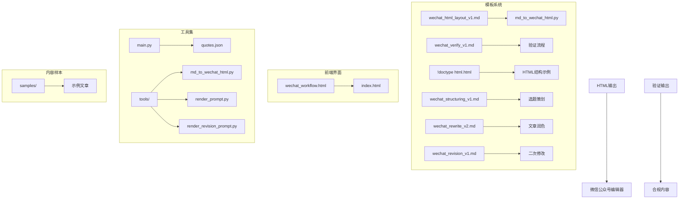
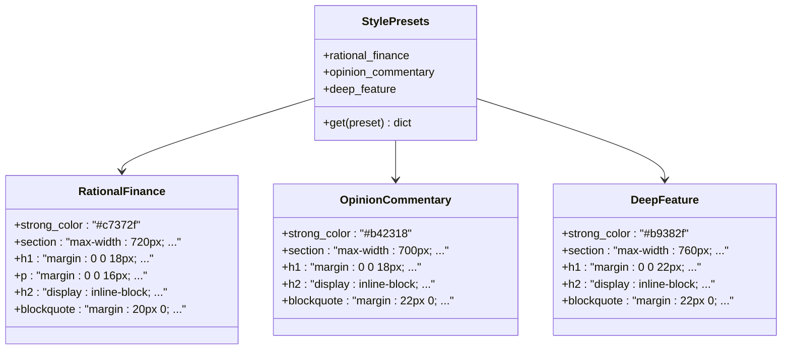
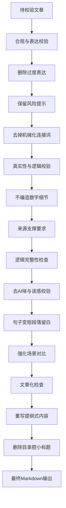
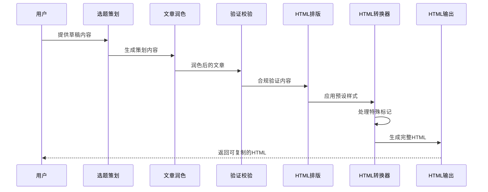
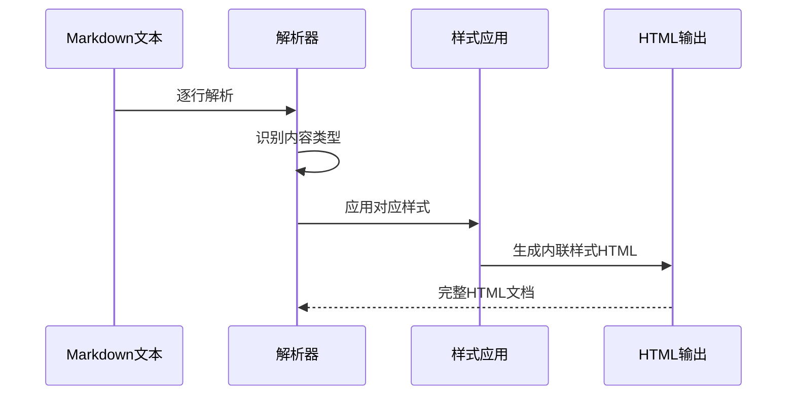
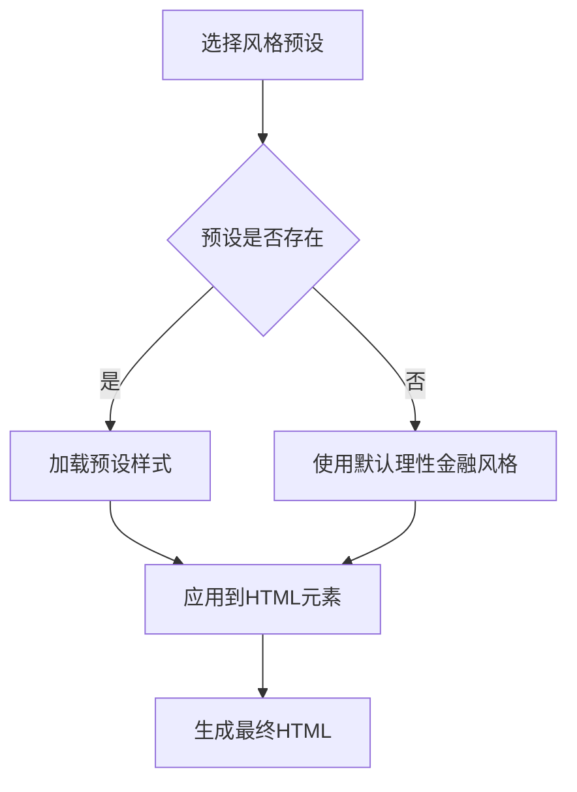
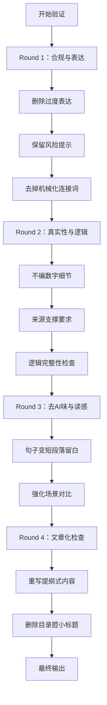
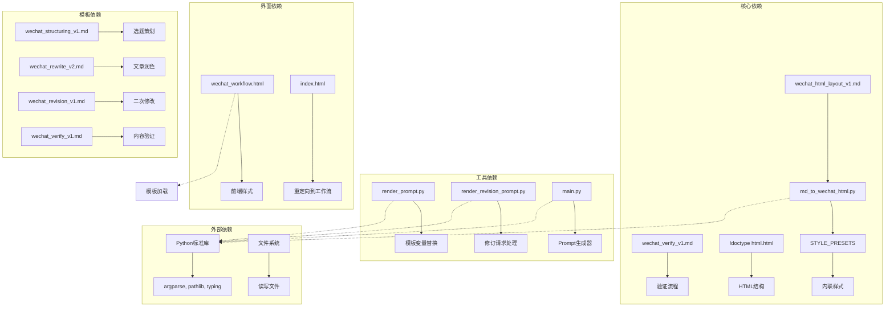

# 模板定制

<cite>
**本文档引用的文件**
- [wechat_html_layout_v1.md](file://prompts/wechat_html_layout_v1.md)
- [wechat_verify_v1.md](file://prompts/wechat_verify_v1.md)
- [!doctype html.html](file://prompts/!doctype html.html)
- [wechat_structuring_v1.md](file://prompts/wechat_structuring_v1.md)
- [wechat_rewrite_v2.md](file://prompts/wechat_rewrite_v2.md)
- [wechat_revision_v1.md](file://prompts/wechat_revision_v1.md)
- [md_to_wechat_html.py](file://tools/md_to_wechat_html.py)
- [wechat_workflow.html](file://wechat_workflow.html)
- [render_prompt.py](file://tools/render_prompt.py)
- [render_revision_prompt.py](file://tools/render_revision_prompt.py)
- [main.py](file://main.py)
- [index.html](file://index.html)
- [README_DEPLOY.md](file://README_DEPLOY.md)
- [samples/1月份的腾讯都没买的话这么多年的互联网白干了.md](file://samples/1月份的腾讯都没买的话这么多年的互联网白干了.md)
</cite>

## 更新摘要
**变更内容**
- 新增微信公众号验证模板 `wechat_verify_v1.md`，提供四轮内部校验流程
- 新增完整的HTML结构模板 `!doctype html.html`，展示标准HTML文档结构
- 扩展模板系统至五个完整模板，形成完整的文章创作工作流程
- 增强模板结构和功能，提升内容质量和合规性保障

## 目录
1. [简介](#简介)
2. [项目结构](#项目结构)
3. [核心组件](#核心组件)
4. [架构概览](#架构概览)
5. [详细组件分析](#详细组件分析)
6. [依赖关系分析](#依赖关系分析)
7. [性能考虑](#性能考虑)
8. [故障排除指南](#故障排除指南)
9. [结论](#结论)

## 简介

本文档专注于微信公众号HTML模板系统的定制方法，特别是 `wechat_html_layout_v1.md` 模板的结构和定制指南。该系统是一个完整的微信公众号文章排版解决方案，提供了三种预设风格（理性金融、观点评论、深度特色），并通过Python工具实现从Markdown到HTML的自动转换。

**更新** 新增了验证模板和完整的HTML结构模板，增强了内容质量和合规性保障，形成了从策划、润色、验证到排版的完整工作流程。

该模板系统的核心目标是将Markdown内容转换为可以直接复制到微信公众号编辑器的富文本HTML，确保样式在复制过程中得到最大程度的保留。

## 项目结构

项目采用模块化设计，主要包含以下核心组件：



**图表来源**
- [wechat_html_layout_v1.md:1-73](file://prompts/wechat_html_layout_v1.md#L1-L73)
- [wechat_verify_v1.md:1-48](file://prompts/wechat_verify_v1.md#L1-L48)
- [!doctype html.html:1-72](file://prompts/!doctype html.html#L1-L72)
- [md_to_wechat_html.py:1-256](file://tools/md_to_wechat_html.py#L1-L256)
- [wechat_workflow.html:2192-2213](file://wechat_workflow.html#L2192-L2213)

**章节来源**
- [wechat_html_layout_v1.md:1-73](file://prompts/wechat_html_layout_v1.md#L1-L73)
- [wechat_verify_v1.md:1-48](file://prompts/wechat_verify_v1.md#L1-L48)
- [!doctype html.html:1-72](file://prompts/!doctype html.html#L1-L72)
- [md_to_wechat_html.py:1-256](file://tools/md_to_wechat_html.py#L1-L256)
- [wechat_workflow.html:2192-2213](file://wechat_workflow.html#L2192-L2213)

## 核心组件

### 模板变量系统

微信HTML模板采用双大括号语法的变量系统：

| 变量类型 | 语法格式 | 用途 | 默认值 |
|---------|---------|------|--------|
| 最终文本 | `{{FINAL_TEXT}}` | 主要内容文本 | 必填 |
| 文章标题 | `{{TITLE}}` | 可选文章标题 | 自动提取 |
| 风格名称 | `{{STYLE_PRESET_NAME}}` | 预设风格名称 | 必填 |
| 风格规则 | `{{STYLE_PRESET_RULES}}` | 风格说明规则 | 必填 |
| 草稿文本 | `{{DRAFT_TEXT}}` | 原始草稿内容 | 必填 |
| 必须保留 | `{{MUST_KEEP}}` | 关键信息保留 | 可选 |
| 扩展要点 | `{{EXPAND_POINTS}}` | 重点扩写内容 | 可选 |
| 大纲文本 | `{{OUTLINE_TEXT}}` | 已确认大纲 | 可选 |

**更新** 新增了草稿文本、必须保留、扩展要点和大纲文本等变量，支持完整的文章创作工作流程。

### 预设风格系统

系统内置三种预设风格，每种风格都有独特的视觉特征：



**图表来源**
- [md_to_wechat_html.py:6-52](file://tools/md_to_wechat_html.py#L6-L52)

**章节来源**
- [wechat_html_layout_v1.md:10-15](file://prompts/wechat_html_layout_v1.md#L10-L15)
- [md_to_wechat_html.py:6-52](file://tools/md_to_wechat_html.py#L6-L52)

### 验证模板系统

**新增** 新增了微信公众号验证模板，提供四轮内部校验流程：



**图表来源**
- [wechat_verify_v1.md:7-31](file://prompts/wechat_verify_v1.md#L7-L31)

**章节来源**
- [wechat_verify_v1.md:1-48](file://prompts/wechat_verify_v1.md#L1-L48)

## 架构概览

整个模板系统采用分层架构设计，从模板定义到内容渲染形成完整的处理链：



**图表来源**
- [wechat_structuring_v1.md:1-33](file://prompts/wechat_structuring_v1.md#L1-L33)
- [wechat_rewrite_v2.md:1-105](file://prompts/wechat_rewrite_v2.md#L1-L105)
- [wechat_verify_v1.md:1-48](file://prompts/wechat_verify_v1.md#L1-L48)
- [wechat_html_layout_v1.md:64-72](file://prompts/wechat_html_layout_v1.md#L64-L72)
- [md_to_wechat_html.py:86-233](file://tools/md_to_wechat_html.py#L86-L233)

## 详细组件分析

### 模板结构分析

微信HTML模板遵循严格的结构规范，确保转换后的HTML在微信编辑器中的兼容性：

#### 核心结构元素

| 元素类型 | 标记语法 | 样式要求 | 特殊规则 |
|---------|---------|----------|----------|
| 标题 | `# 标题` | h1样式，26-28px字体 | 作为文章主标题 |
| 小标题 | `## 小标题` | 重点提示条样式 | 强调重点内容 |
| 引用块 | `> 内容` | 浅灰底+左侧红线 | 说明性内容 |
| 列表 | `- 项目` | 简洁列表样式 | 连续项目 |
| 分隔线 | `---` | 淡色分割线 | 内容分隔 |
| 段落 | 普通文本 | 正文样式 | 标准内容 |

#### 样式映射规则

```mermaid
flowchart TD
A[Markdown输入] --> B{识别标记类型}
B --> |标题|#| C[h1元素<br/>26-28px字体]
B --> |小标题|##| D[h2元素<br/>重点提示条]
B --> |引用块|>| E[blockquote元素<br/>浅灰底+红线]
B --> |列表|-| F[ul/li元素<br/>简洁样式]
B --> |分隔线|---| G[hr元素<br/>淡色分割线]
B --> |普通文本| H[p元素<br/>正文样式]
C --> I[应用内联样式]
D --> I
E --> I
F --> I
G --> I
H --> I
I --> J[生成HTML输出]
```

**图表来源**
- [wechat_html_layout_v1.md:54-62](file://prompts/wechat_html_layout_v1.md#L54-L62)
- [md_to_wechat_html.py:112-148](file://tools/md_to_wechat_html.py#L112-L148)

**章节来源**
- [wechat_html_layout_v1.md:54-62](file://prompts/wechat_html_layout_v1.md#L54-L62)
- [md_to_wechat_html.py:112-148](file://tools/md_to_wechat_html.py#L112-L148)

### HTML转换器详解

HTML转换器是整个系统的核心组件，负责将Markdown内容转换为微信兼容的HTML：

#### 转换流程



**图表来源**
- [md_to_wechat_html.py:86-233](file://tools/md_to_wechat_html.py#L86-L233)

#### 样式应用机制

转换器通过预设的样式字典为不同元素应用相应的内联样式：

| 元素类型 | 样式键 | 主要属性 | 颜色方案 |
|---------|--------|----------|----------|
| 外层容器 | `section` | 最大宽度720px | 白色背景 |
| 标题 | `h1` | 28px字体，800字重 | 深色文字 |
| 段落 | `p` | 17px字体，1.9行高 | #202124颜色 |
| 小标题 | `h2` | 内联块+浅粉色底 | 深红文字 |
| 引用块 | `blockquote` | 浅灰底+3px红线 | 圆角边框 |
| 列表项 | `li` | 16px字体，8px间距 | 标准颜色 |

**章节来源**
- [md_to_wechat_html.py:6-52](file://tools/md_to_wechat_html.py#L6-L52)
- [md_to_wechat_html.py:161-233](file://tools/md_to_wechat_html.py#L161-L233)

### 风格定制系统

系统提供了灵活的风格定制能力，允许用户根据不同的内容类型选择合适的视觉风格：

#### 风格特性对比

| 风格名称 | 字体大小 | 行高 | 强调色 | 适用场景 |
|---------|---------|------|--------|----------|
| rational_finance | 17px | 1.9 | #c7372f | 理性金融分析 |
| opinion_commentary | 17px | 1.86 | #b42318 | 观点评论文章 |
| deep_feature | 17px | 1.96 | #b9382f | 深度特色内容 |

#### 风格定制流程



**图表来源**
- [md_to_wechat_html.py:86-89](file://tools/md_to_wechat_html.py#L86-L89)

**章节来源**
- [md_to_wechat_html.py:6-52](file://tools/md_to_wechat_html.py#L6-L52)
- [md_to_wechat_html.py:236-256](file://tools/md_to_wechat_html.py#L236-L256)

### 验证模板系统

**新增** 验证模板提供了完整的四轮校验流程：

#### 校验流程详解



**图表来源**
- [wechat_verify_v1.md:7-31](file://prompts/wechat_verify_v1.md#L7-L31)

**章节来源**
- [wechat_verify_v1.md:1-48](file://prompts/wechat_verify_v1.md#L1-L48)

### HTML结构模板

**新增** HTML结构模板提供了完整的HTML文档结构示例：

#### 结构特点

| 组件 | 语法 | 功能 | 示例 |
|------|------|------|------|
| 文档类型 | `<!doctype html>` | HTML5文档声明 | 标准声明 |
| HTML根元素 | `<html lang="zh-CN">` | 页面根容器 | 语言设置 |
| 头部信息 | `<head>` | 元数据容器 | 字符集、视口 |
| 标题 | `<title>` | 页面标题 | 文档标题 |
| 主体内容 | `<body>` | 页面主体 | 内容容器 |
| 内容容器 | `<section>` | 主要内容区 | 最大宽度720px |

**章节来源**
- [!doctype html.html:1-72](file://prompts/!doctype html.html#L1-L72)

## 依赖关系分析

系统各组件之间的依赖关系形成了清晰的层次结构：



**图表来源**
- [md_to_wechat_html.py:1-4](file://tools/md_to_wechat_html.py#L1-L4)
- [render_prompt.py:1-3](file://tools/render_prompt.py#L1-L3)
- [render_revision_prompt.py:1-3](file://tools/render_revision_prompt.py#L1-L3)
- [wechat_workflow.html:2192-2213](file://wechat_workflow.html#L2192-L2213)

**章节来源**
- [md_to_wechat_html.py:1-4](file://tools/md_to_wechat_html.py#L1-L4)
- [render_prompt.py:1-3](file://tools/render_prompt.py#L1-L3)
- [render_revision_prompt.py:1-3](file://tools/render_revision_prompt.py#L1-L3)
- [wechat_workflow.html:2192-2213](file://wechat_workflow.html#L2192-L2213)

## 性能考虑

系统在设计时充分考虑了性能优化：

### 内存使用优化
- 使用生成器模式处理大型文档
- 避免不必要的字符串复制
- 及时释放临时变量

### 处理效率优化
- 单次遍历完成内容解析
- 预编译样式字典减少查找开销
- 批量字符串拼接减少I/O操作

### 缓存策略
- 预设样式字典一次性加载
- 避免重复的样式计算
- 合理的文件读写时机

## 故障排除指南

### 常见问题及解决方案

#### 模板变量未正确替换
**症状**: 生成的HTML中包含原始模板变量
**原因**: 模板变量语法错误或缺失
**解决**: 检查变量是否使用正确的双大括号语法

#### 样式显示异常
**症状**: 微信编辑器中样式丢失
**原因**: 使用了外部CSS类或复杂样式
**解决**: 确保所有样式都通过内联方式应用

#### 内容格式错误
**症状**: 标题、列表等格式不正确
**原因**: Markdown标记语法不符合规范
**解决**: 检查Markdown语法，确保符合模板要求

#### 风格选择无效
**症状**: 选择的风格未生效
**原因**: 预设名称拼写错误
**解决**: 确认预设名称与可用选项一致

#### 验证流程中断
**症状**: 验证模板无法正常工作
**原因**: 模板变量缺失或格式错误
**解决**: 检查 {{FINAL_TEXT}} 和 {{MUST_KEEP}} 等变量是否正确填充

#### HTML结构不完整
**症状**: 生成的HTML缺少必要的结构元素
**原因**: 模板文件损坏或缺失
**解决**: 检查 !doctype html.html 模板文件的完整性

**章节来源**
- [wechat_html_layout_v1.md:17-23](file://prompts/wechat_html_layout_v1.md#L17-L23)
- [wechat_verify_v1.md:32-37](file://prompts/wechat_verify_v1.md#L32-L37)
- [md_to_wechat_html.py:236-256](file://tools/md_to_wechat_html.py#L236-L256)

## 结论

微信公众号HTML模板系统提供了一个完整、灵活且高效的解决方案，专门针对微信公众号的特殊要求进行了优化。通过合理的模板设计、强大的转换能力和丰富的定制选项，该系统能够满足各种类型的微信公众号内容创作需求。

**更新** 新增的验证模板和完整的HTML结构模板进一步增强了系统的功能性和可靠性，形成了从策划、润色、验证到排版的完整工作流程。

### 主要优势

1. **兼容性强**: 完全基于内联样式，确保在微信编辑器中的完美显示
2. **定制灵活**: 支持多种预设风格和自定义样式
3. **验证完善**: 新增四轮验证流程，确保内容质量和合规性
4. **结构完整**: 提供完整的HTML结构模板，便于理解和参考
5. **易于使用**: 简单的命令行接口和直观的模板语法
6. **扩展性好**: 模块化设计便于功能扩展和维护

### 最佳实践建议

1. **模板变量管理**: 始终使用正确的变量语法，避免手动修改模板
2. **样式一致性**: 在同一项目中保持风格统一
3. **内容质量**: 确保Markdown内容符合模板要求
4. **测试验证**: 使用提供的工具进行充分测试
5. **验证流程**: 严格按照验证模板的四轮校验流程执行
6. **结构规范**: 参考HTML结构模板，确保文档结构完整

该系统为微信公众号内容创作者提供了一个可靠的工具链，既保证了内容的专业性，又简化了技术实现过程。新增的功能进一步提升了系统的完整性和实用性，为高质量的内容创作提供了有力保障。