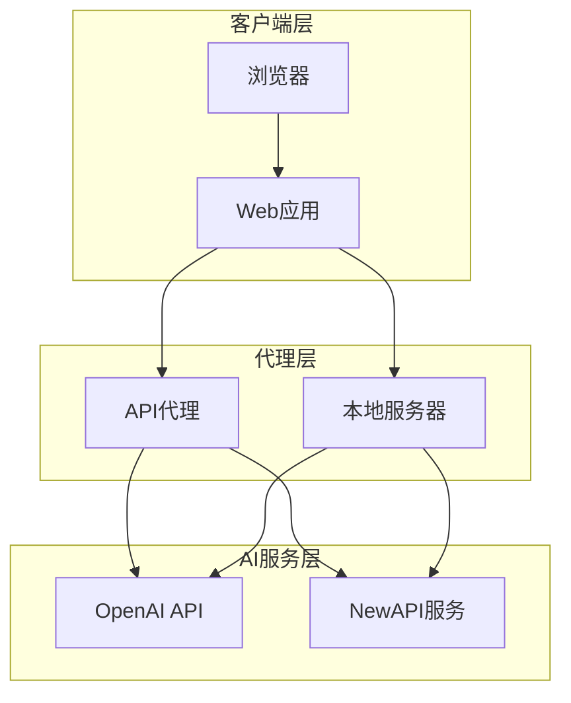
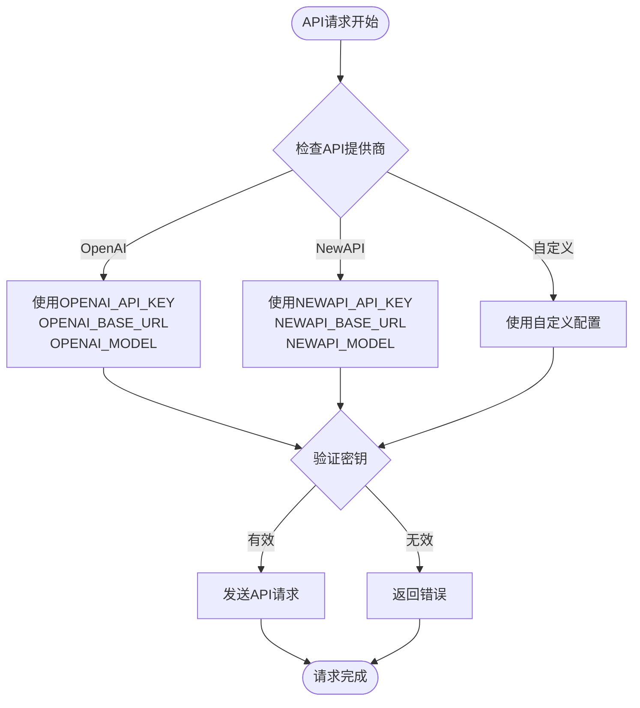
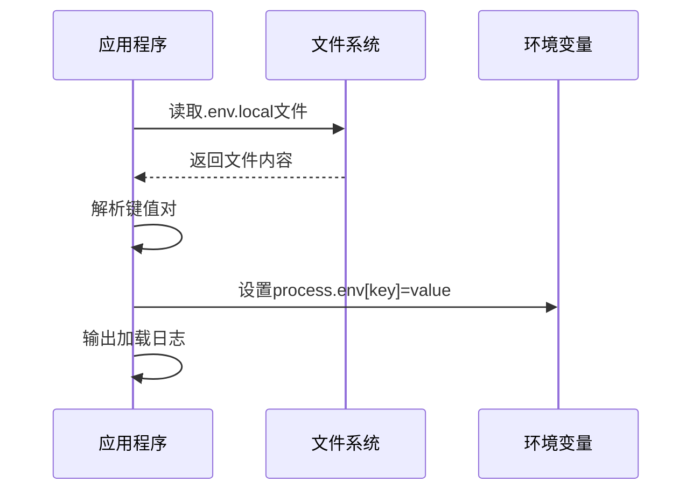
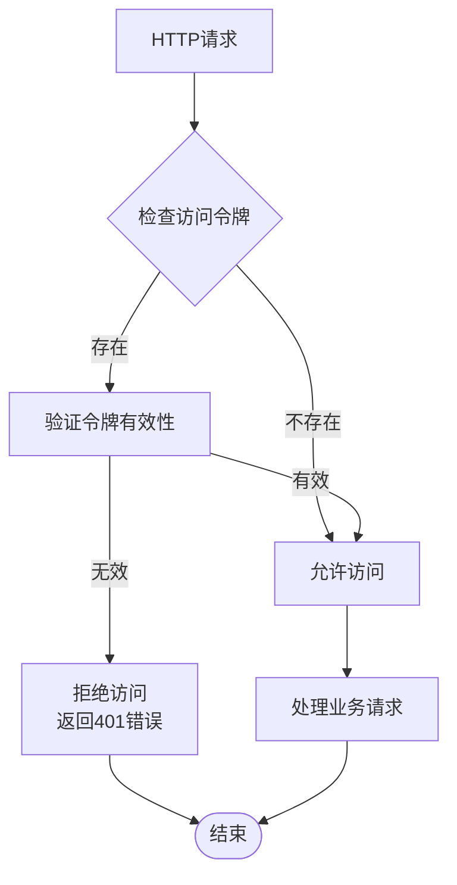
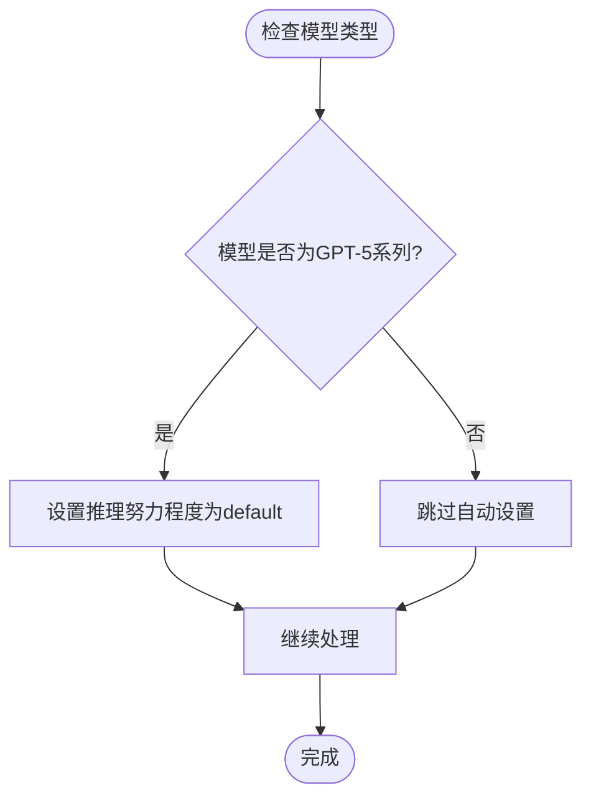

# 环境变量配置

<cite>
**本文档引用的文件**
- [local_server.js](file://local_server.js)
- [api/proxy.js](file://api/proxy.js)
- [api/status.js](file://api/status.js)
- [wechat_workflow.html](file://wechat_workflow.html)
- [Dockerfile](file://Dockerfile)
- [vercel.json](file://vercel.json)
- [README_DEPLOY.md](file://README_DEPLOY.md)
- [VERCEL_GUIDE.md](file://VERCEL_GUIDE.md)
</cite>

## 目录
1. [简介](#简介)
2. [项目概述](#项目概述)
3. [核心环境变量](#核心环境变量)
4. [API密钥配置](#api密钥配置)
5. [服务器配置](#服务器配置)
6. [访问控制配置](#访问控制配置)
7. [推理参数配置](#推理参数配置)
8. [部署环境配置](#部署环境配置)
9. [配置示例](#配置示例)
10. [故障排除](#故障排除)
11. [最佳实践](#最佳实践)

## 简介

本文档详细说明了 Article Jike 项目的环境变量配置，包括API密钥配置、服务器端口设置、访问控制、推理参数等。该工具是一个基于Web的公众号写作助手，支持多种部署方式，包括本地开发、Docker容器和Vercel平台部署。

## 项目概述

Article Jike 是一个集成了AI能力的公众号写作工具，提供了从草稿到成品的完整写作流程。项目采用前后端分离架构，前端使用HTML/CSS/JavaScript实现，后端提供代理服务来处理API请求。



**图表来源**
- [wechat_workflow.html:2050-2106](file://wechat_workflow.html#L2050-L2106)
- [api/proxy.js:35-36](file://api/proxy.js#L35-L36)
- [local_server.js:65-66](file://local_server.js#L65-L66)

## 核心环境变量

### API基础配置

| 变量名 | 类型 | 默认值 | 描述 |
|--------|------|--------|------|
| `OPENAI_BASE_URL` | 字符串 | `https://api.openai.com/v1` | OpenAI API基础URL |
| `NEWAPI_BASE_URL` | 字符串 | 未定义 | NewAPI服务基础URL |
| `OPENAI_API_KEY` | 字符串 | 未定义 | OpenAI API密钥 |
| `NEWAPI_API_KEY` | 字符串 | 未定义 | NewAPI服务密钥 |

### 模型配置

| 变量名 | 类型 | 默认值 | 描述 |
|--------|------|--------|------|
| `OPENAI_MODEL` | 字符串 | `gpt-5.4` | 默认使用的AI模型 |
| `NEWAPI_MODEL` | 字符串 | 未定义 | NewAPI模型名称 |

### 服务器配置

| 变量名 | 类型 | 默认值 | 描述 |
|--------|------|--------|------|
| `PORT` | 数字 | `3001` | 服务器监听端口 |
| `HOST` | 字符串 | `0.0.0.0` | 服务器绑定地址 |

### 推理参数配置

| 变量名 | 类型 | 默认值 | 描述 |
|--------|------|--------|------|
| `OPENAI_REASONING_EFFORT` | 字符串 | `none` | 推理努力程度设置 |

**章节来源**
- [local_server.js:198-203](file://local_server.js#L198-L203)
- [api/proxy.js:35-37](file://api/proxy.js#L35-L37)
- [README_DEPLOY.md:80-88](file://README_DEPLOY.md#L80-L88)

## API密钥配置

### 支持的API提供商

项目支持多个AI服务提供商，包括OpenAI和NewAPI：



**图表来源**
- [api/proxy.js:35-36](file://api/proxy.js#L35-L36)
- [local_server.js:65-66](file://local_server.js#L65-L66)

### 密钥优先级

API密钥的优先级顺序如下：

1. **请求体中的密钥** (`body.apiKey`)
2. **环境变量中的密钥** (`process.env.OPENAI_API_KEY` 或 `process.env.NEWAPI_API_KEY`)
3. **默认值** (如果都不存在)

### 新API支持

项目还支持NewAPI服务提供商，其配置变量与OpenAI类似：

- `NEWAPI_API_KEY` - NewAPI API密钥
- `NEWAPI_BASE_URL` - NewAPI基础URL
- `NEWAPI_MODEL` - NewAPI模型名称

**章节来源**
- [api/proxy.js:35-36](file://api/proxy.js#L35-L36)
- [local_server.js:65-66](file://local_server.js#L65-L66)

## 服务器配置

### 端口和主机设置

服务器配置主要通过以下环境变量控制：

- **PORT**: 指定服务器监听的端口号，默认为3001
- **HOST**: 指定服务器绑定的主机地址，默认为`0.0.0.0`

### 本地开发服务器

本地开发服务器支持`.env.local`文件的自动加载：



**图表来源**
- [local_server.js:34-48](file://local_server.js#L34-L48)

### Docker容器配置

Docker镜像使用Nginx作为静态文件服务器，默认暴露80端口：

- **基础镜像**: nginx:alpine
- **默认端口**: 80
- **静态文件**: wechat_workflow.html
- **Prompts目录**: /usr/share/nginx/html/prompts

**章节来源**
- [local_server.js:198-203](file://local_server.js#L198-L203)
- [Dockerfile:1-14](file://Dockerfile#L1-L14)

## 访问控制配置

### 访问令牌机制

项目实现了双重访问控制机制：

1. **服务器级访问令牌** (`ARTICLE_JIKE_ACCESS_TOKEN`)
2. **应用级访问令牌** (`APP_ACCESS_TOKEN`)



**图表来源**
- [local_server.js:15-32](file://local_server.js#L15-L32)
- [api/proxy.js:1-21](file://api/proxy.js#L1-L21)

### 令牌验证流程

令牌验证支持多种方式：

1. **请求头验证** (`X-Article-Jike-Access-Token`)
2. **Authorization头验证** (`Bearer <token>`)
3. **请求体验证** (`body.accessToken`)

### 客户端访问令牌

客户端可以通过以下方式设置访问令牌：

- **浏览器存储**: localStorage中的`accessToken`
- **设置对话框**: 通过界面输入访问密钥
- **一次性令牌**: 通过URL参数传递

**章节来源**
- [local_server.js:19-24](file://local_server.js#L19-L24)
- [api/proxy.js:5-10](file://api/proxy.js#L5-L10)
- [wechat_workflow.html:1098-1113](file://wechat_workflow.html#L1098-L1113)

## 推理参数配置

### 推理努力程度

推理努力程度参数用于控制AI模型的推理复杂度：

| 参数值 | 描述 | 使用场景 |
|--------|------|----------|
| `none` | 不进行额外推理 | 快速响应，适合简单任务 |
| `low` | 低强度推理 | 平衡性能和质量 |
| `medium` | 中等强度推理 | 复杂任务的标准配置 |
| `high` | 高强度推理 | 需要深度分析的复杂任务 |

### 自动推理参数检测

对于GPT-5系列模型，系统会自动设置推理努力程度为`default`：



**图表来源**
- [wechat_workflow.html](file://wechat_workflow.html#L2016)

### 其他推理参数

支持的其他推理参数包括：

- `max_tokens`: 最大生成tokens数量
- `max_completion_tokens`: 最大补全tokens数量
- `temperature`: 采样温度
- `top_p`: 核采样概率

**章节来源**
- [local_server.js:82-86](file://local_server.js#L82-L86)
- [api/proxy.js:74-78](file://api/proxy.js#L74-L78)
- [wechat_workflow.html](file://wechat_workflow.html#L2016)

## 部署环境配置

### 本地开发环境

本地开发环境配置相对简单，主要依赖`.env.local`文件：

```bash
# .env.local文件示例
PORT=3001
HOST=0.0.0.0
OPENAI_BASE_URL=https://api.openai.com/v1
OPENAI_MODEL=gpt-5.4
OPENAI_REASONING_EFFORT=none
OPENAI_API_KEY=your-openai-api-key
ARTICLE_JIKE_ACCESS_TOKEN=your-access-token
```

### Docker容器环境

Docker容器环境使用Nginx作为静态文件服务器：

```dockerfile
FROM nginx:alpine
COPY wechat_workflow.html /usr/share/nginx/html/index.html
COPY prompts /usr/share/nginx/html/prompts
EXPOSE 80
CMD ["nginx", "-g", "daemon off;"]
```

### Vercel平台环境

Vercel平台部署需要配置以下环境变量：

```bash
# Vercel环境变量
OPENAI_API_KEY=your-openai-api-key
OPENAI_BASE_URL=https://api.openai.com/v1
OPENAI_MODEL=gpt-5.4
```

**章节来源**
- [README_DEPLOY.md:74-126](file://README_DEPLOY.md#L74-L126)
- [VERCEL_GUIDE.md:17-30](file://VERCEL_GUIDE.md#L17-L30)

## 配置示例

### 本地开发配置

```bash
# .env.local文件
PORT=3001
HOST=0.0.0.0
OPENAI_BASE_URL=https://api.openai.com/v1
OPENAI_MODEL=gpt-5.4
OPENAI_REASONING_EFFORT=none
OPENAI_API_KEY=sk-your-openai-key
ARTICLE_JIKE_ACCESS_TOKEN=your-secret-token
```

### Docker部署配置

```bash
# Docker环境变量
ENV PORT=80
ENV HOST=0.0.0.0
ENV OPENAI_BASE_URL=https://api.openai.com/v1
ENV OPENAI_MODEL=gpt-5.4
ENV OPENAI_API_KEY=your-openai-key
```

### Vercel部署配置

```bash
# Vercel项目设置
# Environment Variables
OPENAI_API_KEY: sk-your-openai-key
OPENAI_BASE_URL: https://api.openai.com/v1
OPENAI_MODEL: gpt-5.4
```

### systemd服务配置

```ini
[Unit]
Description=Article Jike WeChat Workflow
Wants=network-online.target
After=network-online.target

[Service]
Type=simple
User=ubuntu
Group=ubuntu
WorkingDirectory=/opt/article-jike
EnvironmentFile=/etc/article-jike.env
ExecStart=/usr/bin/node /opt/article-jike/local_server.js
Restart=on-failure
RestartSec=3

[Install]
WantedBy=multi-user.target
```

**章节来源**
- [README_DEPLOY.md:80-112](file://README_DEPLOY.md#L80-L112)

## 故障排除

### 常见配置问题

#### 1. API密钥验证失败

**症状**: 返回401错误或"ACCESS_TOKEN_REQUIRED"

**解决方案**:
- 确认`OPENAI_API_KEY`或`NEWAPI_API_KEY`已正确设置
- 检查API密钥的有效性和余额
- 验证API密钥的权限范围

#### 2. 访问令牌认证失败

**症状**: 返回401错误

**解决方案**:
- 确认`ARTICLE_JIKE_ACCESS_TOKEN`或`APP_ACCESS_TOKEN`已设置
- 检查客户端是否正确传递访问令牌
- 验证令牌格式是否正确

#### 3. 服务器启动失败

**症状**: 服务器无法启动或端口被占用

**解决方案**:
- 检查`PORT`变量是否被其他进程占用
- 确认`HOST`地址的网络权限
- 验证防火墙设置

#### 4. Docker容器无法访问API

**症状**: 容器内无法连接到外部API

**解决方案**:
- 检查容器网络配置
- 验证API服务的可达性
- 确认DNS解析正常

### 调试方法

#### 启用调试日志

在请求中包含调试信息：

```javascript
// 调试日志示例
console.log('[Proxy Debug]', {
    receivedBodyBaseUrl: body.baseUrl,
    envBaseUrl: process.env.OPENAI_BASE_URL,
    finalBaseUrl: baseUrl,
    hasApiKey: !!apiKey,
    apiKeyLength: apiKey ? apiKey.length : 0,
    model,
    envKeyExists: !!(process.env.OPENAI_API_KEY)
});
```

#### 健康检查

使用健康检查端点验证服务状态：

```bash
curl http://localhost:3001/api/status
```

**章节来源**
- [api/proxy.js:40-49](file://api/proxy.js#L40-L49)
- [local_server.js:140-154](file://local_server.js#L140-L154)

## 最佳实践

### 安全配置建议

1. **密钥管理**
   - 使用独立的API密钥，避免与生产环境共享
   - 定期轮换API密钥
   - 在生产环境中使用加密存储

2. **访问控制**
   - 为不同环境设置不同的访问令牌
   - 实施最小权限原则
   - 定期审查访问日志

3. **环境隔离**
   - 开发、测试、生产环境使用不同的配置
   - 避免在代码中硬编码敏感信息
   - 使用环境变量管理配置

### 性能优化建议

1. **缓存策略**
   - 合理设置API响应缓存
   - 实施适当的请求限流
   - 优化静态资源缓存

2. **连接管理**
   - 复用API连接
   - 实施连接池管理
   - 监控连接状态

3. **资源监控**
   - 监控API使用量
   - 跟踪请求延迟
   - 分析错误率趋势

### 部署最佳实践

1. **容器化部署**
   - 使用多阶段构建减少镜像大小
   - 实施健康检查
   - 配置适当的资源限制

2. **平台部署**
   - 在Vercel中启用自动重部署
   - 配置环境变量的生命周期管理
   - 实施蓝绿部署策略

3. **监控和日志**
   - 集成应用性能监控
   - 设置告警规则
   - 定期备份配置文件

通过遵循这些配置指南和最佳实践，您可以确保Article Jike项目在各种部署环境中稳定运行，并获得最佳的用户体验。