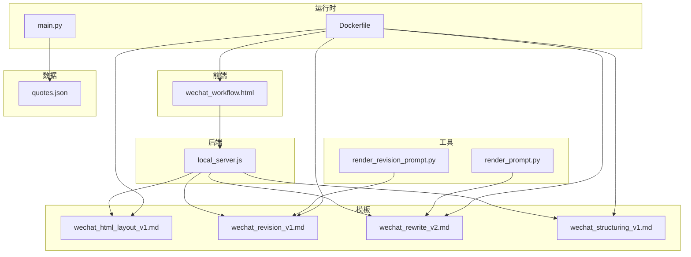
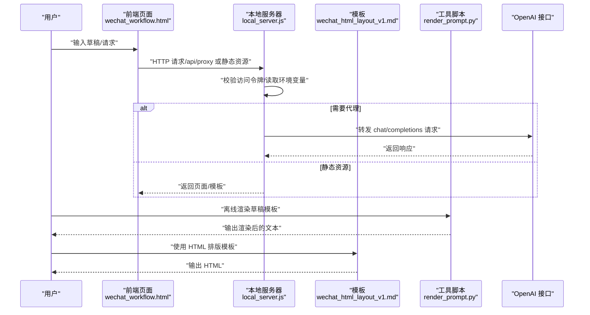
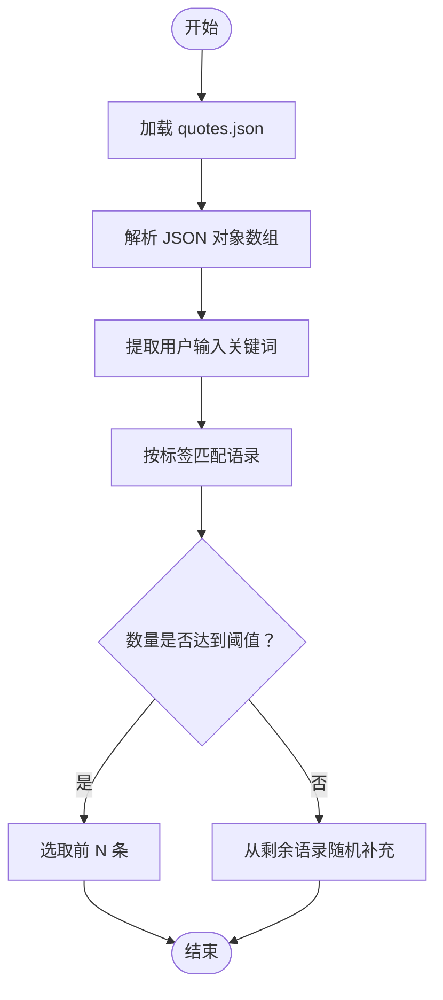
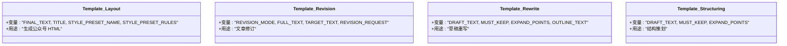
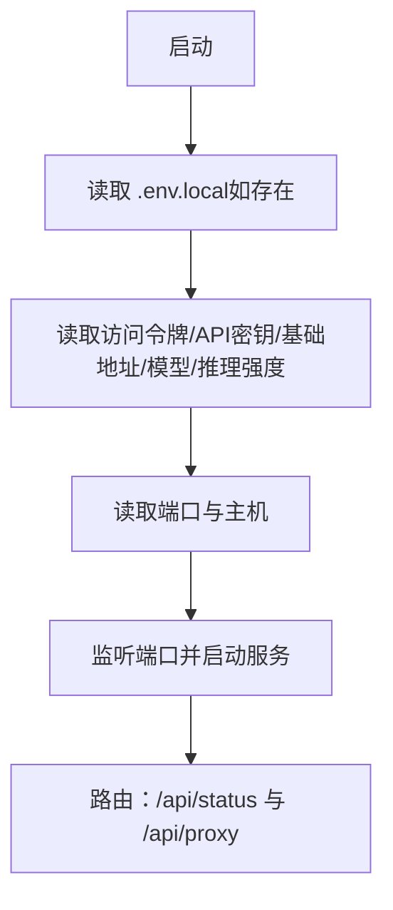
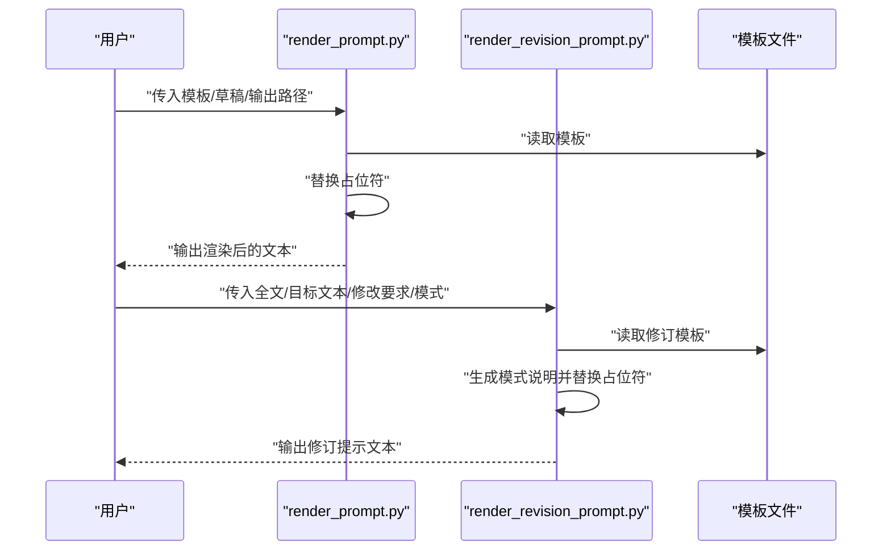
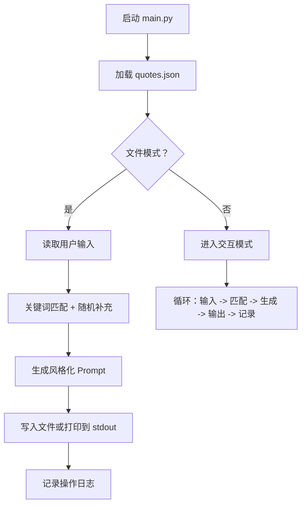
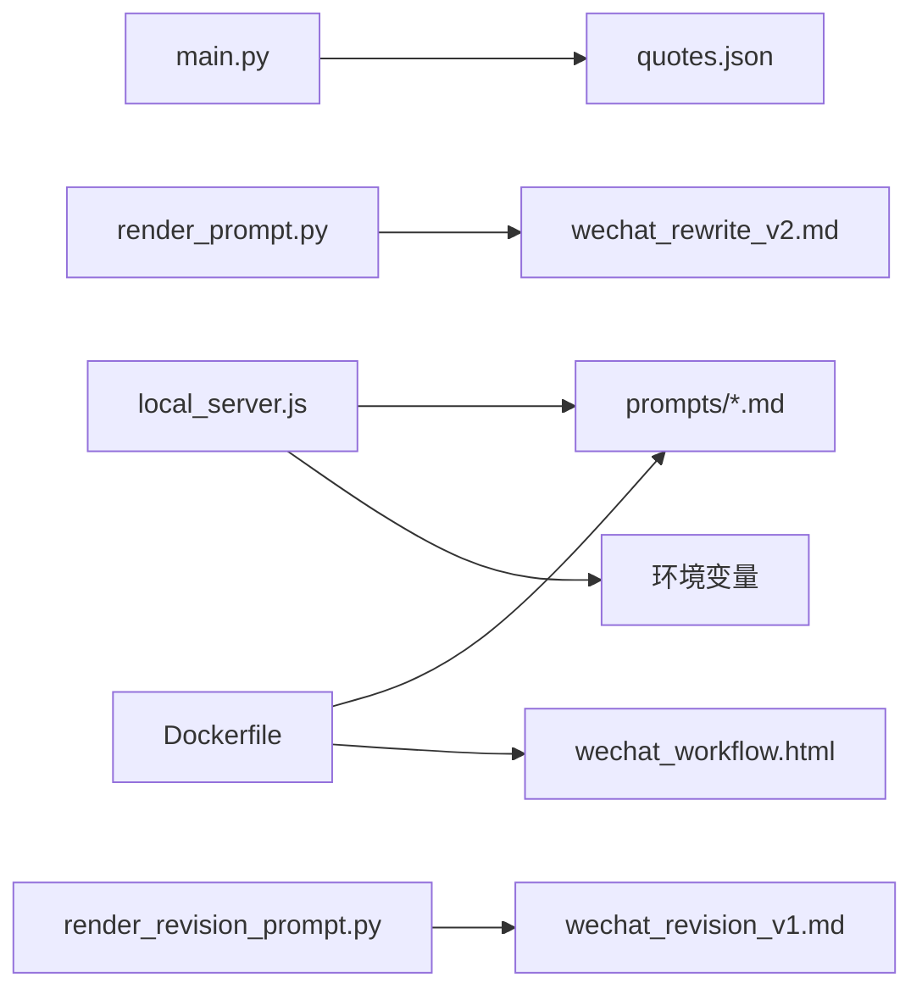

# 配置与定制

<cite>
**本文引用的文件**
- [quotes.json](file://quotes.json)
- [wechat_html_layout_v1.md](file://prompts/wechat_html_layout_v1.md)
- [wechat_revision_v1.md](file://prompts/wechat_revision_v1.md)
- [wechat_rewrite_v2.md](file://prompts/wechat_rewrite_v2.md)
- [wechat_structuring_v1.md](file://prompts/wechat_structuring_v1.md)
- [render_prompt.py](file://tools/render_prompt.py)
- [render_revision_prompt.py](file://tools/render_revision_prompt.py)
- [main.py](file://main.py)
- [local_server.js](file://local_server.js)
- [wechat_workflow.html](file://wechat_workflow.html)
- [Dockerfile](file://Dockerfile)
- [README_DEPLOY.md](file://README_DEPLOY.md)
</cite>

## 目录
1. [简介](#简介)
2. [项目结构](#项目结构)
3. [核心组件](#核心组件)
4. [架构总览](#架构总览)
5. [详细组件分析](#详细组件分析)
6. [依赖关系分析](#依赖关系分析)
7. [性能考量](#性能考量)
8. [故障排查指南](#故障排查指南)
9. [结论](#结论)
10. [附录](#附录)

## 简介
本文件面向使用者与维护者，系统化说明本项目的配置与定制方法，涵盖以下方面：
- 语录数据库结构与新增语录流程（quotes.json）
- Prompt 模板定制（wechat_html_layout_v1.md 等）
- 环境变量配置（API 密钥、服务器端口、访问令牌、推理强度等）
- 工具脚本使用（render_prompt.py、render_revision_prompt.py 的参数与用法）
- 最佳实践与扩展建议

## 项目结构
项目采用“前端页面 + 后端代理 + 模板与语录 + 工具脚本”的组织方式，便于本地开发、容器化部署与云端托管。

图表来源
- [wechat_workflow.html](file://wechat_workflow.html)
- [local_server.js](file://local_server.js)
- [wechat_html_layout_v1.md](file://prompts/wechat_html_layout_v1.md)
- [wechat_revision_v1.md](file://prompts/wechat_revision_v1.md)
- [wechat_rewrite_v2.md](file://prompts/wechat_rewrite_v2.md)
- [wechat_structuring_v1.md](file://prompts/wechat_structuring_v1.md)
- [quotes.json](file://quotes.json)
- [render_prompt.py](file://tools/render_prompt.py)
- [render_revision_prompt.py](file://tools/render_revision_prompt.py)
- [Dockerfile](file://Dockerfile)

章节来源
- [wechat_workflow.html](file://wechat_workflow.html)
- [local_server.js](file://local_server.js)
- [Dockerfile](file://Dockerfile)

## 核心组件
- 语录库（quotes.json）：存放多条中文语录，支持按关键词与标签匹配，用于生成 Prompt 上下文。
- Prompt 模板：包含公众号 HTML 排版模板、修订模板、重写模板与结构策划模板。
- 工具脚本：用于渲染通用草稿模板与修订模板，便于离线预览与调试。
- 本地服务器：提供静态页面、模板加载与 OpenAI 代理接口，支持访问令牌与环境变量配置。
- 主程序：整合语录与用户输入，生成风格化 Prompt，支持文件与交互两种模式。

章节来源
- [quotes.json](file://quotes.json)
- [wechat_html_layout_v1.md](file://prompts/wechat_html_layout_v1.md)
- [wechat_revision_v1.md](file://prompts/wechat_revision_v1.md)
- [wechat_rewrite_v2.md](file://prompts/wechat_rewrite_v2.md)
- [wechat_structuring_v1.md](file://prompts/wechat_structuring_v1.md)
- [render_prompt.py](file://tools/render_prompt.py)
- [render_revision_prompt.py](file://tools/render_revision_prompt.py)
- [local_server.js](file://local_server.js)
- [main.py](file://main.py)

## 架构总览
下图展示从用户输入到最终输出的关键流程，包括本地服务器代理、模板渲染与工具脚本协作。

图表来源
- [local_server.js](file://local_server.js)
- [wechat_html_layout_v1.md](file://prompts/wechat_html_layout_v1.md)
- [render_prompt.py](file://tools/render_prompt.py)

## 详细组件分析

### 语录数据库（quotes.json）
- 数据结构
  - 数组元素为对象，包含作者、作者中文名、英文内容、中文翻译、标签数组等字段。
  - 示例字段：author、author_cn、content、content_cn、tags。
- 新增语录方法
  - 在数组末尾追加一条对象，确保字段齐全。
  - tags 用于关键词匹配与语录筛选，建议使用与主题相关的英文关键词。
  - 保存后，主程序会自动加载并参与 Prompt 生成。
- 匹配逻辑
  - 主程序内置关键词映射，按用户输入中的关键词查找匹配标签，再筛选语录。
  - 若匹配不足，会从剩余语录中随机补充，保证输出数量上限。

图表来源
- [main.py](file://main.py)
- [quotes.json](file://quotes.json)

章节来源
- [quotes.json](file://quotes.json)
- [main.py](file://main.py)

### Prompt 模板定制
- wechat_html_layout_v1.md（公众号 HTML 排版模板）
  - 角色与目标：将最终文本转为可直接复制到微信公众号编辑器的 HTML。
  - 硬约束：不得改写内容含义、必须输出完整 HTML、内联样式为主、不依赖外部 CSS。
  - 模板变量：{{FINAL_TEXT}}、{{TITLE}}、{{STYLE_PRESET_NAME}}、{{STYLE_PRESET_RULES}}。
  - 使用建议：通过工具脚本或本地服务器注入变量，确保输出符合公众号排版规范。
- wechat_revision_v1.md（修订模板）
  - 角色与目标：根据用户修改要求对目标文本进行二轮修改。
  - 模板变量：{{REVISION_MODE}}、{{FULL_TEXT}}、{{TARGET_TEXT}}、{{REVISION_REQUEST}}。
  - 模式：支持全文重写与选中段落重写两种模式。
- wechat_rewrite_v2.md（重写模板）
  - 角色与目标：将草稿润色为可直接发布的公众号文章。
  - 模板变量：{{DRAFT_TEXT}}、{{MUST_KEEP}}、{{EXPAND_POINTS}}、{{OUTLINE_TEXT}}。
- wechat_structuring_v1.md（结构策划模板）
  - 角色与目标：仅做选题策划，不直接写正文。
  - 模板变量：{{DRAFT_TEXT}}、{{MUST_KEEP}}、{{EXPAND_POINTS}}。

图表来源
- [wechat_html_layout_v1.md](file://prompts/wechat_html_layout_v1.md)
- [wechat_revision_v1.md](file://prompts/wechat_revision_v1.md)
- [wechat_rewrite_v2.md](file://prompts/wechat_rewrite_v2.md)
- [wechat_structuring_v1.md](file://prompts/wechat_structuring_v1.md)

章节来源
- [wechat_html_layout_v1.md](file://prompts/wechat_html_layout_v1.md)
- [wechat_revision_v1.md](file://prompts/wechat_revision_v1.md)
- [wechat_rewrite_v2.md](file://prompts/wechat_rewrite_v2.md)
- [wechat_structuring_v1.md](file://prompts/wechat_structuring_v1.md)

### 环境变量配置
- 本地服务器（local_server.js）
  - 访问令牌：ARTICLE_JIKE_ACCESS_TOKEN 或 APP_ACCESS_TOKEN，用于保护接口。
  - API 密钥：OPENAI_API_KEY 或 NEWAPI_API_KEY。
  - 基础地址：OPENAI_BASE_URL 或 NEWAPI_BASE_URL。
  - 模型：OPENAI_MODEL 或 NEWAPI_MODEL，默认 gpt-5.4。
  - 推理强度：OPENAI_REASONING_EFFORT。
  - 端口与主机：PORT、HOST，默认 3001、0.0.0.0。
  - .env.local：手动加载键值对，覆盖默认值。
- 部署与云端（README_DEPLOY.md）
  - Vercel 环境变量：OPENAI_API_KEY、OPENAI_MODEL 等。
  - systemd 服务示例：包含环境文件与最小服务配置。
- 日志与健康检查
  - /api/status 返回服务状态、模型、推理强度、授权状态等信息。
  - /api/proxy 代理上游接口，支持流式返回。

图表来源
- [local_server.js](file://local_server.js)
- [README_DEPLOY.md](file://README_DEPLOY.md)

章节来源
- [local_server.js](file://local_server.js)
- [README_DEPLOY.md](file://README_DEPLOY.md)

### 工具脚本使用
- render_prompt.py
  - 参数
    - -t/--template：模板文件路径（如 wechat_rewrite_v2.md）
    - -i/--input：输入草稿文件路径
    - -o/--output：输出文件路径
    - --must-keep：必须保留的句子/信息
    - --expand-points：希望重点扩写的点
    - --outline：已确认的标题/大纲
  - 行为：读取模板与草稿，替换 {{DRAFT_TEXT}}、{{MUST_KEEP}}、{{EXPAND_POINTS}}、{{OUTLINE_TEXT}}，输出到指定文件。
- render_revision_prompt.py
  - 参数
    - -t/--template：修订模板路径（默认 wechat_revision_v1.md）
    - -f/--full-text：全文内容
    - -o/--output：输出文件路径
    - --target-text：目标文本（未提供则使用全文）
    - --request：修改要求
    - --mode：full 或 selection（默认 full）
  - 行为：根据模式生成“全文重写”或“选中段落重写”的说明，替换 {{REVISION_MODE}}、{{FULL_TEXT}}、{{TARGET_TEXT}}、{{REVISION_REQUEST}}，输出到指定文件。

图表来源
- [render_prompt.py](file://tools/render_prompt.py)
- [render_revision_prompt.py](file://tools/render_revision_prompt.py)

章节来源
- [render_prompt.py](file://tools/render_prompt.py)
- [render_revision_prompt.py](file://tools/render_revision_prompt.py)

### 主程序（Prompt 生成与日志）
- 功能概览
  - 加载 quotes.json，按关键词匹配与随机补充生成语录集合。
  - 生成风格化 Prompt，支持文件输入与交互模式。
  - 记录操作日志到 logs/operations.log。
- 关键流程

图表来源
- [main.py](file://main.py)

章节来源
- [main.py](file://main.py)

### 前端页面与容器化
- wechat_workflow.html
  - 提供三页工作流：输入、精修、输出。
  - 内置样式与交互，支持切换页面、复制提示、触发生成。
- Dockerfile
  - 使用 nginx:alpine，拷贝静态页面与 prompts 目录，暴露 80 端口。

章节来源
- [wechat_workflow.html](file://wechat_workflow.html)
- [Dockerfile](file://Dockerfile)

## 依赖关系分析
- 组件耦合
  - main.py 依赖 quotes.json；local_server.js 依赖环境变量与模板目录。
  - 工具脚本独立于运行时，仅依赖模板与输入文件。
- 外部依赖
  - 本地服务器代理上游 OpenAI 接口，需正确配置 API 密钥与基础地址。
- 潜在环路
  - 无直接循环依赖；模板与数据通过脚本与运行时间接耦合。

图表来源
- [main.py](file://main.py)
- [local_server.js](file://local_server.js)
- [render_prompt.py](file://tools/render_prompt.py)
- [render_revision_prompt.py](file://tools/render_revision_prompt.py)
- [Dockerfile](file://Dockerfile)

章节来源
- [main.py](file://main.py)
- [local_server.js](file://local_server.js)
- [render_prompt.py](file://tools/render_prompt.py)
- [render_revision_prompt.py](file://tools/render_revision_prompt.py)
- [Dockerfile](file://Dockerfile)

## 性能考量
- 本地服务器
  - 流式返回：支持上游流式响应，降低等待时间。
  - 缓存控制：JSON 响应设置 no-store，避免缓存干扰。
- 模板与语录
  - 模板体积较小，读取开销低；语录库建议保持精简，避免过大 JSON 影响加载。
- 工具脚本
  - 仅进行字符串替换，性能开销极低；适合批量预渲染。

## 故障排查指南
- 401 未授权
  - 检查 ARTICLE_JIKE_ACCESS_TOKEN 或 APP_ACCESS_TOKEN 是否配置正确。
  - 本地服务器会校验请求头中的 x-article-jike-access-token 或 Authorization Bearer。
- 代理失败（500）
  - 检查 OPENAI_API_KEY、OPENAI_BASE_URL、OPENAI_MODEL 是否正确。
  - 确认上游接口可达，必要时更换基础地址。
- 端口占用
  - 修改 PORT 或 HOST，确保未被占用。
- 日志定位
  - 查看 logs/operations.log 中的操作记录，定位输入与输出文件路径。
- 健康检查
  - 访问 /api/status，确认模型、推理强度、授权状态与服务运行时间。

章节来源
- [local_server.js](file://local_server.js)
- [README_DEPLOY.md](file://README_DEPLOY.md)
- [main.py](file://main.py)

## 结论
本项目通过“语录库 + 模板 + 工具脚本 + 本地服务器”的组合，提供了灵活的配置与定制能力。遵循本文档的配置与最佳实践，可快速完成语录扩展、模板定制与环境部署，并在生产环境中稳定运行。

## 附录

### 环境变量清单（本地与云端）
- 本地服务器
  - ARTICLE_JIKE_ACCESS_TOKEN / APP_ACCESS_TOKEN：访问令牌
  - OPENAI_API_KEY / NEWAPI_API_KEY：API 密钥
  - OPENAI_BASE_URL / NEWAPI_BASE_URL：基础地址
  - OPENAI_MODEL / NEWAPI_MODEL：模型名称
  - OPENAI_REASONING_EFFORT：推理强度
  - PORT / HOST：端口与主机
  - .env.local：键值对文件，用于本地覆盖
- 云端（Vercel）
  - OPENAI_API_KEY、OPENAI_MODEL 等，按需添加并重新部署

章节来源
- [local_server.js](file://local_server.js)
- [README_DEPLOY.md](file://README_DEPLOY.md)