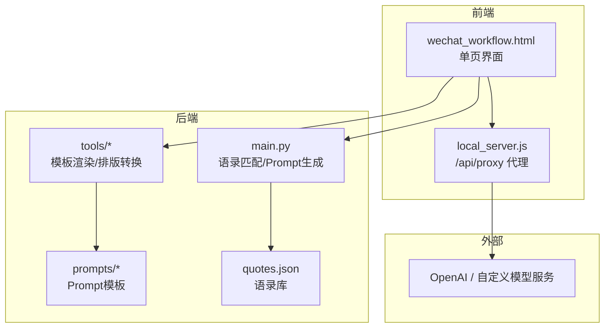
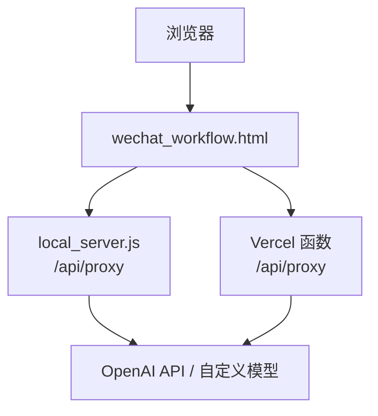
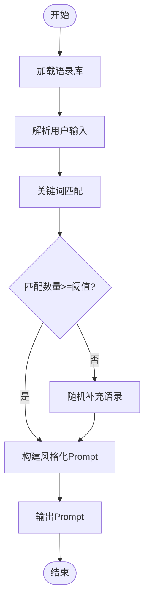
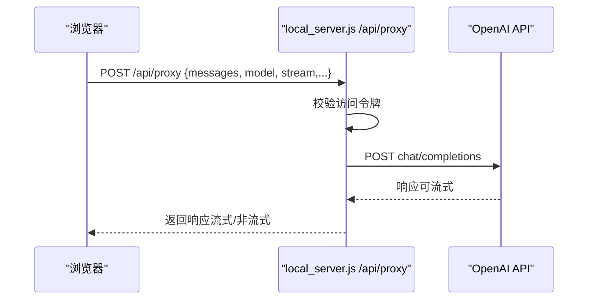
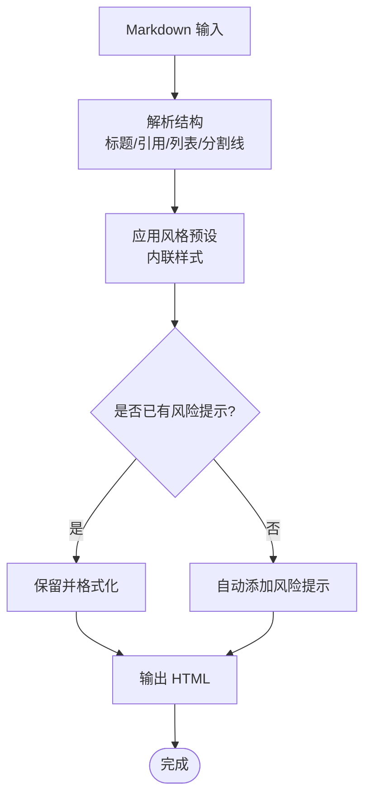
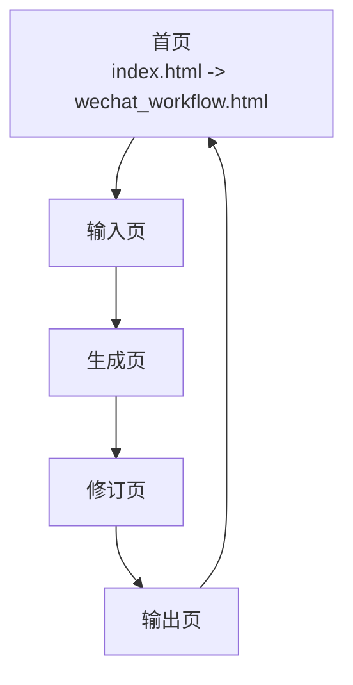
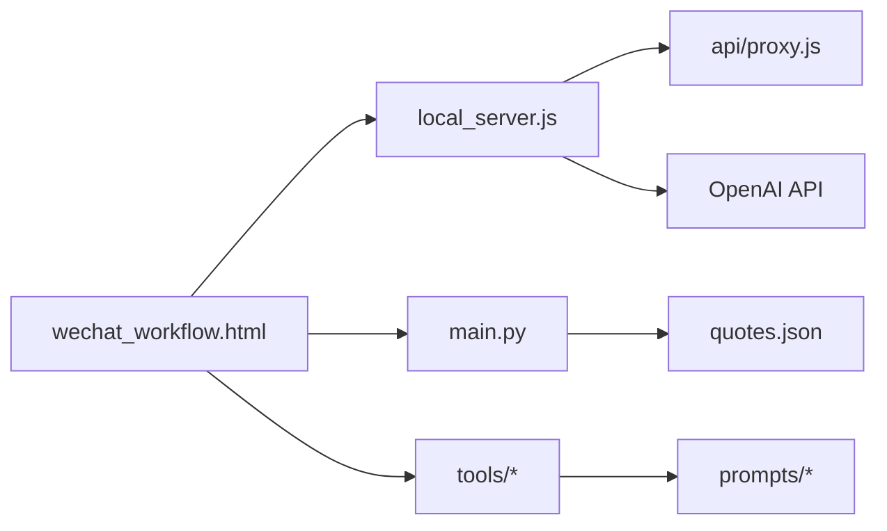

# 项目概述

<cite>
**本文引用的文件**
- [README_DEPLOY.md](file://README_DEPLOY.md)
- [VERCEL_GUIDE.md](file://VERCEL_GUIDE.md)
- [main.py](file://main.py)
- [local_server.js](file://local_server.js)
- [index.html](file://index.html)
- [wechat_workflow.html](file://wechat_workflow.html)
- [api/proxy.js](file://api/proxy.js)
- [tools/md_to_wechat_html.py](file://tools/md_to_wechat_html.py)
- [tools/render_prompt.py](file://tools/render_prompt.py)
- [tools/render_revision_prompt.py](file://tools/render_revision_prompt.py)
- [prompts/wechat_html_layout_v1.md](file://prompts/wechat_html_layout_v1.md)
- [prompts/wechat_verify_v1.md](file://prompts/wechat_verify_v1.md)
- [quotes.json](file://quotes.json)
- [samples/1月份的腾讯都没买的话这么多年的互联网白干了.md](file://samples/1月份的腾讯都没买的话这么多年的互联网白干了.md)
</cite>

## 目录
1. [引言](#引言)
2. [项目结构](#项目结构)
3. [核心组件](#核心组件)
4. [架构总览](#架构总览)
5. [详细组件分析](#详细组件分析)
6. [依赖分析](#依赖分析)
7. [性能考虑](#性能考虑)
8. [故障排查指南](#故障排查指南)
9. [结论](#结论)
10. [附录](#附录)

## 引言
“投资智慧回响”是一个面向微信公众号内容创作者的全栈写作辅助系统，旨在以巴菲特、芒格、段永平等投资大师的理念为指导，提供从“智能Prompt生成”“语录匹配”“内容校验”到“HTML排版渲染”的一体化工作流。系统既可作为本地开发工具，也可通过 Vercel 或自建服务器一键部署，支持流式与非流式两种 AI 接口模式，帮助创作者用更理性、克制且具商业洞察力的语言，写出高质量的投资主题文章。

## 项目结构
项目采用前后端分离的全栈组织方式：
- Python 后端：负责语录加载、关键词匹配、Prompt 构造与本地静态资源/代理服务。
- Node.js 前端：提供 Web 界面与 API 代理，支持访问令牌鉴权与流式响应。
- HTML 界面：单页应用（SPA）风格，包含“输入草稿”“生成Prompt”“修订润色”“排版渲染”等页面。
- 工具链：若干 Python 脚本，用于模板渲染、修订提示构造与 Markdown 到微信 HTML 的转换。
- 资源与样本：包含 Prompt 模板、语录库、示例文章等。

图表来源
- [local_server.js:127-196](file://local_server.js#L127-L196)
- [main.py:32-82](file://main.py#L32-L82)
- [wechat_workflow.html:1-800](file://wechat_workflow.html#L1-L800)

章节来源
- [README_DEPLOY.md:74-126](file://README_DEPLOY.md#L74-L126)
- [wechat_workflow.html:1-800](file://wechat_workflow.html#L1-L800)

## 核心组件
- 智能 Prompt 生成器（Python）
  - 加载语录库，基于用户输入进行关键词匹配，动态拼接大师语录，生成风格化系统 Prompt。
- 语录匹配引擎
  - 使用关键词映射与随机补充策略，保证每次生成都有相关语录佐证。
- API 代理服务（Node.js）
  - 提供统一的 /api/proxy 接口，支持访问令牌鉴权、流式/非流式响应、参数透传与错误处理。
- 内容渲染与排版（Python 工具）
  - 将 Markdown 转换为可直接粘贴到微信后台的 HTML，内置多种风格预设与风险提示规则。
- Web 界面（HTML/CSS/JS）
  - 提供“输入草稿—生成Prompt—修订润色—排版渲染”的可视化工作流，支持本地与云端部署。

章节来源
- [main.py:45-127](file://main.py#L45-L127)
- [api/proxy.js:23-118](file://api/proxy.js#L23-L118)
- [tools/md_to_wechat_html.py:86-233](file://tools/md_to_wechat_html.py#L86-L233)
- [wechat_workflow.html:1-800](file://wechat_workflow.html#L1-L800)

## 架构总览
系统支持两种部署形态：
- 本地开发：Node.js 本地服务器提供静态资源与代理，Python 工具独立运行。
- 云端部署：Vercel 函数作为代理，前端直连云端，后端逻辑可按需迁移。

图表来源
- [local_server.js:127-196](file://local_server.js#L127-L196)
- [api/proxy.js:23-118](file://api/proxy.js#L23-L118)
- [index.html:1-16](file://index.html#L1-L16)

章节来源
- [README_DEPLOY.md:1-126](file://README_DEPLOY.md#L1-L126)
- [VERCEL_GUIDE.md:1-52](file://VERCEL_GUIDE.md#L1-L52)

## 详细组件分析

### 组件A：智能 Prompt 生成与语录匹配
- 设计理念
  - 以“大师语录”为锚点，结合用户输入，生成风格一致、逻辑严密、可读性强的系统 Prompt。
- 关键流程
  - 读取 quotes.json，按关键词映射匹配相关语录。
  - 若匹配不足，随机补充，保证多样性与相关性。
  - 将匹配结果与用户输入融合，生成最终 Prompt。
- 交互模式
  - 支持命令行文件模式与交互模式，便于不同使用场景。

图表来源
- [main.py:32-82](file://main.py#L32-L82)
- [main.py:84-127](file://main.py#L84-L127)

章节来源
- [main.py:32-127](file://main.py#L32-L127)
- [quotes.json:1-108](file://quotes.json#L1-L108)

### 组件B：API 代理服务（Node.js）
- 设计理念
  - 通过统一代理屏蔽前端与后端的差异，支持访问令牌鉴权、流式响应与参数透传。
- 关键流程
  - 校验访问令牌，拒绝未授权请求。
  - 解析请求体，组装上游调用参数（模型、消息、推理强度等）。
  - 发起上游请求，按需流式返回响应。
  - 统一错误处理与状态码返回。

图表来源
- [local_server.js:50-125](file://local_server.js#L50-L125)
- [api/proxy.js:23-118](file://api/proxy.js#L23-L118)

章节来源
- [local_server.js:15-32](file://local_server.js#L15-L32)
- [local_server.js:50-125](file://local_server.js#L50-L125)
- [api/proxy.js:12-21](file://api/proxy.js#L12-L21)

### 组件C：内容渲染与微信 HTML 排版
- 设计理念
  - 将 Markdown 转换为微信后台可直接粘贴的 HTML，遵循公众号排版规范，强调内联样式与可读性。
- 关键流程
  - 解析 Markdown，识别标题、引用、列表、分割线等结构。
  - 应用风格预设（理性金融/观点评论/深度特色），内联样式保证复制粘贴一致性。
  - 自动补全风险提示，避免重复与违规表述。

图表来源
- [tools/md_to_wechat_html.py:86-233](file://tools/md_to_wechat_html.py#L86-L233)
- [prompts/wechat_html_layout_v1.md:1-73](file://prompts/wechat_html_layout_v1.md#L1-L73)

章节来源
- [tools/md_to_wechat_html.py:6-52](file://tools/md_to_wechat_html.py#L6-L52)
- [tools/md_to_wechat_html.py:86-233](file://tools/md_to_wechat_html.py#L86-L233)
- [prompts/wechat_html_layout_v1.md:17-73](file://prompts/wechat_html_layout_v1.md#L17-L73)

### 组件D：Web 界面与工作流
- 设计理念
  - 单页应用风格，页面间切换流畅，支持草稿输入、Prompt 预览、修订建议与排版预览。
- 关键页面
  - 输入页：草稿输入与配置项。
  - 生成页：Prompt 预览与 AI 调用入口。
  - 修订页：全文/选区修订，支持预设与自定义。
  - 输出页：HTML 预览与导出选项。

图表来源
- [index.html:1-16](file://index.html#L1-L16)
- [wechat_workflow.html:1-800](file://wechat_workflow.html#L1-L800)

章节来源
- [index.html:1-16](file://index.html#L1-L16)
- [wechat_workflow.html:1-800](file://wechat_workflow.html#L1-L800)

## 依赖分析
- 组件耦合
  - main.py 与 quotes.json 强耦合，语录匹配依赖 JSON 结构。
  - tools/* 与 prompts/* 强耦合，模板渲染依赖预设字段。
  - local_server.js 与 api/proxy.js 在功能上互补，前者提供本地开发，后者适配 Vercel。
- 外部依赖
  - OpenAI API（或自定义代理）用于流式/非流式对话。
  - 浏览器端无需构建链，直接使用静态资源与代理接口。

图表来源
- [main.py:32-82](file://main.py#L32-L82)
- [tools/render_prompt.py:1-28](file://tools/render_prompt.py#L1-L28)
- [tools/render_revision_prompt.py:1-44](file://tools/render_revision_prompt.py#L1-L44)
- [local_server.js:127-196](file://local_server.js#L127-L196)
- [api/proxy.js:23-118](file://api/proxy.js#L23-L118)

章节来源
- [main.py:32-82](file://main.py#L32-L82)
- [tools/render_prompt.py:1-28](file://tools/render_prompt.py#L1-L28)
- [tools/render_revision_prompt.py:1-44](file://tools/render_revision_prompt.py#L1-L44)
- [local_server.js:127-196](file://local_server.js#L127-L196)
- [api/proxy.js:23-118](file://api/proxy.js#L23-L118)

## 性能考虑
- 代理层性能
  - 流式响应可降低首字节延迟，适合长文本生成。
  - 参数透传与最小化中间处理，减少额外开销。
- 前端体验
  - 单页应用减少页面切换抖动，预览与导出即时反馈。
- 本地部署
  - 无需前端构建链，启动即用；适合快速迭代与离线使用。

## 故障排查指南
- 401 未授权
  - 检查访问令牌配置（环境变量或请求头），确保与预期一致。
- 400 缺少必要字段
  - 确认请求体包含模型、消息数组、基础 URL 与 API Key。
- 云端部署后 AI 无法使用
  - 在 Vercel 控制台添加 OPENAI_API_KEY、OPENAI_BASE_URL、OPENAI_MODEL 等环境变量并重新部署。
- 本地服务器无法访问
  - 检查端口占用与防火墙放行，确认 /api/status 健康检查可用。

章节来源
- [local_server.js:15-32](file://local_server.js#L15-L32)
- [api/proxy.js:51-63](file://api/proxy.js#L51-L63)
- [README_DEPLOY.md:26-42](file://README_DEPLOY.md#L26-L42)
- [VERCEL_GUIDE.md:12-41](file://VERCEL_GUIDE.md#L12-L41)

## 结论
“投资智慧回响”以“大师理念 + 工具链 + 代理服务”的组合，为微信公众号创作者提供了从“思想启发—Prompt 构建—内容修订—排版落地”的闭环工作流。系统兼顾易用性与扩展性，既适合初学者快速上手，也为有经验的开发者提供了清晰的架构与可定制的模板体系。

## 附录
- 目标用户
  - 微信公众号内容创作者、投资主题作者、希望提升写作质量与专业度的个人写作者。
- 设计理念
  - 以“理性、克制、讲人话”的风格，用商业常识与大师智慧重构写作框架。
- 技术选型理由
  - Python：简洁高效，适合数据处理与模板渲染。
  - Node.js：轻量代理与静态服务，适配本地与云端部署。
  - HTML/CSS：单页应用，无需构建链，快速迭代。
  - OpenAI：成熟的模型与流式能力，满足创作需求。